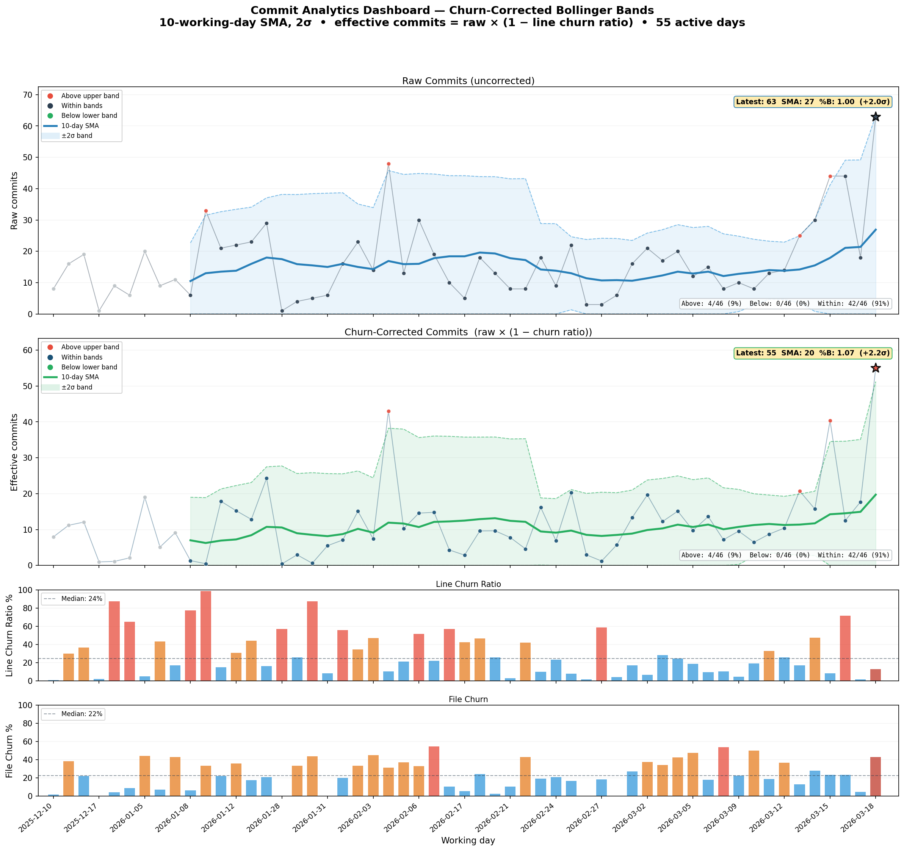

# Bid Euchre AI Research Framework

A Python framework for deterministic simulation and strategy evaluation of the card game Bid Euchre.

## Dashboard



Churn-corrected Bollinger Bands on daily commit counts (working days only). Updated automatically after each merge to main. See `scripts/generate_dashboard.py` for methodology.

## Quick Start

### Install
```bash
uv sync
```

Or with pip (alternative):
```bash
python -m venv .venv
source .venv/bin/activate
pip install -e ".[dev]"
```

### Verify setup
```bash
make check
```

### Run experiment
```bash
uv run python experiments/run_experiment.py \
  --config experiments/configs/quick_test.yaml \
  --seed 42 \
  --n_per 5
```

### Run experiment suite
```bash
uv run python scripts/run_suite.py \
  --suite experiments/suites/baseline_tiny.yaml \
  --seed 42 \
  --n-per 20
```

**Note**: Experiment outputs go to `data/runs/<run_id>/` and are not committed to git.

## Documentation

- [docs/DEVELOPMENT.md](docs/DEVELOPMENT.md) — Development setup and workflow
- [docs/01_core/EXPERIMENTS.md](docs/01_core/EXPERIMENTS.md) — Running experiments and suites
- [docs/02_agent/AGENTS.md](docs/02_agent/AGENTS.md) — Development workflow and best practices
- [docs/TESTING_STRATEGY.md](docs/TESTING_STRATEGY.md) — Test layers and validation commands
- [docs/STYLEGUIDE.md](docs/STYLEGUIDE.md) — Coding conventions and placement rules
- [docs/README.md](docs/README.md) — Full documentation index

## Requirements

- Python 3.10+
- See `pyproject.toml` for dependencies (install via `uv sync` or `pip install -e ".[dev]"`)
