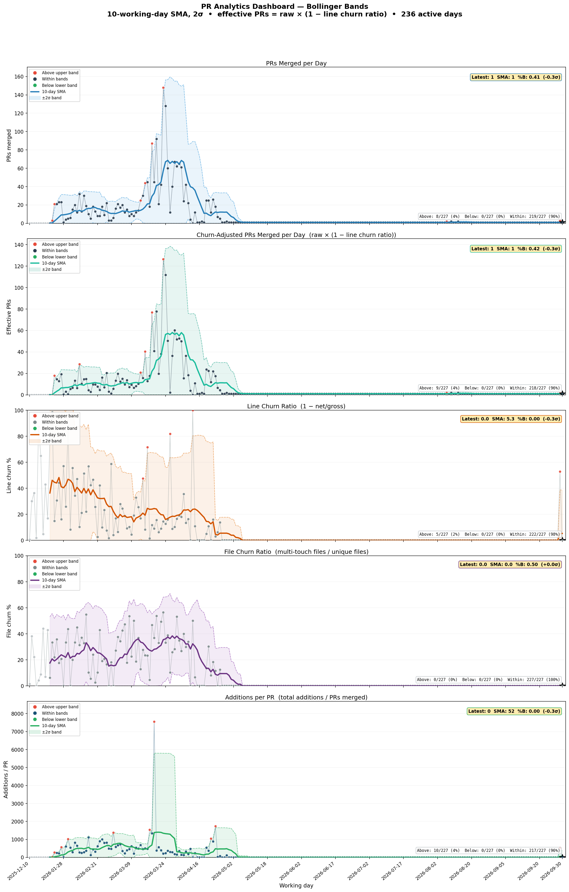

# Bid Euchre AI Research Framework

A Python project for studying bidding and card-play strategies in Bid Euchre: a four-player partnership game with a 40-card double deck, an auction, and ten tricks per hand. The research question is how hand features, prediction models, and bidding decisions affect points won against other strategies.

The repository combines a rules engine, seeded simulations, heuristic and learned bidding policies, statistical evaluation, and research reports. A separate FastAPI browser game uses the same game logic. See the [game rules](docs/01_core/RULES.md) for this variant, including suit, high, low, moon, and loner contracts.

## How it works

```text
YAML experiment + seed
        ↓
Deal generation → auction / strategy decisions → legal trick play → scoring
        ↓
Run metadata + result JSON + optional hand logs
        ↓
Statistical comparisons → diagnostic charts → research decisions
```

| Layer | Code | Responsibility |
|---|---|---|
| Game engine | `src/bid_euchre/core/`, `sim/`, `scoring.py` | Cards, legal actions, trick resolution, scoring |
| Policies and models | `src/bid_euchre/strategy/`, `models/` | Heuristics, regression and gradient-boosted bidding models |
| Experiments | `experiments/run_experiment.py`, `experiments/configs/` | Configured runs, explicit seeds, common deals across strategies |
| Evidence | `src/bid_euchre/analysis/`, `reporting/`, `docs/04_reports/` | Comparisons, uncertainty, diagnostics, recorded decisions |
| Browser game | `web/` | Local web interface and hosted-play support |

The engine determines legal outcomes; strategies choose actions. Research runs record the seed, configuration hash, and code revision. See [architecture](docs/01_core/ARCHITECTURE.md) and [reproducibility](docs/01_core/REPRODUCIBILITY.md).

## Start locally

Requires Python 3.10+ and [uv](https://docs.astral.sh/uv/getting-started/installation/). Run from the repository root:

```bash
git clone https://github.com/Questuart/Bid-Euchre.git
cd Bid-Euchre
uv sync --frozen --extra dev

uv run python experiments/run_experiment.py \
  --config experiments/configs/quick_test.yaml \
  --seed 42 --n_per 5
```

This small smoke experiment plays 20 hands: two strategies × two fixed-contract scenarios × five hands. It checks that the pipeline works; it is too small to rank strategies reliably. Results appear under `data/runs/<run_id>/results/`, alongside `meta.json` and the effective configuration. Generated runs are gitignored.

For a larger comparison or a small suite:

```bash
uv run python experiments/run_experiment.py \
  --config experiments/configs/strategy_comparison.yaml \
  --seed 42 --n_per 200

uv run python scripts/run_suite.py \
  --suite experiments/suites/baseline_tiny.yaml \
  --seed 42 --n-per 20
```

Run the repository checks with `make check` (repository lint, Ruff, non-slow/non-browser tests, notebook hygiene, and documentation checks). `make notebook-run` separately executes notebook smoke tests. See [development](docs/DEVELOPMENT.md) for the pip alternative and [testing](docs/TESTING_STRATEGY.md) for individual targets.

## Read one result

The [Arc D v2 r3 decision report](docs/04_reports/arc_d_v2/r3/canonical/02_decision.md) illustrates why prediction quality and competitive performance need separate evaluation. In the committed comparator snapshot, the gradient-boosted bidder (`gbt_av`) has net points per deal of **3.70**, with a reported interval of **[2.399, 5.0605]**. Its head-to-head mean point delta against the anchor is **−1.34**. Those are different evaluation settings; the comparator ranking does not establish head-to-head dominance.

This is **preliminary evidence**, using seed 42 in QUICK mode. The snapshot includes data-sanity warnings and sanity-bound failures, and lacks formal advance-check evidence. It is not a claim of optimal play or a completed validation campaign. The [results and diagnostics](docs/04_reports/arc_d_v2/r3/canonical/01_results.md), [manifest](docs/04_reports/arc_d_v2/r3/canonical/00_manifest.md), and committed CSV tables expose the underlying evidence. Full training data and research-run artifacts are gitignored (browser inference snapshots are bundled separately); the quickstart above does not recreate this research campaign.

Useful further reading:

- [R1.5 research retrospective](docs/04_reports/arc_d_v1/r1_5/11_r1_5_arc_retrospective.md) — objective alignment, experiments, and lessons.
- [R1.5 measurement integrity](docs/04_reports/arc_d_v1/r1_5/measurement_integrity_r1_5.md) — limitations and deviations.
- [Report index](docs/04_reports/README.md) — historical research by phase; distinguish canonical reports from archived revisions.

## Browser game availability

The supported starting point for a fresh checkout is the local simulation above. Browser-game code, inference model snapshots in `web/models/`, and [deployment instructions](docs/01_core/DEPLOYMENT.md) are included. From the repository root, use the bundled snapshots explicitly:

```bash
OLSA_ARTIFACT=web/models/training_artifact_full_ols_av.json \
GBT_ARTIFACT=web/models/training_artifact_gbt_av.json \
uv run uvicorn web.app:create_app --factory --host 127.0.0.1 --port 8000
```

Open `http://127.0.0.1:8000`. Local play uses SQLite. In a second terminal at the repository root, create a local invite code and enter it on the landing page:

```bash
uv run python scripts/internal/manage_invite_codes.py generate --count 1 --label "Local demo"
```

The repository records a [Render retirement backup on April 29, 2026](docs/01_core/RENDER_RETIREMENT_2026-04-29.md); no live public demo is verified here. Retained deployment configuration is not evidence of an active service.

## Development and AI assistance

This is an AI-assisted development and research project. The repository includes agent instructions, implementation plans, automated review tooling, tests, and recorded research decisions. These make the workflow inspectable; commit or PR volume alone does not establish code quality or individual authorship. Evaluate the code, tests, and evidence together.

- [Development workflow](docs/DEVELOPMENT.md)
- [Experiment guide](docs/01_core/EXPERIMENTS.md)
- [Agent boundaries](docs/02_agent/AI_BOUNDARIES.md)
- [Documentation index](docs/README.md)

<details>
<summary>Development activity chart</summary>



Daily PR merge counts and additions volume, with Bollinger Bands (working days only). This is repository activity, not a performance or quality benchmark. Generated by `scripts/generate_dashboard.py`.

</details>
