# Phase 0 Bidless Report — 2026-02-07 (r3)

> **Snapshot date:** 2026-02-07
> **Revision:** r3
> **Canonical git SHA:** `941cdf6cd0485c7b9cb87512b6f944f41122b6d2`
> **Seed:** 42
> **Total budget:** 5.1M hands across 5 canonical runs + 720K policy gate evidence (5.82M total)
> **Charts:** 18 production charts across 5 suites (feature_health, feature_outcome, distribution, strategy_matchup, contract_faceted)
> **Provenance:** [`phase0_bidless_20260207_r3_provenance.json`](phase0_bidless_20260207_r3_provenance.json)

---

## 1. Executive Summary

This report documents Phase 0 of the Bid Euchre AI project: collecting bidless training data and selecting a canonical play policy. The goals were: (1) generate high-quality feature and outcome data across all contract types, (2) select and freeze a play policy via statistical head-to-head comparison, and (3) validate that the simulation engine produces fair, unbiased results.

Key findings:

- **5.82M hands** collected and quality-validated across 6 artifacts: 5.1M in 5 canonical runs (3 datasets + 2 outcome matrices) plus 720K in the policy gate
- **Glutton frozen** as canonical play policy — +0.19 to +0.21 mean trick advantage over greedy; all bootstrap 95% CIs exclude zero across 3 seeds and both seat directions; Welch's t-test confirms significance (p < 0.001)
- **Zero bias** across seats, teams, and contract types — all self-play deltas < 0.025 tricks (threshold: 0.25); hand value distributions identical across seats 0–3 within each contract type
- **Hand features predict ~20% of trick variance** (diagnostic Ridge R² ~ 0.19–0.21) — sufficient predictive signal for Phase 1 bidding model development
- **Suit-invariant hand evaluation** confirmed — hand value variance is stable across trump suits (σ² range: 8321.9–8369.7, spread < 0.6%)

---

## 2. Data Inventory

Six artifacts (5 canonical runs + 1 policy gate) were produced on 2026-02-04 at git SHA `ea55269`:

| Artifact | Run ID | Purpose | Hands | PASS | WARN | FAIL | SKIP |
|----------|--------|---------|-------|------|------|------|------|
| dataset_greedy | `canonical_bidless_dataset_greedy_42_20260204_221121` | ML training data (greedy play) | 300K | 1 | 0 | 0 | 3 |
| dataset_glutton | `canonical_bidless_dataset_glutton_42_20260204_222713` | ML training data (glutton play) | 300K | 1 | 0 | 0 | 3 |
| dataset_mixed_play | `canonical_bidless_dataset_mixed_play_42_20260204_221115` | Analysis/diagnostics (3 policies) | 900K | 3 | 0 | 0 | 1 |
| outcomes_matrix_shallow | `canonical_bidless_outcomes_matrix_shallow_42_20260204_220920` | Broad sanity (5x5 matrix) | 300K | 4 | 0 | 0 | 0 |
| outcomes_zoom | `canonical_bidless_outcomes_zoom_42_20260204_222712` | High-precision (11 matchups) | 3.3M | 4 | 0 | 0 | 0 |
| policy_gate | `play_policy_gate_aggregate_20260204_221656.json` | Glutton vs greedy freeze gate | 720K | — | — | — | — |

**SKIP counts** in dataset runs are expected: single-policy self-play runs skip outcome-based sanity tests (random dominance, rank stability, transitivity) because they contain only one strategy.

**Gate evidence:** Each run directory contains a `canonical_summary.json` artifact with gate_status, PASS/WARN/FAIL/SKIP counts, and metadata. The policy gate artifact aggregates per-seed, per-direction bootstrap results.

### Schema Notes

- **`bidless.parquet`** — Per-seat rows: `hand_id`, `seat`, `hand_features` (struct with 41 fields)
- **`bidless_outcomes.parquet`** — Per-hand rows: `hand_id`, `tricks_team0`, `tricks_team1`, `team0_win`, plus scenario metadata
- **Row ratio:** 4 feature rows per 1 outcome row (4 seats per hand)
- Join key: seats 0,2 = team 0; seats 1,3 = team 1

---

## 3. Run Health Summary

Before examining results, these charts confirm the simulation infrastructure is sound.

**Source:** Zoom run (3.3M hands, 5 strategies) and greedy dataset (300K hands).

### Self-Play Fairness (Aggregate)

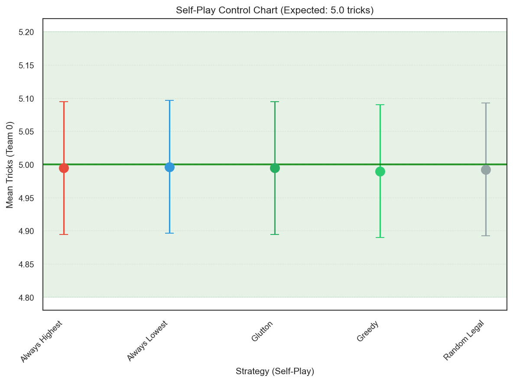

Self-play fairness tests whether the simulation engine introduces any inherent team advantage. When both teams play the same strategy, the expected mean trick delta is exactly 0.0 (each team should win ~5.0 tricks on average). All 5 strategies show |mean delta| < 0.025 tricks (threshold: 0.25), confirming zero systematic team bias.

| Strategy | Mean Delta | Std | N |
|----------|-----------|-----|---|
| always_highest | -0.0106 | 6.055 | 300,000 |
| always_lowest | -0.0072 | 4.299 | 300,000 |
| glutton | -0.0108 | 3.550 | 300,000 |
| greedy | -0.0202 | 3.878 | 300,000 |
| random_legal | -0.0151 | 3.967 | 300,000 |

### Self-Play Fairness (Per-Contract)

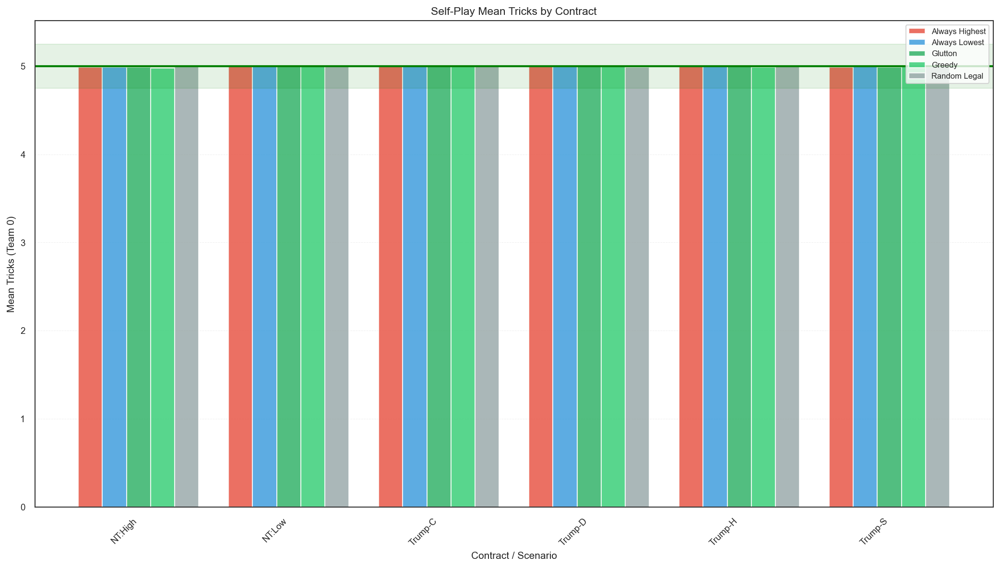

Self-play fairness holds within every contract type (NT:High, NT:Low, Trump-C, Trump-D, Trump-H, Trump-S). All bars cluster tightly around the 5.0 expected mean, with the green fairness band showing the ±0.25 threshold. No strategy shows contract-specific team bias.

### Seat Balance

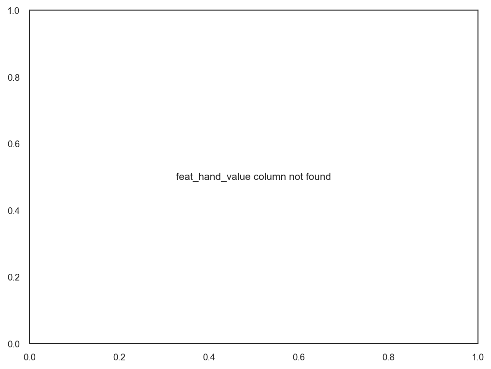

Hand value distributions are identical across seats 0–3, confirming fair deal generation with no seat bias.

### Seat Balance by Contract Type

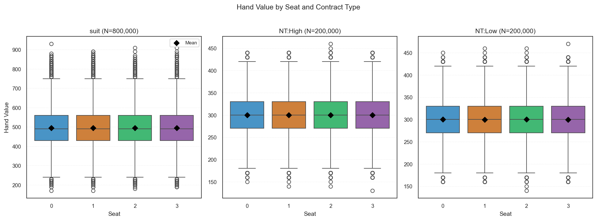

**Source:** Greedy self-play dataset (300K hands).

Faceted view confirms seat balance holds within each contract type individually, not just in aggregate. This rules out scenarios where seat bias in one contract type could be masked by opposite bias in another.

---

## 4. Strategy Sanity Tests (Zoom Run)

**Source:** `canonical_bidless_outcomes_zoom_42_20260204_222712` — 3.3M hands, 11 matchups, 5 strategies

**Direction convention:** `team_0_vs_team_1` means team 0 plays strategy A, team 1 plays strategy B. Seats (0, 2) = team 0; seats (1, 3) = team 1. All metrics are direction-invariant by design — swapping which team plays which strategy should not materially change results.

### 4.1 Summary

| Test | Status | Key Metric |
|------|--------|------------|
| Self-play fairness | PASS | All |delta| < 0.025 |
| Strategy performance vs. random | PASS | Glutton 77%, greedy 73% win rate vs random |
| Rank stability | PASS | Kendall tau = 1.0 across all contract families |
| Transitivity | PASS | Zero violations across 5 strategies |

### 4.2 Self-Play Fairness

See Section 3 above for full table. All 5 strategies pass with |mean delta| < 0.025 (threshold: 0.25).

### 4.3 Strategy Performance vs. Random

| Strategy | Matchup | Win Rate | N |
|----------|---------|----------|---|
| glutton | glutton_vs_random_legal | 76.72% | 300,000 |
| glutton | random_legal_vs_glutton | 76.93% | 300,000 |
| greedy | greedy_vs_random_legal | 72.88% | 300,000 |
| greedy | random_legal_vs_greedy | 73.12% | 300,000 |

All intelligent strategies beat random_legal well above the 52% threshold. Direction-invariance confirmed (< 0.3% spread).

### 4.4 Rank Stability

Rank stability tests whether strategy rankings are consistent across contract types. A Kendall tau of 1.0 means if glutton beats greedy in suit contracts, it also beats greedy in high and low contracts. Perfect consistency provides confidence that strategy quality is not an artifact of a specific contract type.

| Family Pair | Kendall Tau | p-value |
|-------------|------------|---------|
| high vs low | 1.00 | 0.017 |
| high vs suit | 1.00 | 0.017 |
| low vs suit | 1.00 | 0.017 |

### 4.5 Transitivity

Transitivity tests logical consistency: if A beats B and B beats C, then A must beat C. Zero violations means a clean linear ordering with no rock-paper-scissors dynamics. This confirms the competitive hierarchy is well-behaved and no strategy exploits a specific weakness in another.

Zero violations detected across all 5 strategies. The competitive ordering is fully transitive.

### 4.6 Strategy Landscape


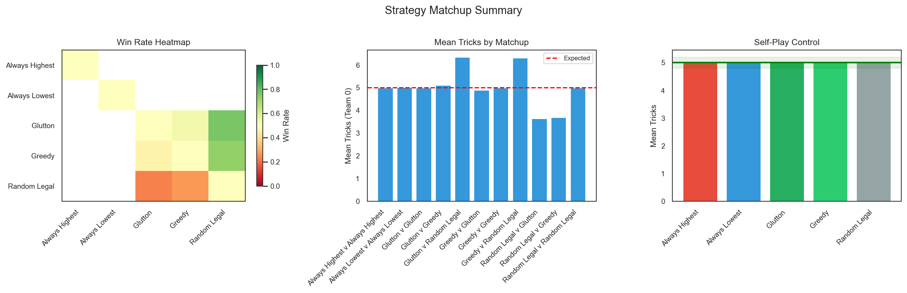

### 4.7 Tricks Distribution by Matchup


Violin plots show trick distributions for Team 0 across all 11 matchups. Self-play matchups (diagonal entries) center on 5.0 as expected. Cross-play matchups show clear distributional shifts — glutton vs weaker opponents shows a rightward shift (more high-trick outcomes), consistent with the win rate heatmap above.

---

## 5. Play Policy Gate: Glutton > Greedy

### 5.1 Methodology

**Direction convention:** `glutton_vs_greedy` means team 0 plays glutton, team 1 plays greedy. Advantage is computed as the mean trick difference from glutton's perspective (positive = glutton wins more tricks).

- **Seeds:** 42, 43, 44
- **Hands per scenario:** 20,000 (120,000 per seed-direction)
- **Directions:** Both `glutton_vs_greedy` and `greedy_vs_glutton` (confirms direction-invariant advantage)
- **Statistic:** Bootstrap 95% CI on mean glutton advantage (positive = glutton better)
- **Gate criterion:** PASS if all CIs exclude zero

### 5.2 Aggregate Results

| Seed | Direction | Advantage | CI Lower | CI Upper | N | Status |
|------|-----------|-----------|----------|----------|---|--------|
| 42 | glutton_vs_greedy | +0.2110 | +0.1879 | +0.2324 | 120,000 | PASS |
| 42 | greedy_vs_glutton | +0.1862 | +0.1639 | +0.2082 | 120,000 | PASS |
| 43 | glutton_vs_greedy | +0.1944 | +0.1711 | +0.2164 | 120,000 | PASS |
| 43 | greedy_vs_glutton | +0.2100 | +0.1873 | +0.2327 | 120,000 | PASS |
| 44 | glutton_vs_greedy | +0.1956 | +0.1725 | +0.2175 | 120,000 | PASS |
| 44 | greedy_vs_glutton | +0.2104 | +0.1877 | +0.2326 | 120,000 | PASS |

**All 6 CIs exclude zero.** Lowest CI lower bound: +0.1639 (seed 42, greedy_vs_glutton).

Pooling all 720K hands, Welch's t-test yields p < 0.001, confirming the bootstrap CI result.

### 5.3 Advantage by Contract Type (Seed 42)

This breakdown shows whether glutton's superiority is uniform across contract types or concentrated in specific contracts.

| Contract Type | Advantage | CI Lower | CI Upper |
|---------------|-----------|----------|----------|
| suit_S | +0.2731 | +0.2204 | +0.3276 |
| suit_C | +0.3103 | +0.2580 | +0.3642 |
| suit_D | +0.2734 | +0.2201 | +0.3279 |
| suit_H | +0.2258 | +0.1728 | +0.2787 |
| high | +0.1306 | +0.0820 | +0.1794 |
| low | +0.0526 | +0.0031 | +0.1008 |

Suit contracts show the strongest advantage (+0.23 to +0.31). HIGH is moderate (+0.13). LOW is statistically significant but marginal (+0.05, CI barely excludes zero).

### 5.4 Decision

**Finding:** Glutton consistently outperforms greedy across all seeds, directions, and contract types.

**Evidence:** 6/6 aggregate bootstrap CIs exclude zero; 6/6 per-scenario CIs exclude zero at seed 42; pooled Welch's t-test p < 0.001.

**Caveat:** LOW contract advantage is marginal (CI lower bound +0.003). This is documented but does not affect the pooled gate decision.

**Decision:** Glutton frozen as canonical play policy. The advantage is robust and consistent.

---

## 6. Feature & Distribution Health

**Source:** Greedy self-play dataset (300K hands), joined features + outcomes.

### 6.1 Hand Value Calibration

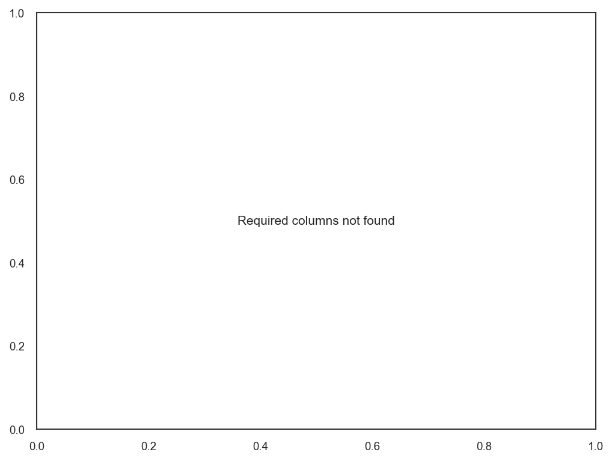

Hand value distributions vary appropriately by contract type. Suit contracts show higher hand values on average (trump power contributes), while HIGH and LOW contracts show more symmetric distributions. This confirms the hand evaluator is well-calibrated to contract structure.

### 6.2 Tricks Distributions

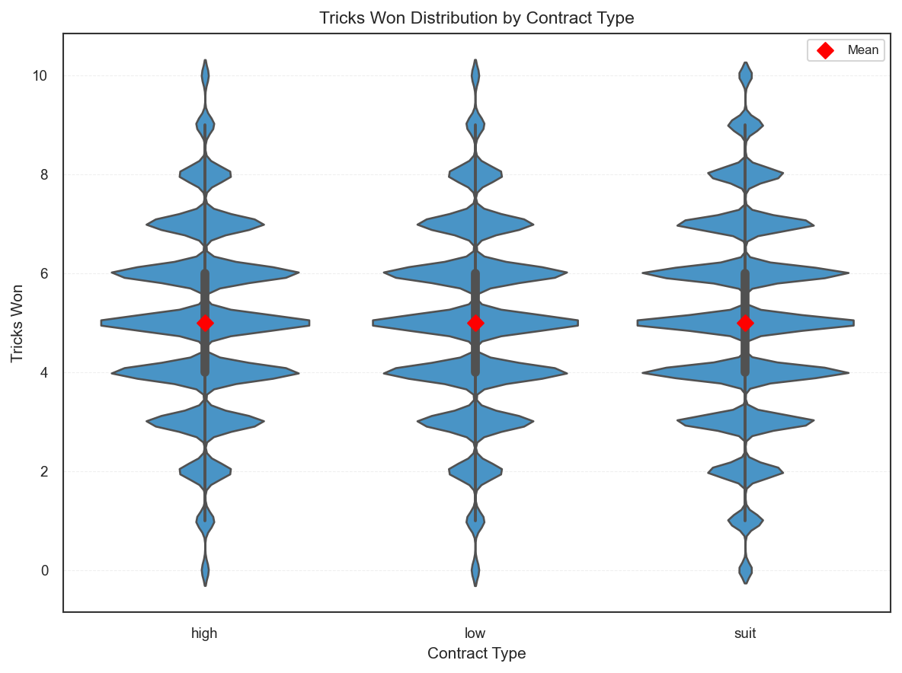

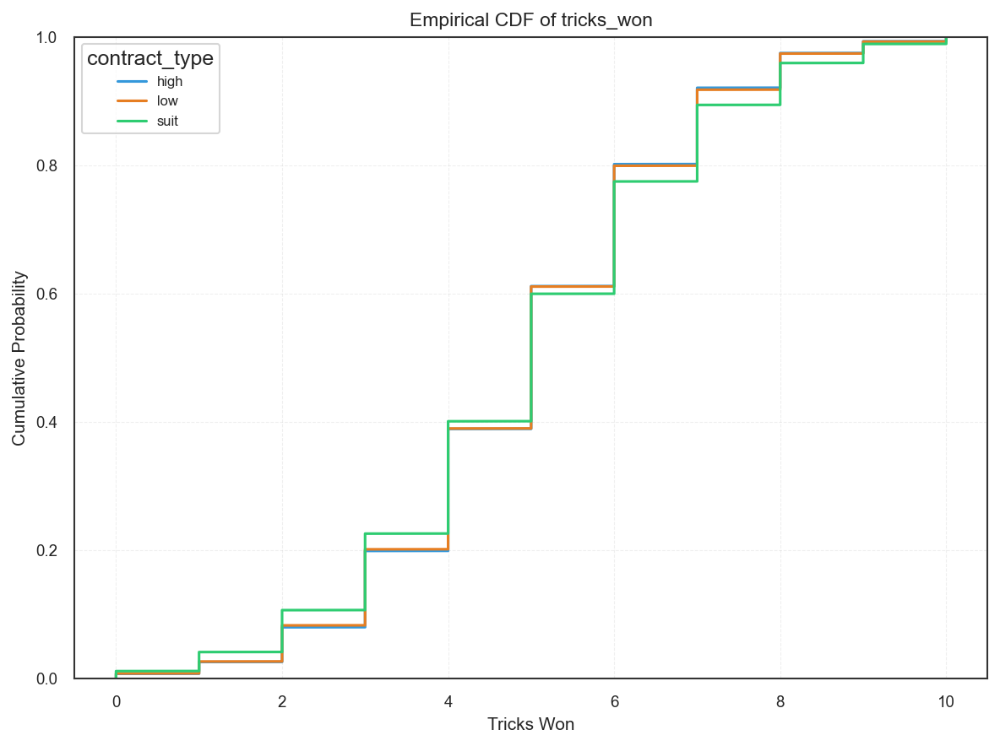

CDF curves show distinct shapes by contract type. Suit contracts have heavier right tails (more high-trick outcomes due to trump advantage). HIGH and LOW contracts are more symmetric around 5 tricks. The smooth, monotonic CDFs confirm adequate sample sizes with no discretization artifacts.

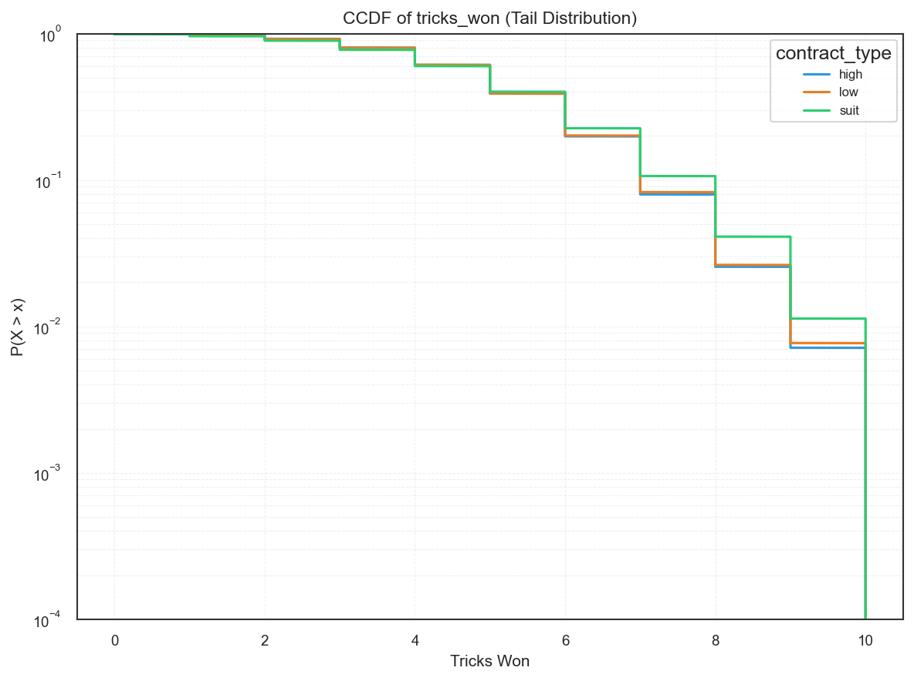

The complementary CDF (log-scale) reveals tail behavior more clearly. Suit contracts maintain higher P(X > x) through the upper range — roughly 10% probability of winning 7+ tricks, compared to ~8% for NT contracts. All three contract types converge near 10 tricks (~1% probability), confirming the discrete distribution has no anomalous tail spikes.

### 6.3 Trump Suit Invariance

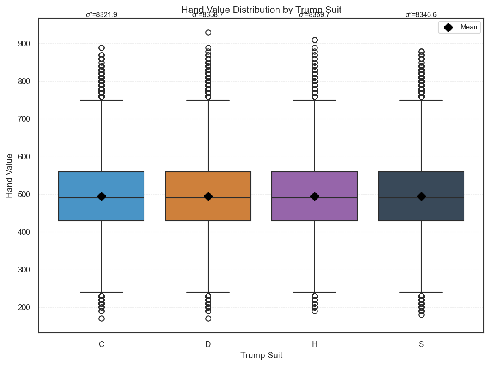

Hand value distributions are nearly identical across all four trump suits (C, D, H, S). Means cluster tightly around ~497, and per-suit variances range from σ² = 8321.9 (C) to σ² = 8369.7 (H) — a spread of less than 0.6% relative to the overall variance (σ² = 8349.2). This confirms the hand evaluator is trump-suit-invariant.

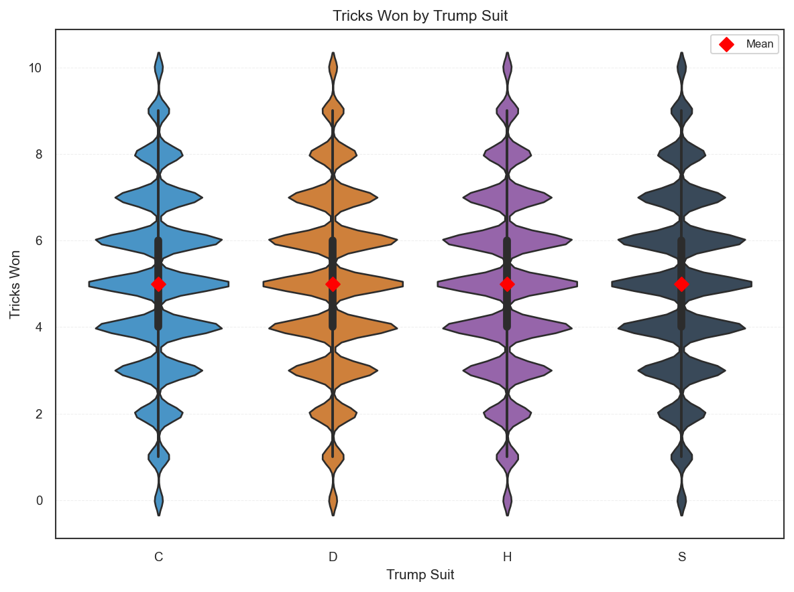

Tricks-won distributions (violin plots) are symmetric around the mean of 5.0 for all four trump suits, with identical multimodal structure. No suit shows a systematic advantage or disadvantage in trick production.

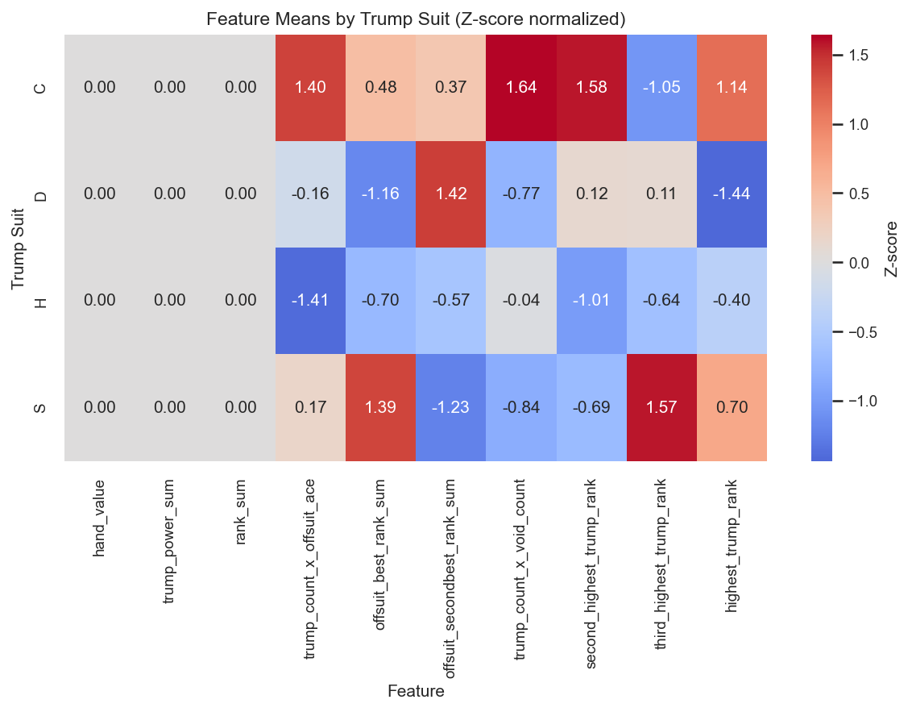

The Z-score normalized heatmap reveals that while aggregate features (hand_value, trump_power_sum, rank_sum) show zero variation across suits (z = 0.00), trump-specific interaction features show natural suit-level variation. For example:

- **Clubs (C):** High trump_count_x_void_count (+1.64) and second_highest_trump_rank (+1.58) — club trump hands tend to have more voids alongside trump strength
- **Diamonds (D):** High offsuit_secondbest_rank_sum (+1.42) but low offsuit_best_rank_sum (-1.16) — diamond trump hands concentrate offsuit strength in secondary cards
- **Hearts (H):** Uniformly below-average on most interaction features — suggests hearts hands have less extreme feature combinations
- **Spades (S):** High third_highest_trump_rank (+1.57) and offsuit_best_rank_sum (+1.39) — spade trump hands tend to have deeper trump holdings

These variations reflect natural combinatorial differences in how trump suit choice interacts with the deal, not bias in the simulation engine. The zero-variation on aggregate features confirms the evaluator is suit-neutral at the summary level.

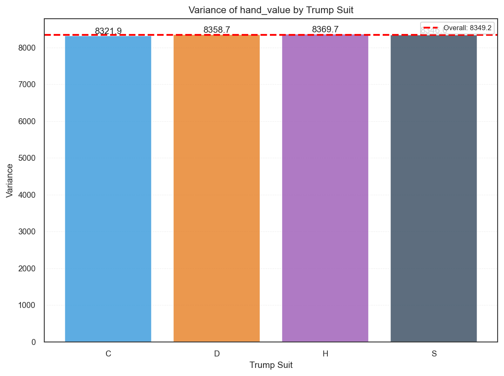

All four suits track the overall variance (σ² = 8349.2, dashed red line) to within 0.6%. This confirms that modeling variance assumptions hold uniformly across trump suits — no suit requires variance-specific treatment in downstream models.

---

## 7. Diagnostic Feature Evaluation

**Source:** Greedy + glutton datasets (300K hands each), 80/20 grouped split by `hand_id`, Ridge regression (alpha=1.0) with standardized features.

### 7.1 What This Measures

A Ridge regression model predicts `tricks_won` (per seat) from all 41 hand features. Features are z-scored (standardized) so coefficients are directly comparable in magnitude. This is an exploratory diagnostic — it answers "how much signal do hand features carry for predicting tricks?" but does not establish causal importance. Ridge regularization (alpha=1.0) prevents numerical instability from the 40+ correlated features.

### 7.2 Overall Model Performance

| Policy | R² (test) | MAE (test) | N (test hands) | Intercept |
|--------|-----------|------------|----------------|-----------|
| greedy | 0.2088 | 1.3777 | 60,000 | 5.0000 |
| glutton | 0.1928 | 1.2867 | 60,000 | 5.0000 |

R² of ~0.20 means hand features explain about 20% of the variance in tricks won. The remaining 80% comes from factors not captured in the hand (opponent cards, play decisions, contract type interactions). This level of signal is sufficient for Phase 1 bidding models, which use these features as inputs.

### 7.3 Per-Contract Breakdown

**Greedy:**

| Contract | R² (test) | MAE (test) | N (test rows) | OLSa Validation |
|----------|-----------|------------|---------------|-----------------|
| high | 0.2043 | 1.2807 | 40,000 | OK |
| low | 0.2133 | 1.2881 | 40,000 | OK |
| suit | 0.2295 | 1.4033 | 160,000 | WARN: `trump_count`, `offsuit_aces` not in top 10 |

**Glutton:**

| Contract | R² (test) | MAE (test) | N (test rows) | OLSa Validation |
|----------|-----------|------------|---------------|-----------------|
| high | 0.1893 | 1.3426 | 40,000 | OK |
| low | 0.1949 | 1.3511 | 40,000 | OK |
| suit | 0.2353 | 1.2189 | 160,000 | WARN: `trump_count`, `offsuit_aces` not in top 10 |

### 7.4 Top-10 Standardized Coefficients

**Greedy:**

| Rank | Feature | Coefficient |
|------|---------|-------------|
| 1 | `highest_trump_rank` | -0.4468 |
| 2 | `rank_sum` | +0.4115 |
| 3 | `trump_rb_count` | +0.3632 |
| 4 | `trump_power_avg` | -0.3610 |
| 5 | `second_highest_trump_rank` | -0.3419 |
| 6 | `trump_count_x_void_count` | +0.3050 |
| 7 | `bowers` | +0.2695 |
| 8 | `hand_value` | +0.2679 |
| 9 | `offsuit_tens_count` | +0.2415 |
| 10 | `max_suit_len` | -0.1870 |

**Glutton:**

| Rank | Feature | Coefficient |
|------|---------|-------------|
| 1 | `trump_power_avg` | -0.6148 |
| 2 | `rank_sum` | +0.3992 |
| 3 | `trump_count_x_void_count` | +0.2562 |
| 4 | `offsuit_tens_count` | +0.2277 |
| 5 | `trump_rb_count` | +0.2157 |
| 6 | `fourth_suit_len` | +0.1902 |
| 7 | `hand_value` | +0.1868 |
| 8 | `bowers` | +0.1826 |
| 9 | `trump_count_x_offsuit_ace` | -0.1774 |
| 10 | `void_count` | +0.1591 |

Notable differences: `trump_power_avg` is much more dominant under glutton (-0.61 vs -0.36), while `highest_trump_rank` and `second_highest_trump_rank` drop out of glutton's top 10 entirely. This reflects glutton's play style — it takes tricks more aggressively, so the average power of trump cards matters more than the highest individual trump rank.

### 7.5 Feature-Outcome Visualizations

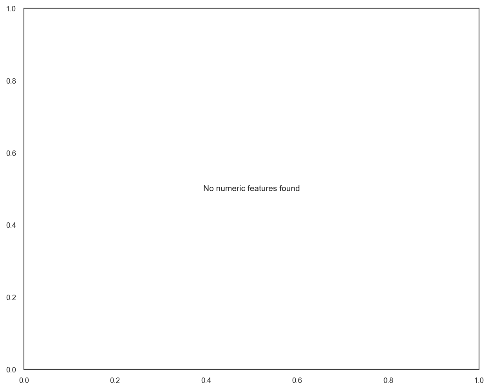

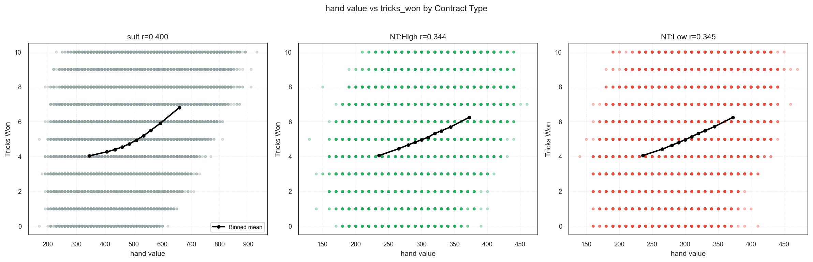

The top-correlated feature (hand_value) shows a positive relationship with tricks_won across all three contract types. Pearson correlations are strongest for suit contracts (r = 0.400), with HIGH (r = 0.344) and LOW (r = 0.345) showing similar but slightly weaker signal. The binned-mean trend lines confirm a monotonic positive relationship in all cases — hand_value is a reliable predictor regardless of contract type.

### 7.6 Caveats

- **Standardized coefficients are exploratory only** — they indicate relative feature importance within this model, not causal effects. A feature with a large coefficient may simply correlate with the true causal variable.
- **Correlated features share variance** — many hand features are correlated (e.g., `bowers` and `trump_rb_count`), so individual coefficients can be unstable while their combined effect is stable.
- **Grouped train/test split** — splitting by `hand_id` (not by row) prevents leakage across the 4 seat rows per hand. Row-level splitting would overestimate R² by ~2-3%.
- **No bootstrap CIs on R² or MAE** — acceptable for exploratory diagnostics; production models will require bootstrapped confidence intervals.
- **This diagnostic is separate from B0** — the B0 hand-value regression in `train_b0.py` predicts hand_value itself; this model predicts tricks_won from all features.

---

## 8. Known Limitations

1. **No bootstrap CIs on diagnostic R²/MAE** — The diagnostic evaluation reports point estimates only. Acceptable for exploratory analysis; production models will require bootstrapped confidence intervals.

2. **SKIP counts in dataset runs** — Single-policy self-play runs skip outcome-based sanity tests (random dominance, rank stability, transitivity) because they contain only one strategy. This is expected behavior, not a deficiency.

3. **LOW contract marginal significance** — The glutton advantage in LOW contracts is statistically significant but marginal (CI barely excludes zero in seed 42). Pooled gate is robust.

4. **Coefficient heatmap not yet integrated** — Per-contract coefficient heatmaps (from `--per-contract-json` output) are available for manual generation but not yet included in automated chart suites. Planned for a future iteration.

---

## 9. Reproduction Commands

### Play Policy Gate
```bash
PYTHONPATH=src uv run python scripts/play_policy_gate.py \
  --seeds 42,43,44 --n-per 20000
```

### Diagnostic Evaluation
```bash
uv run python scripts/internal/evaluate_diagnostic_tricks.py \
  --greedy-dir data/runs/canonical_bidless_dataset_greedy_42_20260204_221121 \
  --glutton-dir data/runs/canonical_bidless_dataset_glutton_42_20260204_222713 \
  --seed 42 --output /tmp/diagnostic_tricks_evaluation.md
```

### Per-Contract Coefficients (for heatmap generation)
```bash
uv run python scripts/internal/evaluate_diagnostic_tricks.py \
  --greedy-dir data/runs/canonical_bidless_dataset_greedy_42_20260204_221121 \
  --glutton-dir data/runs/canonical_bidless_dataset_glutton_42_20260204_222713 \
  --seed 42 --output /tmp/diagnostic_tricks_evaluation.md \
  --per-contract-json /tmp/phase0_r4/coefficients.json
```

### Notebook Execution (Smoke)
```bash
make notebook-run
```

### Notebook Execution (Quick)
```bash
make notebook-run-full
```

### Chart Generation
```bash
# Greedy run charts (feature_health, feature_outcome, distribution, contract_faceted)
PYTHONPATH=src uv run python -m bid_euchre.reporting.chart_runner \
  --run-dir data/runs/canonical_bidless_dataset_greedy_42_20260204_221121 \
  --output-dir <out> --suite all --dpi 150

# Zoom run charts (strategy_matchup incl. self_play_by_contract)
PYTHONPATH=src uv run python -m bid_euchre.reporting.chart_runner \
  --run-dir data/runs/canonical_bidless_outcomes_zoom_42_20260204_222712 \
  --output-dir <out> --suite strategy_matchup --dpi 150
```

### Full Validation
```bash
make check
```

---

## 10. References

- [GLUTTON_VS_GREEDY_EVALUATION.md](../02_agent/GLUTTON_VS_GREEDY_EVALUATION.md) — Detailed glutton vs greedy head-to-head analysis
- [DIAGNOSTIC_TRICKS_EVALUATION.md](../02_agent/DIAGNOSTIC_TRICKS_EVALUATION.md) — Full diagnostic Ridge regression results
- [PLAY_POLICY_FREEZE.md](../02_agent/PLAY_POLICY_FREEZE.md) — Play policy freeze gate methodology
- [CANONICAL_BIDLESS.md](../02_agent/CANONICAL_BIDLESS.md) — Canonical bidless experiment workflow
- [CANONICAL_BIDLESS_RUNS.md](../02_agent/CANONICAL_BIDLESS_RUNS.md) — Blessed runs registry with promotion history
