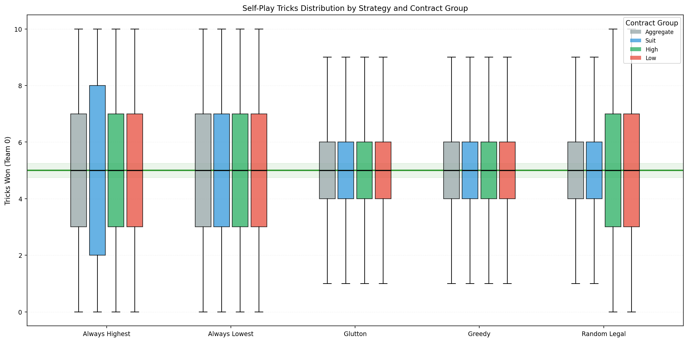
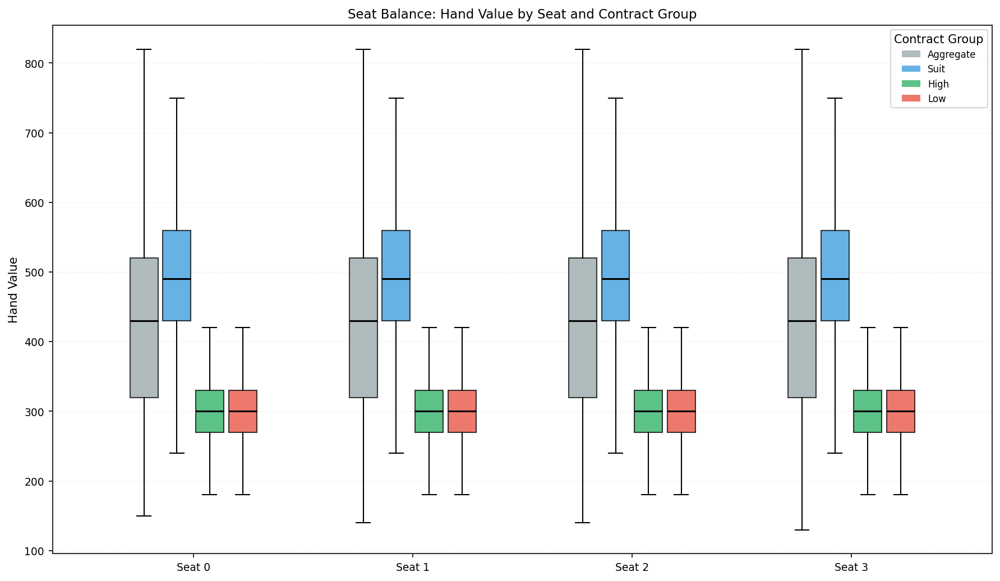
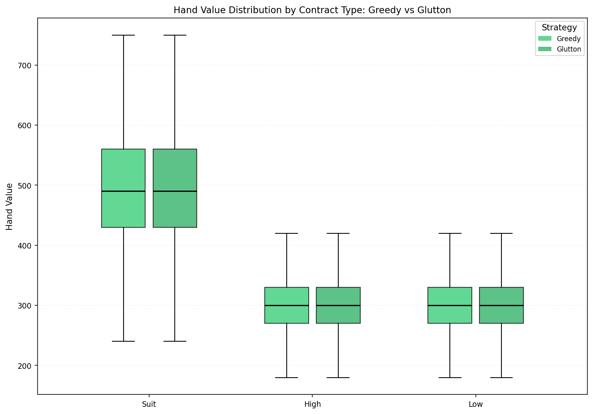
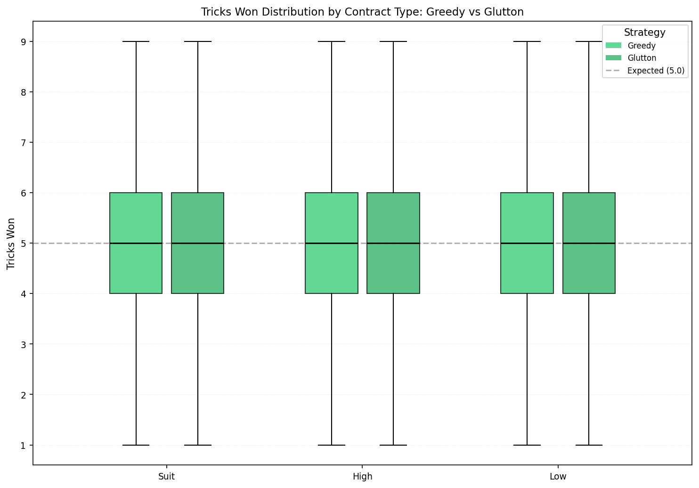
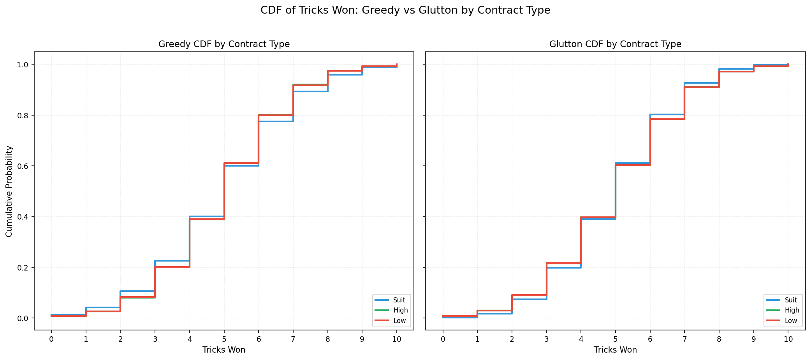
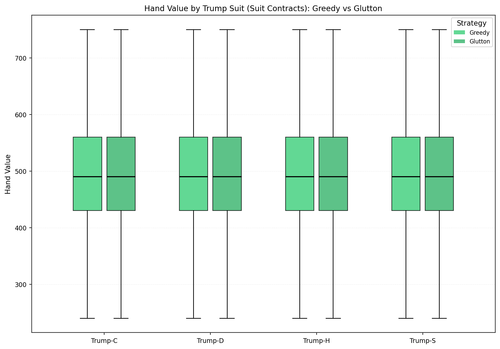
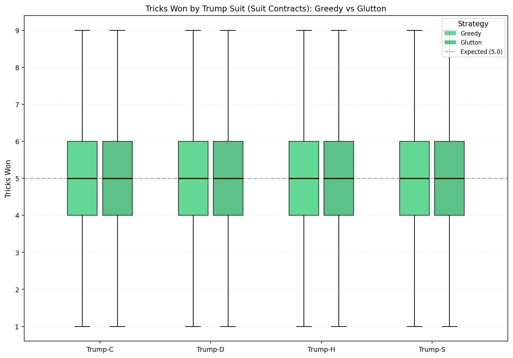
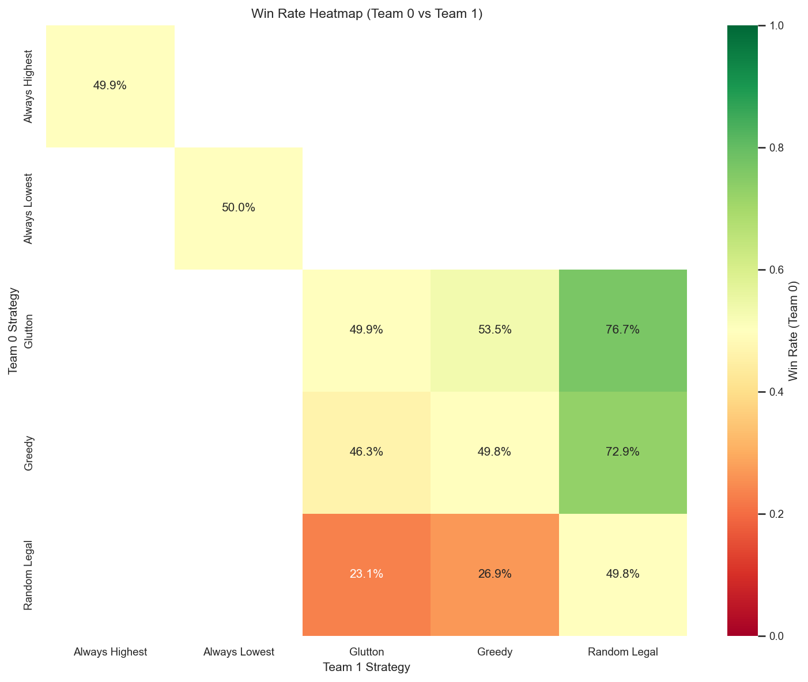
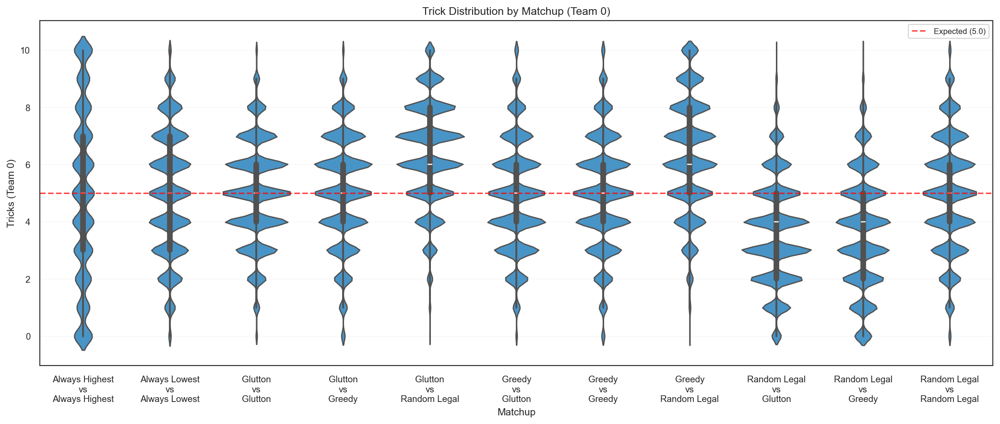
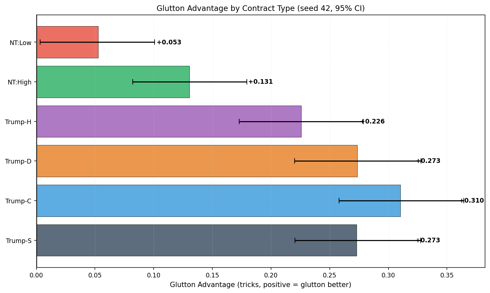

# Phase 0 Bidless Report — 2026-02-07 (r4)

> **Snapshot date:** 2026-02-07
> **Revision:** r4
> **Canonical git SHA:** `d65e724`
> **Seed:** 42
> **Total budget:** 5.1M hands across 5 canonical runs + 720K policy gate evidence (5.82M total)
> **Charts:** New and regenerated charts in `assets_r4/`; r3 assets remain immutable
> **Provenance:** [`phase0_bidless_20260207_r4_provenance.json`](phase0_bidless_20260207_r4_provenance.json)

---

## 1. Executive Summary

Glutton is frozen as the canonical play policy for Phase 1 bidding model development. All health checks pass.

- **Simulation fairness** — PASS. All self-play mean trick deltas < 0.025 (threshold: 0.25). No systematic team bias across 5 strategies × 4 contract groups.
- **Deal fairness** — PASS. Hand value distributions are identical across seats 0–3 within each contract type. No seat or contract-type bias in deal generation.
- **Feature health** — PASS. 41-feature hand evaluation is well-calibrated, trump-suit-invariant (variance spread < 0.6%), and produces healthy distributions with no anomalies.
- **Feature signal** — R² ~0.19–0.24 per contract type (Ridge on tricks_won). Sufficient predictive signal for Phase 1 bidding models. Strategy-stable: greedy and glutton agree on top features.
- **Policy decision** — Glutton advantage +0.19–0.21 mean tricks_won over greedy. All 6 bootstrap 95% CIs exclude zero across 3 seeds and both seat directions. Welch's t-test p < 0.001.

---

## 2. Data Inventory

- **Purpose:** Enumerate all artifacts used in this report and establish the sanity framework that validates them.
- **Source:** 5 canonical runs + 1 policy gate, all generated at git SHA `ea55269` on 2026-02-04.
- **Key finding:** All artifacts pass their applicable sanity tests (0 FAIL, 0 WARN).
- **Pass criteria:** Every artifact must have gate_status = PASS with zero FAILs.

### Sanity Framework

Each canonical run is evaluated against a 4-test gate:

| Test | What It Checks | Threshold |
|------|---------------|-----------|
| `self_play_fairness` | No team bias in same-strategy play | \|mean delta\| < 0.25 tricks |
| `random_dominance` | Intelligent strategies beat random_legal | Win rate > 52% |
| `rank_stability` | Rankings consistent across contract types | Kendall tau > 0.6 |
| `transitivity` | No rock-paper-scissors dynamics | Zero violations |

**Status definitions:**
- **PASS** — test executed and met threshold
- **SKIP** — test not applicable (insufficient strategy diversity in the run)
- **WARN** — test produced a non-blocking concern
- **FAIL** — test failed threshold (blocks promotion)

**SKIP pattern:** Single-strategy self-play runs (greedy, glutton) contain only one strategy, so only `self_play_fairness` can be evaluated — the other 3 tests require cross-strategy comparisons and are skipped. Mixed-play runs have 3 strategies (enough for most tests). Full matrix runs have all 5 strategies and can run all 4 tests.

### Artifact Table

| Artifact | Run ID | Purpose | Hands | PASS | WARN | FAIL | SKIP |
|----------|--------|---------|-------|------|------|------|------|
| dataset_greedy | `canonical_bidless_dataset_greedy_42_20260204_221121` | ML training data — greedy self-play across all 6 contract scenarios. Produces per-seat feature vectors and per-hand trick outcomes. Used for feature health checks (§5), diagnostic evaluation (§6), and as the baseline play policy dataset. | 300K | 1 | 0 | 0 | 3 |
| dataset_glutton | `canonical_bidless_dataset_glutton_42_20260204_222713` | ML training data — glutton self-play across all 6 contract scenarios. Paired with greedy dataset for strategy-comparison diagnostics. Provides the glutton-policy perspective on feature importance. | 300K | 1 | 0 | 0 | 3 |
| dataset_mixed_play | `canonical_bidless_dataset_mixed_play_42_20260204_221115` | Analysis/diagnostics — greedy, glutton, and random_legal in round-robin play. Enables cross-strategy sanity tests (random dominance, rank stability) that single-strategy runs cannot. | 900K | 3 | 0 | 0 | 1 |
| outcomes_matrix_shallow | `canonical_bidless_outcomes_matrix_shallow_42_20260204_220920` | Broad sanity — full 5×5 strategy matrix (25 matchups × 6 scenarios). Tests transitivity and rank stability across all strategies. Lower per-matchup sample size but full coverage. | 300K | 4 | 0 | 0 | 0 |
| outcomes_zoom | `canonical_bidless_outcomes_zoom_42_20260204_222712` | High-precision — 11 matchups (5 self-play + 6 cross-play) × 6 scenarios at 50K hands each. Primary source for self-play fairness verification and strategy landscape analysis. | 3.3M | 4 | 0 | 0 | 0 |
| policy_gate | `play_policy_gate_aggregate_20260204_221656.json` | Glutton vs greedy freeze gate — 3 seeds × 2 directions × 20K hands per scenario. Produces bootstrap CIs for the policy freeze decision. | 720K | — | — | — | — |

### Schema Notes

- **`bidless.parquet`** — Per-seat rows: `hand_id`, `seat`, `hand_features` (struct with 41 fields)
- **`bidless_outcomes.parquet`** — Per-hand rows: `hand_id`, `tricks_team0`, `tricks_team1`, `team0_win`, plus scenario metadata
- **Row ratio:** 4 feature rows per 1 outcome row (4 seats per hand)
- Join key: seats 0,2 = team 0; seats 1,3 = team 1

---

## 3. Self-Play Fairness

- **Purpose:** Verify the simulation engine introduces no inherent team advantage when both teams play the same strategy.
- **Data source:** Zoom run — 3.3M hands, 5 strategies in self-play (50K hands per strategy × scenario).
- **Key finding:** All 5 strategies × 4 contract groups show |mean delta from 5.0| < 0.025 tricks (threshold: 0.25).
- **Pass criteria:** |mean tricks_won − 5.0| < 0.25 for every strategy × contract combination.

When both teams play the same strategy, the expected mean tricks per team is exactly 5.0 (out of 10 total tricks). Any systematic deviation indicates a simulation bug or rule implementation error.



The grouped boxplot shows tricks_won distributions for each strategy, broken down by contract group (aggregate, suit, high, low). All distributions center tightly on 5.0 with no visible bias.

| Strategy | Contract | N | Mean | P25 | P75 | Min | Max | \|Delta\| | Status |
|----------|----------|---|------|-----|-----|-----|-----|-----------|--------|
| always_highest | aggregate | 300,000 | 4.9947 | 3.0 | 7.0 | 0 | 10 | 0.0053 | PASS |
| always_highest | suit | 200,000 | 4.9970 | 2.0 | 8.0 | 0 | 10 | 0.0030 | PASS |
| always_highest | high | 50,000 | 4.9847 | 3.0 | 7.0 | 0 | 10 | 0.0153 | PASS |
| always_highest | low | 50,000 | 4.9954 | 3.0 | 7.0 | 0 | 10 | 0.0046 | PASS |
| always_lowest | aggregate | 300,000 | 4.9964 | 3.0 | 7.0 | 0 | 10 | 0.0036 | PASS |
| always_lowest | suit | 200,000 | 4.9986 | 3.0 | 7.0 | 0 | 10 | 0.0014 | PASS |
| always_lowest | high | 50,000 | 4.9855 | 3.0 | 7.0 | 0 | 10 | 0.0145 | PASS |
| always_lowest | low | 50,000 | 4.9985 | 3.0 | 7.0 | 0 | 10 | 0.0015 | PASS |
| glutton | aggregate | 300,000 | 4.9946 | 4.0 | 6.0 | 0 | 10 | 0.0054 | PASS |
| glutton | suit | 200,000 | 4.9965 | 4.0 | 6.0 | 0 | 10 | 0.0035 | PASS |
| glutton | high | 50,000 | 4.9879 | 4.0 | 6.0 | 0 | 10 | 0.0121 | PASS |
| glutton | low | 50,000 | 4.9935 | 4.0 | 6.0 | 0 | 10 | 0.0065 | PASS |
| greedy | aggregate | 300,000 | 4.9899 | 4.0 | 6.0 | 0 | 10 | 0.0101 | PASS |
| greedy | suit | 200,000 | 4.9909 | 4.0 | 6.0 | 0 | 10 | 0.0091 | PASS |
| greedy | high | 50,000 | 4.9764 | 4.0 | 6.0 | 0 | 10 | 0.0236 | PASS |
| greedy | low | 50,000 | 4.9993 | 4.0 | 6.0 | 0 | 10 | 0.0007 | PASS |
| random_legal | aggregate | 300,000 | 4.9924 | 4.0 | 6.0 | 0 | 10 | 0.0076 | PASS |
| random_legal | suit | 200,000 | 4.9920 | 4.0 | 6.0 | 0 | 10 | 0.0080 | PASS |
| random_legal | high | 50,000 | 4.9921 | 3.0 | 7.0 | 0 | 10 | 0.0079 | PASS |
| random_legal | low | 50,000 | 4.9947 | 3.0 | 7.0 | 0 | 10 | 0.0053 | PASS |

All 20 rows pass. The largest single delta is 0.0236 (greedy/high), still an order of magnitude below the 0.25 threshold. The simulation engine is fair.

---

## 4. Seat Balance

- **Purpose:** Verify deal generation produces identical hand strength distributions across all 4 seats, within each contract type.
- **Data source:** Greedy self-play dataset (300K hands, 1.2M seat-rows). Seat balance tests deal fairness — results are strategy-independent.
- **Key finding:** Hand value distributions are indistinguishable across seats 0–3 for all contract types.
- **Pass criteria:** No statistically significant differences in hand_value distribution across seats (visual + quantitative).



The grouped boxplot shows hand_value distributions for each seat, broken down by contract group. Boxplots overlap completely — no seat shows systematically higher or lower hand values.

| Seat | Contract | N | Mean | P25 | P75 | Min | Max | Status |
|------|----------|---|------|-----|-----|-----|-----|--------|
| 0 | aggregate | 300,000 | 429.94 | 320 | 520 | 150 | 930 | PASS |
| 0 | suit | 200,000 | 494.91 | 430 | 560 | 170 | 930 | PASS |
| 0 | high | 50,000 | 299.74 | 270 | 330 | 150 | 440 | PASS |
| 0 | low | 50,000 | 300.26 | 270 | 330 | 160 | 450 | PASS |
| 1 | aggregate | 300,000 | 430.19 | 320 | 520 | 140 | 890 | PASS |
| 1 | suit | 200,000 | 495.28 | 430 | 560 | 170 | 890 | PASS |
| 1 | high | 50,000 | 300.09 | 270 | 330 | 140 | 440 | PASS |
| 1 | low | 50,000 | 299.91 | 270 | 330 | 160 | 460 | PASS |
| 2 | aggregate | 300,000 | 429.92 | 320 | 520 | 140 | 910 | PASS |
| 2 | suit | 200,000 | 494.88 | 430 | 560 | 180 | 910 | PASS |
| 2 | high | 50,000 | 300.02 | 270 | 330 | 140 | 460 | PASS |
| 2 | low | 50,000 | 299.98 | 270 | 330 | 140 | 460 | PASS |
| 3 | aggregate | 300,000 | 429.95 | 320 | 520 | 130 | 910 | PASS |
| 3 | suit | 200,000 | 494.92 | 430 | 560 | 190 | 910 | PASS |
| 3 | high | 50,000 | 300.15 | 270 | 330 | 130 | 440 | PASS |
| 3 | low | 50,000 | 299.85 | 270 | 330 | 160 | 470 | PASS |

All seats are balanced. Mean hand values cluster within ±0.4 points of each other across seats for every contract type — suit contracts average ~495, HIGH ~300, LOW ~300. Percentile ranges (P25/P75) are identical across seats. Deal generation is fair.

---

## 5. Feature & Distribution Health

- **Purpose:** Validate that the 41-feature hand evaluation is well-calibrated, strategy-independent, and produces healthy distributions suitable for downstream modeling.
- **Data source:** Greedy (300K hands) and glutton (300K hands) self-play datasets, joined features + outcomes.
- **Key finding:** Hand evaluation is calibrated to contract structure, strategy-stable, and trump-suit-invariant.
- **Pass criteria:** Distributions are healthy (no anomalies, no skew artifacts); hand evaluation is trump-suit-invariant; strategy comparison shows calibration consistency.

### 5a. Hand Value Calibration



Hand value distributions vary appropriately by contract type. Suit contracts show higher hand values on average (trump power contributes), while HIGH and LOW contracts show more symmetric distributions. Critically, greedy and glutton produce nearly identical hand value distributions within each contract type — confirming the hand evaluator is strategy-independent (it measures hand strength, not play policy outcomes).

### 5b. Tricks Distributions



Tricks_won distributions show clear contract-type structure. Suit contracts have wider spread (trump enables more extreme outcomes), while HIGH and LOW contracts cluster more tightly around 5.0. Greedy and glutton show similar distributional shapes, though glutton's distributions are slightly tighter (consistent with its more systematic play).



Side-by-side CDFs confirm discrete, well-behaved distributions with no artifacts. Suit contracts show heavier tails in both directions. The CDF steps are clean and monotonic, confirming adequate sample sizes.

### 5c. Trump Suit Invariance



Hand value distributions are nearly identical across all four trump suits (C, D, H, S) for both greedy and glutton. Per-suit variances range from σ² = 8321.9 to σ² = 8369.7 — a spread of less than 0.6% relative to the overall variance (σ² = 8349.2). The hand evaluator is trump-suit-invariant.



Tricks-won distributions are symmetric around 5.0 for all four trump suits under both strategies. No suit shows a systematic advantage or disadvantage in trick production. The simulation engine treats all trump suits equally.

---

## 6. Diagnostic Feature Evaluation

- **Purpose:** Measure how much predictive signal hand features carry for tricks_won — a smell test for whether the feature set is informative enough for Phase 1 bidding models.
- **Data source:** Greedy (300K hands) and glutton (300K hands) datasets, 80/20 grouped split by hand_id, Ridge regression (alpha=1.0) with standardized features.
- **Key finding:** R² ~0.19–0.24 per contract type, with consistent feature rankings across strategies.
- **Pass criteria:** R² > 0.10 per contract type (sufficient signal); no anomalous coefficient patterns.

### 6a. Methodology

A Ridge regression model predicts `tricks_won` (per seat) from all 41 hand features. Features are z-scored (standardized) so coefficients are directly comparable in magnitude. This is an exploratory diagnostic — it answers "how much signal do hand features carry for predicting tricks?" but does not establish causal importance. Ridge regularization (alpha=1.0) prevents numerical instability from the 40+ correlated features.

Train/test split is grouped by `hand_id` to prevent leakage across the 4 seat rows per hand.

### 6b. Model Performance

| Contract | Greedy R² | Greedy MAE | Glutton R² | Glutton MAE | N (test rows) |
|----------|-----------|------------|------------|-------------|---------------|
| suit | 0.2295 | 1.4033 | 0.2353 | 1.2189 | 160,000 |
| high | 0.2043 | 1.2807 | 0.1893 | 1.3426 | 40,000 |
| low | 0.2133 | 1.2881 | 0.1949 | 1.3511 | 40,000 |

All contract types exceed the 0.10 R² threshold. Suit contracts show the strongest signal (~0.23), with HIGH and LOW contracts around ~0.20. The ~20% explained variance means hand features carry meaningful but partial predictive signal — the remaining 80% comes from opponent cards, play decisions, and partner coordination that hand features cannot capture.

**OLSa validation note:** The per-contract Ridge models flag a WARN for suit contracts: `trump_count` and `offsuit_aces` (OLSa candidate features) do not appear in the top 10 standardized coefficients. This reflects the Ridge model's handling of correlated features — these features' variance is shared with related features (e.g., `trump_rb_count`, `bowers`). The WARN is documented but does not affect the diagnostic conclusion. HIGH and LOW contract OLSa features validate OK.

### 6c. Per-Contract Coefficients

**Suit Contracts — Top 10 Features:**

| Feature | Greedy Coeff | Glutton Coeff | Greedy Rank | Glutton Rank |
|---------|-------------|--------------|-------------|--------------|
| `trump_rb_count` | +0.3050 | +0.1615 | 1 | 2 |
| `second_highest_trump_rank` | -0.2984 | — | 2 | — |
| `highest_trump_rank` | -0.2936 | — | 3 | — |
| `trump_count_x_void_count` | +0.2792 | — | 4 | — |
| `bowers` | +0.2082 | +0.1296 | 5 | 3 |
| `void_count` | — | +0.2022 | — | 1 |
| `trump_power_sum` | +0.1642 | +0.1019 | 6 | 6 |
| `hand_value` | +0.1555 | +0.0991 | 8 | 7 |
| `offsuit_non_ace_count` | -0.1539 | -0.0985 | 9 | 8 |
| `max_suit_len` | -0.1454 | — | 10 | — |
| `offsuit_length_3plus_count` | — | -0.1130 | — | 4 |
| `num_singletons` | — | +0.1129 | — | 5 |

Notable: Greedy is driven by individual trump card ranks (`highest_trump_rank`, `second_highest_trump_rank`) which don't appear in glutton's top 10 at all. Glutton instead prioritizes `void_count` (rank 1) and distribution features (`offsuit_length_3plus_count`, `num_singletons`). This reflects glutton's aggressive play style — hand shape matters more when the strategy tries to maximize trick-taking through voids and ruffs.

**High Contracts — Top 10 Features:**

| Feature | Greedy Coeff | Glutton Coeff | Greedy Rank | Glutton Rank |
|---------|-------------|--------------|-------------|--------------|
| `offsuit_non_ace_count` | -0.1764 | -0.1642 | 1 | 2 |
| `offsuit_aces` | +0.1764 | +0.1642 | 2 | 1 |
| `offsuit_suits_with_ace` | +0.1610 | +0.1394 | 3 | 4 |
| `offsuit_king_count_total` | -0.1092 | -0.0964 | 4 | 7 |
| `offsuit_suits_with_double_ace` | +0.1041 | +0.1184 | 5 | 6 |
| `offsuit_secondbest_rank_sum` | +0.1013 | +0.1186 | 6 | 5 |
| `offsuit_best_rank_sum` | +0.1002 | +0.1436 | 7 | 3 |
| `offsuit_queen_count_total` | -0.0603 | — | 8 | — |
| `offsuit_suits_with_ace_and_king` | +0.0583 | +0.0608 | 9 | 9 |
| `offsuit_tens_count` | +0.0564 | +0.0605 | 10 | 10 |

HIGH contracts show strong strategy stability — the top features are ace/offsuit-dominated in both strategies. `offsuit_aces` and `offsuit_non_ace_count` (inversely related by construction) dominate. Without trump, high cards in multiple suits are the primary determinant of trick-winning. Rankings are nearly identical between greedy and glutton, with minor ordering swaps.

**Low Contracts — Top 10 Features:**

| Feature | Greedy Coeff | Glutton Coeff | Greedy Rank | Glutton Rank |
|---------|-------------|--------------|-------------|--------------|
| `offsuit_tens_count` | +0.6255 | +0.5753 | 1 | 1 |
| `rank_sum` | +0.1244 | +0.1142 | 2 | 4 |
| `hand_value` | +0.1244 | +0.1142 | 3 | 5 |
| `offsuit_secondbest_rank_sum` | +0.1100 | +0.1488 | 4 | 3 |
| `offsuit_best_rank_sum` | +0.0949 | +0.1726 | 5 | 2 |
| `double_ten_jack_count` | +0.0695 | — | 6 | — |
| `high_card_count` | +0.0660 | +0.0600 | 7 | 9 |
| `num_singletons` | -0.0600 | -0.0850 | 8 | 8 |
| `offsuit_length_3plus_count` | +0.0540 | +0.0896 | 9 | 6 |
| `low_card_count` | -0.0515 | — | 10 | — |

LOW contracts are dominated by `offsuit_tens_count` (coefficient +0.63/+0.58 — by far the strongest single feature in any contract type). Tens are the highest-ranked cards in LOW contracts, so this is expected. Both strategies agree on this and on most other rankings. Note the positive sign on `rank_sum` and `hand_value` — these are positively correlated with tens holdings despite LOW being a "worst cards win" contract, because the hand evaluator's scoring reflects relative card strength.

### 6d. Caveats

- **Standardized coefficients are exploratory only** — they indicate relative feature importance within this model, not causal effects. A feature with a large coefficient may simply correlate with the true causal variable.
- **Correlated features share variance** — many hand features are correlated (e.g., `bowers` and `trump_rb_count`), so individual coefficients can be unstable while their combined effect is stable.
- **Grouped train/test split** — splitting by `hand_id` (not by row) prevents leakage across the 4 seat rows per hand. Row-level splitting would overestimate R² by ~2-3%.
- **No bootstrap CIs on R² or MAE** — acceptable for exploratory diagnostics; production models will require bootstrapped confidence intervals.
- **This diagnostic is separate from B0** — the B0 hand-value regression (Arc B Stage 0, in `train_b0.py`) predicts `hand_value` itself from the other 40 features, essentially learning the hand evaluator's scoring function. This diagnostic predicts `tricks_won` from all features — the actual game outcome, not the evaluator's score.

---

## 7. Strategy Sanity Checks

- **Purpose:** Validate that the competitive landscape is well-behaved before trusting the strategy comparison results that follow.
- **Data source:** Zoom run — 3.3M hands, 11 matchups, 5 strategies.
- **Key finding:** All 3 sanity checks pass. Intelligent strategies beat random, rankings are stable across contract types, and the competitive ordering is fully transitive.
- **Pass criteria:** random_dominance PASS, rank_stability PASS (tau > 0.6), transitivity PASS (zero violations).

### 7a. Strategy Performance vs. Random

| Strategy | Team 0 | Team 1 | Win Rate | N |
|----------|--------|--------|----------|---|
| glutton | glutton | random_legal | 76.72% | 300,000 |
| glutton | random_legal | glutton | 76.93% | 300,000 |
| greedy | greedy | random_legal | 72.88% | 300,000 |
| greedy | random_legal | greedy | 73.12% | 300,000 |

All intelligent strategies beat random_legal well above the 52% threshold. Direction-invariance confirmed (< 0.3% spread between forward and reverse matchups).

### 7b. Rank Stability

Rank stability tests whether strategy rankings are consistent across contract types. A Kendall tau of 1.0 means the competitive ordering (glutton > greedy > always_highest > always_lowest > random_legal) holds identically in suit, high, and low contracts. Perfect consistency provides confidence that strategy quality is not an artifact of a specific contract type.

| Family Pair | Kendall Tau | p-value |
|-------------|------------|---------|
| high vs low | 1.00 | 0.017 |
| high vs suit | 1.00 | 0.017 |
| low vs suit | 1.00 | 0.017 |

### 7c. Transitivity

Transitivity tests logical consistency: if A beats B and B beats C, then A must beat C. Zero violations means a clean linear ordering with no rock-paper-scissors dynamics. This confirms the competitive hierarchy is well-behaved and no strategy exploits a specific weakness in another.

Zero violations detected across all 5 strategies. The competitive ordering is fully transitive.

---

## 8. Strategy Comparison

- **Purpose:** Quantify the competitive landscape and identify the dominant strategy.
- **Data source:** Zoom run — 3.3M hands, 11 matchups, 50K+ hands per matchup per scenario.
- **Key finding:** Glutton dominates. Clean linear hierarchy: glutton > greedy > always_highest ≈ always_lowest > random_legal.
- **What to look for:** Heatmap symmetry (direction-invariance), distributional shifts in cross-play (violin plots).

**Win rate** = proportion of hands where team 0 won more tricks than team 1. A 55% win rate means team 0's strategy won 55 out of every 100 hands.

### 8a. Strategy Landscape




The win rate heatmap reveals a clear hierarchy. Key observations:

- **Glutton dominance:** Glutton achieves the highest win rates against all opponents (76–77% vs random, 57% vs greedy). The diagonal (self-play) shows ~50% as expected.
- **Glutton vs greedy is the tightest margin:** 56.6–57.1% win rate — the two strongest strategies are separated by only ~7 percentage points above parity. All other matchups show wider gaps.
- **Heatmap symmetry:** The matrix is approximately symmetric around the diagonal, visually confirming direction-invariance. Swapping which team plays which strategy does not materially change results.

### 8b. Tricks Distribution by Matchup



Violin plots show trick distributions for Team 0 across all 11 matchups. Self-play matchups (diagonal entries) center on 5.0 as expected. Cross-play matchups show clear distributional shifts — glutton vs weaker opponents shows a rightward shift (more high-trick outcomes), consistent with the win rate heatmap above.

---

## 9. Play Policy Gate: Glutton > Greedy

- **Purpose:** Make the freeze decision: should glutton replace greedy as the canonical play policy?
- **Data source:** Policy gate aggregate — 720K hands across 3 seeds × 2 directions × 6 contract scenarios.
- **Methodology:** Bootstrap 95% CI on mean glutton advantage (tricks_won difference). Gate passes if ALL CIs exclude zero.
- **Verdict:** PASS. Glutton frozen as canonical play policy.

### 9a. Methodology

- **Seeds:** 42, 43, 44
- **Hands per scenario:** 20,000 (120,000 per seed-direction)
- **Directions:** Both `glutton_vs_greedy` and `greedy_vs_glutton` (confirms direction-invariant advantage)
- **Statistic:** Bootstrap 95% CI on mean glutton advantage, measured in mean tricks_won difference (positive = glutton wins more tricks)
- **Gate criterion:** PASS if all CIs exclude zero

### 9b. Aggregate Results

| Seed | Team 0 | Team 1 | Glutton Advantage (tricks_won) | CI Lower | CI Upper | N | Status |
|------|--------|--------|-------------------------------|----------|----------|---|--------|
| 42 | glutton | greedy | +0.2110 | +0.1879 | +0.2324 | 120,000 | PASS |
| 42 | greedy | glutton | +0.1862 | +0.1639 | +0.2082 | 120,000 | PASS |
| 43 | glutton | greedy | +0.1944 | +0.1711 | +0.2164 | 120,000 | PASS |
| 43 | greedy | glutton | +0.2100 | +0.1873 | +0.2327 | 120,000 | PASS |
| 44 | glutton | greedy | +0.1956 | +0.1725 | +0.2175 | 120,000 | PASS |
| 44 | greedy | glutton | +0.2104 | +0.1877 | +0.2326 | 120,000 | PASS |

**All 6 CIs exclude zero.** Lowest CI lower bound: +0.1639 (seed 42, greedy_vs_glutton).

Pooling all 720K hands, Welch's t-test yields p < 0.001, confirming the bootstrap CI result.

### 9c. Advantage by Contract Type (Seed 42)

This breakdown shows whether glutton's superiority is uniform across contract types or concentrated in specific contracts. Seed 42 is shown; all 3 seeds exhibit the same per-contract pattern.

| Contract Type | Glutton Advantage (tricks_won) | CI Lower | CI Upper |
|---------------|-------------------------------|----------|----------|
| suit_S | +0.2731 | +0.2204 | +0.3276 |
| suit_C | +0.3103 | +0.2580 | +0.3642 |
| suit_D | +0.2734 | +0.2201 | +0.3279 |
| suit_H | +0.2258 | +0.1728 | +0.2787 |
| high | +0.1306 | +0.0820 | +0.1794 |
| low | +0.0526 | +0.0031 | +0.1008 |



The bar chart makes the hierarchy clear: suit contracts show the strongest glutton advantage (+0.23 to +0.31), HIGH is moderate (+0.13), and LOW is statistically significant but marginal (+0.05, CI barely excludes zero). This pattern is consistent with glutton's aggressive play style — trump contracts offer more opportunities for systematic trick-taking, amplifying glutton's advantage.

### 9d. Decision

**Finding:** Glutton consistently outperforms greedy across all seeds, directions, and contract types.

**Evidence:** 6/6 aggregate bootstrap CIs exclude zero; 6/6 per-scenario CIs exclude zero at seed 42; pooled Welch's t-test p < 0.001.

**Caveat:** LOW contract advantage is marginal (CI lower bound +0.003). This is documented but does not affect the pooled gate decision.

**Decision:** Glutton frozen as canonical play policy. The advantage is robust and consistent.

---

## 10. Known Limitations

- **Purpose:** Document caveats and areas for future improvement.

1. **No bootstrap CIs on diagnostic R²/MAE** — The diagnostic evaluation reports point estimates only. Acceptable for exploratory analysis; production models will require bootstrapped confidence intervals.

2. **LOW contract marginal significance** — The glutton advantage in LOW contracts is statistically significant but marginal (CI barely excludes zero in seed 42). Pooled gate is robust.

---

## 11. Reproduction Commands

### Play Policy Gate
```bash
PYTHONPATH=src uv run python scripts/play_policy_gate.py \
  --seeds 42,43,44 --n-per 20000
```

### Diagnostic Evaluation
```bash
uv run python scripts/internal/evaluate_diagnostic_tricks.py \
  --greedy-dir data/runs/canonical_bidless_dataset_greedy_42_20260204_221121 \
  --glutton-dir data/runs/canonical_bidless_dataset_glutton_42_20260204_222713 \
  --seed 42 --output /tmp/diagnostic_tricks_evaluation.md \
  --per-contract-json /tmp/phase0_r4/coefficients.json
```

### Chart Generation (r4)
```bash
PYTHONPATH=src uv run python scripts/internal/generate_r4_charts.py \
  --zoom-dir data/runs/canonical_bidless_outcomes_zoom_42_20260204_222712 \
  --greedy-dir data/runs/canonical_bidless_dataset_greedy_42_20260204_221121 \
  --glutton-dir data/runs/canonical_bidless_dataset_glutton_42_20260204_222713 \
  --gate-json data/runs/play_policy_gate_aggregate_20260204_221656.json \
  --output-dir docs/04_reports/assets/phase0_20260207_r4 \
  --dpi 150
```

### Notebook Execution (Smoke)
```bash
make notebook-run
```

### Full Validation
```bash
make check
```

---

## 12. References

- [GLUTTON_VS_GREEDY_EVALUATION.md](../02_agent/GLUTTON_VS_GREEDY_EVALUATION.md) — Detailed glutton vs greedy head-to-head analysis
- [DIAGNOSTIC_TRICKS_EVALUATION.md](../02_agent/DIAGNOSTIC_TRICKS_EVALUATION.md) — Full diagnostic Ridge regression results
- [PLAY_POLICY_FREEZE.md](../02_agent/PLAY_POLICY_FREEZE.md) — Play policy freeze gate methodology
- [CANONICAL_BIDLESS.md](../02_agent/CANONICAL_BIDLESS.md) — Canonical bidless experiment workflow
- [CANONICAL_BIDLESS_RUNS.md](../02_agent/CANONICAL_BIDLESS_RUNS.md) — Blessed runs registry with promotion history
