# Rung Results Report

Generated from canonical CSV tables and chart PNGs.

## Dashboards

### Chart 1. Competitive Dashboard

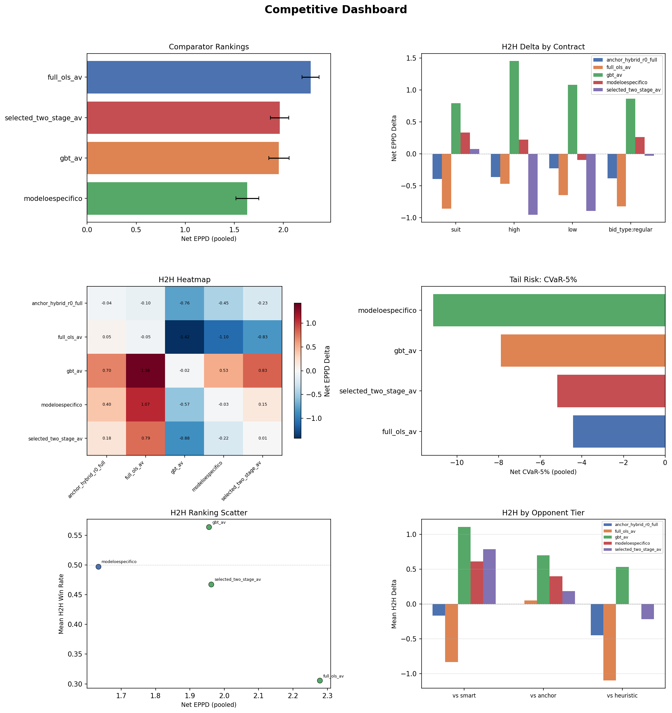

### Chart 2. Health Dashboard

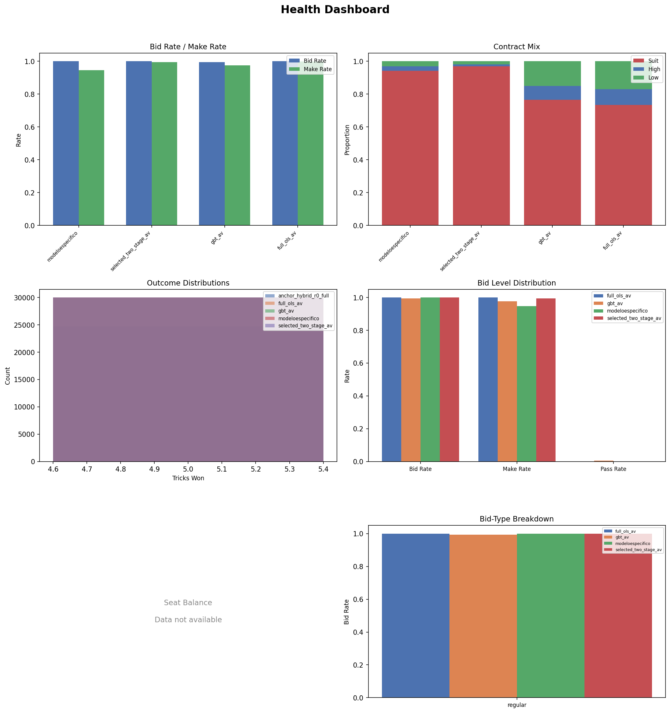

### Chart 3. Model Evaluation Dashboard

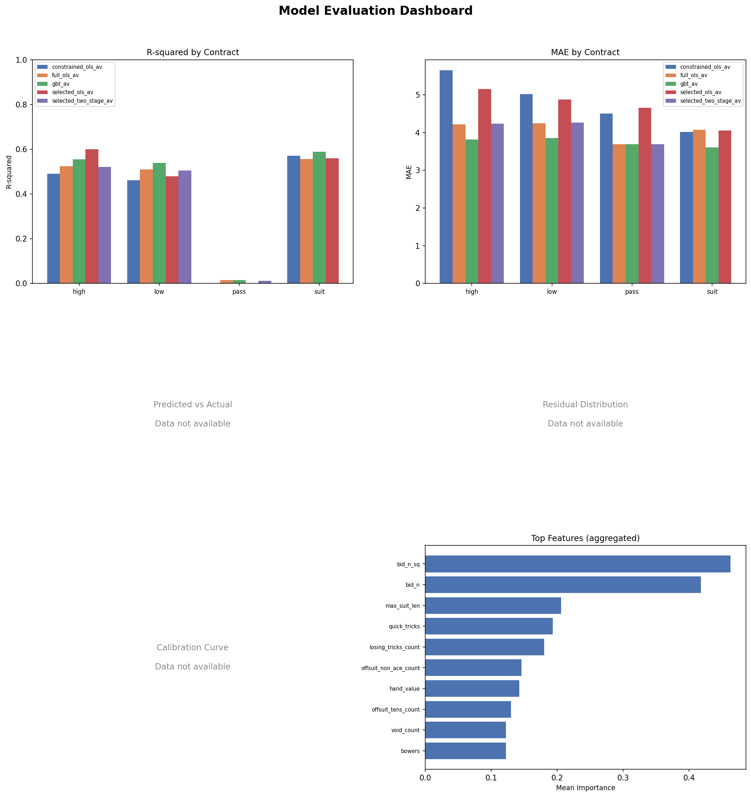

## 1. Data Sanity

| check_name | scope | value | threshold | status | detail |
| --- | --- | --- | --- | --- | --- |
| h2h_cells_populated | h2h | 25.0000 | 25.0000 | PASS | 25/25 cells have metrics |
| h2h_min_deals | h2h | 30000.0000 | 10.0000 | PASS | Minimum deals across cells: 30000 |
| comparator_bidders_present | comparator | 4.0000 | 2.0000 | PASS | 4 bidders in comparator |
| r2_positive_constrained_ols_av_suit | training | 0.5706 | 0.0000 | PASS | constrained_ols_av suit R²=0.5706 |
| r2_positive_constrained_ols_av_high | training | 0.4910 | 0.0000 | PASS | constrained_ols_av high R²=0.4910 |
| r2_positive_constrained_ols_av_low | training | 0.4609 | 0.0000 | PASS | constrained_ols_av low R²=0.4609 |
| r2_positive_constrained_ols_av_pass | training | -0.0238 | 0.0000 | WARN | constrained_ols_av pass R²=-0.0238 |
| r2_positive_full_ols_av_high | training | 0.5248 | 0.0000 | PASS | full_ols_av high R²=0.5248 |
| r2_positive_full_ols_av_low | training | 0.5092 | 0.0000 | PASS | full_ols_av low R²=0.5092 |
| r2_positive_full_ols_av_pass | training | 0.0147 | 0.0000 | PASS | full_ols_av pass R²=0.0147 |

*Full table omitted from markdown — see `tables/data_sanity.csv`*

## 2. Offline Model Performance

| model | contract | r_squared | mae | n_train | n_val |
| --- | --- | --- | --- | --- | --- |
| constrained_ols_av | suit | 0.5706 | 4.0174 | 2340 | 228 |
| constrained_ols_av | high | 0.4910 | 5.6478 | 585 | 57 |
| constrained_ols_av | low | 0.4609 | 5.0205 | 585 | 57 |
| constrained_ols_av | pass | -0.0238 | 4.5000 | 80 | 8 |
| full_ols_av | high | 0.5248 | 4.2199 | 1229966 | 153083 |
| full_ols_av | low | 0.5092 | 4.2467 | 1229966 | 153083 |
| full_ols_av | pass | 0.0147 | 3.6858 | 160000 | 20000 |
| full_ols_av | suit | 0.5563 | 4.0760 | 4919864 | 612332 |
| gbt_av | high | 0.5541 | 3.8115 | 1229966 | 153083 |
| gbt_av | low | 0.5389 | 3.8555 | 1229966 | 153083 |

*Full table omitted from markdown — see `tables/model_performance.csv`*

### Chart 14. R-squared by Contract

### Chart 15. MAE by Contract

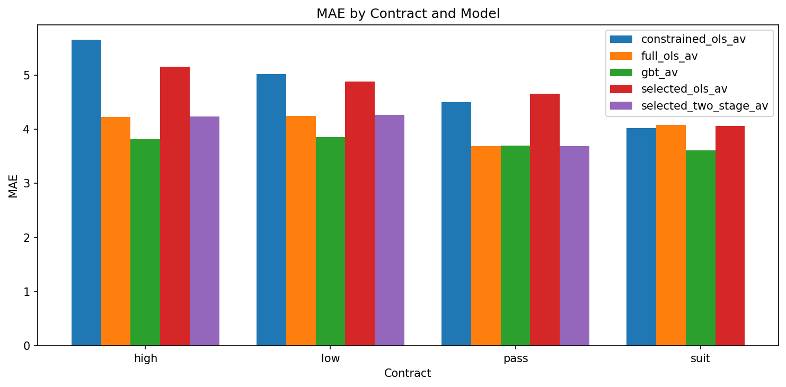

## 3. Offline Diagnostics

### Chart 16. Predicted vs Actual

*Chart not available — source data absent.*

### Chart 17. Residual Distribution

*Chart not available — source data absent.*

### Chart 18. Calibration Curve

*Chart not available — source data absent.*

### Chart 20. Feature Importance

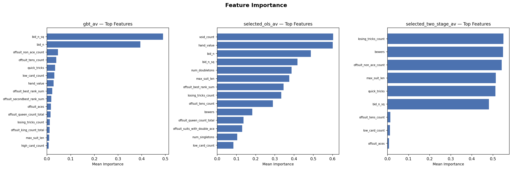

## 4. Model Interpretability

### Chart 19. Selection Path

## 5. Cross-Model Decision Analysis

*Decision comparison analysis not yet generated.*

## 6. Comparator Rankings

| model | facet | net_eppd | ci_low | ci_high | bid_rate | make_rate | net_cvar_5 | rank |
| --- | --- | --- | --- | --- | --- | --- | --- | --- |
| full_ols_av | pooled | 2.2778 | 2.1913 | 2.3653 | 1.0000 | 0.9999 | -4.4200 | 1 |
| selected_two_stage_av | pooled | 1.9621 | 1.8688 | 2.0553 | 1.0000 | 0.9953 | -5.1827 | 2 |
| gbt_av | pooled | 1.9548 | 1.8509 | 2.0577 | 0.9941 | 0.9758 | -7.8952 | 3 |
| modeloespecifico | pooled | 1.6332 | 1.5173 | 1.7486 | 1.0000 | 0.9467 | -11.1533 | 4 |

### Chart 4. Comparator Ranking Bars

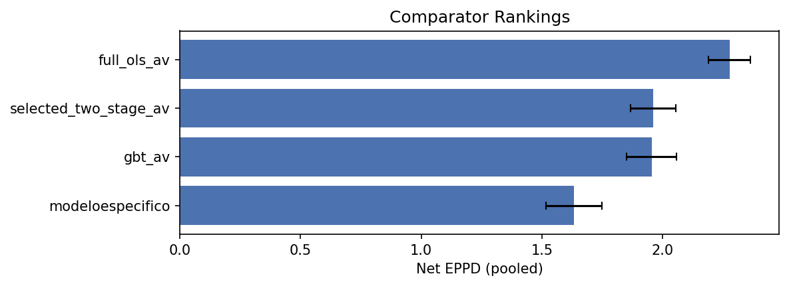

### Chart 5. Tail Risk Panel

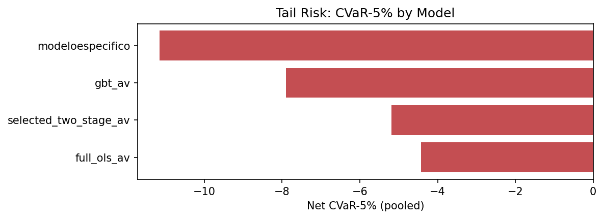

## 7. H2H Battery

### Chart 6. H2H Delta by Contract

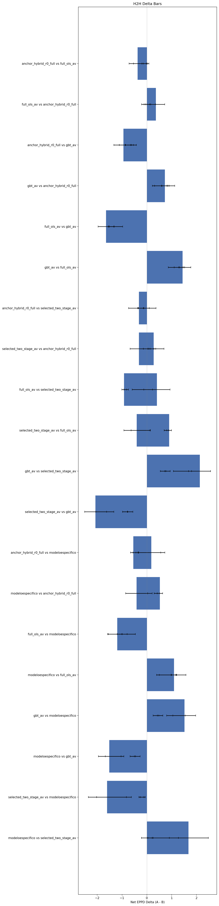

### Chart 7. H2H Heatmap

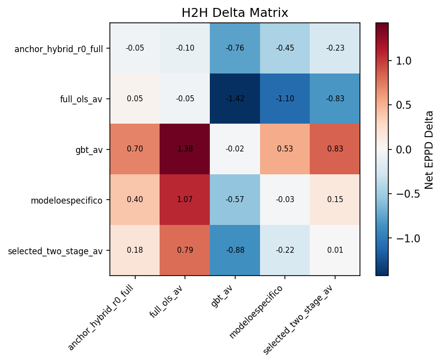

Full H2H Delta Matrix (click to expand)

| team0 | team1 | facet | net_eppd_delta | ci_low | ci_high | win_rate_a | deals_total |
| --- | --- | --- | --- | --- | --- | --- | --- |
| modeloespecifico | modeloespecifico | pooled | -0.0268 | -0.1279 | 0.0751 | 0.4363 | 30000 |
| modeloespecifico | modeloespecifico | suit | -0.0272 | -0.1303 | 0.0764 | 0.4359 | 28248 |
| modeloespecifico | modeloespecifico | high | 0.1027 | -0.5537 | 0.7887 | 0.4504 | 837 |
| modeloespecifico | modeloespecifico | low | -0.1333 | -0.7492 | 0.4849 | 0.4360 | 915 |
| modeloespecifico | modeloespecifico | bid_type:regular | -0.0268 | -0.1279 | 0.0751 | 0.4363 | 30000 |
| modeloespecifico | selected_two_stage_av | pooled | 0.1499 | 0.0461 | 0.2523 | 0.4395 | 30000 |
| modeloespecifico | selected_two_stage_av | suit | 0.1106 | 0.0060 | 0.2144 | 0.4341 | 28750 |
| modeloespecifico | selected_two_stage_av | high | 1.6808 | 0.9030 | 2.4790 | 0.6102 | 567 |
| modeloespecifico | selected_two_stage_av | low | 0.5344 | -0.2166 | 1.2735 | 0.5241 | 683 |
| modeloespecifico | selected_two_stage_av | bid_type:regular | 0.1499 | 0.0461 | 0.2523 | 0.4395 | 30000 |

*Full table omitted from markdown — see `tables/h2h_delta_matrix.csv`*

## 8. Behavioral Analysis

### Pooled Behavior Summary

| model | net_eppd | eppd | bid_rate | pass_rate | make_rate | cvar_5 | net_cvar_5 | mix_suit | mix_high | mix_low | source |
| --- | --- | --- | --- | --- | --- | --- | --- | --- | --- | --- | --- |
| modeloespecifico | 1.6332 | 5.6079 | 1.0000 | 0.0000 | 0.9467 | -4.5907 | -11.1533 | 0.9416 | 0.0279 | 0.0305 | comparator |
| selected_two_stage_av | 1.9621 | 5.9676 | 1.0000 | 0.0000 | 0.9953 | 2.1400 | -5.1827 | 0.9695 | 0.0121 | 0.0184 | comparator |
| gbt_av | 1.9548 | 5.8310 | 0.9941 | 0.0059 | 0.9758 | -1.3011 | -7.8952 | 0.7652 | 0.0839 | 0.1509 | comparator |
| full_ols_av | 2.2778 | 6.1389 | 1.0000 | 0.0000 | 0.9999 | 2.7893 | -4.4200 | 0.7332 | 0.0980 | 0.1688 | comparator |
| modeloespecifico | 4.6780 |  | 0.4991 | 0.5009 | 0.9331 | -3.2210 |  | 0.9416 | 0.0279 | 0.0305 | h2h_self_play |
| selected_two_stage_av | 4.6394 |  | 0.4979 | 0.5021 | 0.9152 | -4.1460 |  | 0.9695 | 0.0121 | 0.0184 | h2h_self_play |
| gbt_av | 4.5012 |  | 0.4969 | 0.5031 | 0.8996 | -5.6400 |  | 0.7652 | 0.0839 | 0.1509 | h2h_self_play |
| full_ols_av | 4.9582 |  | 0.4992 | 0.5008 | 0.9878 | 0.4350 |  | 0.7332 | 0.0980 | 0.1688 | h2h_self_play |
| anchor_hybrid_r0_full | 3.5406 |  | 0.4092 | 0.5908 | 0.8646 | -5.9520 |  | 0.7758 | 0.0934 | 0.1308 | h2h_self_play |

### Behavior by Contract

| model | contract | net_eppd | bid_rate | pass_rate | make_rate | source |
| --- | --- | --- | --- | --- | --- | --- |
| modeloespecifico | pooled | 1.6332 | 1.0000 | 0.0000 | 0.9467 | comparator |
| selected_two_stage_av | pooled | 1.9621 | 1.0000 | 0.0000 | 0.9953 | comparator |
| gbt_av | pooled | 1.9548 | 0.9941 | 0.0059 | 0.9758 | comparator |
| full_ols_av | pooled | 2.2778 | 1.0000 | 0.0000 | 0.9999 | comparator |

### Chart 12. Bid and Make Rates

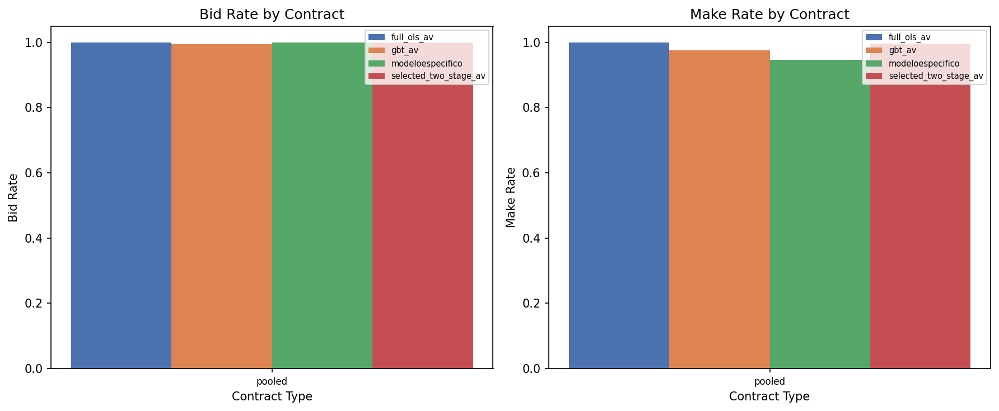

### Chart 11. Contract Mix

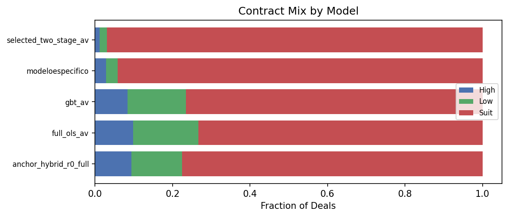

## 9. Sanity Bounds

| model | check_name | value | lower_bound | upper_bound | status |
| --- | --- | --- | --- | --- | --- |
| modeloespecifico | bid_rate_range | 1.0000 | 0.0500 | 0.9500 | FAIL |
| modeloespecifico | make_rate_range | 0.9467 | 0.1000 | 1.0000 | PASS |
| selected_two_stage_av | bid_rate_range | 1.0000 | 0.0500 | 0.9500 | FAIL |
| selected_two_stage_av | make_rate_range | 0.9953 | 0.1000 | 1.0000 | PASS |
| gbt_av | bid_rate_range | 0.9941 | 0.0500 | 0.9500 | FAIL |
| gbt_av | make_rate_range | 0.9758 | 0.1000 | 1.0000 | PASS |
| full_ols_av | bid_rate_range | 1.0000 | 0.0500 | 0.9500 | FAIL |
| full_ols_av | make_rate_range | 0.9999 | 0.1000 | 1.0000 | PASS |
| constrained_ols_av | r2_positive_suit | 0.5706 | 0.0000 | 1.0000 | PASS |
| constrained_ols_av | r2_positive_high | 0.4910 | 0.0000 | 1.0000 | PASS |

*Full table omitted from markdown — see `tables/sanity_bounds_check.csv`*
