# Rung Results Report

Generated from canonical CSV tables and chart PNGs.

## Dashboards

### Chart 1. Competitive Dashboard

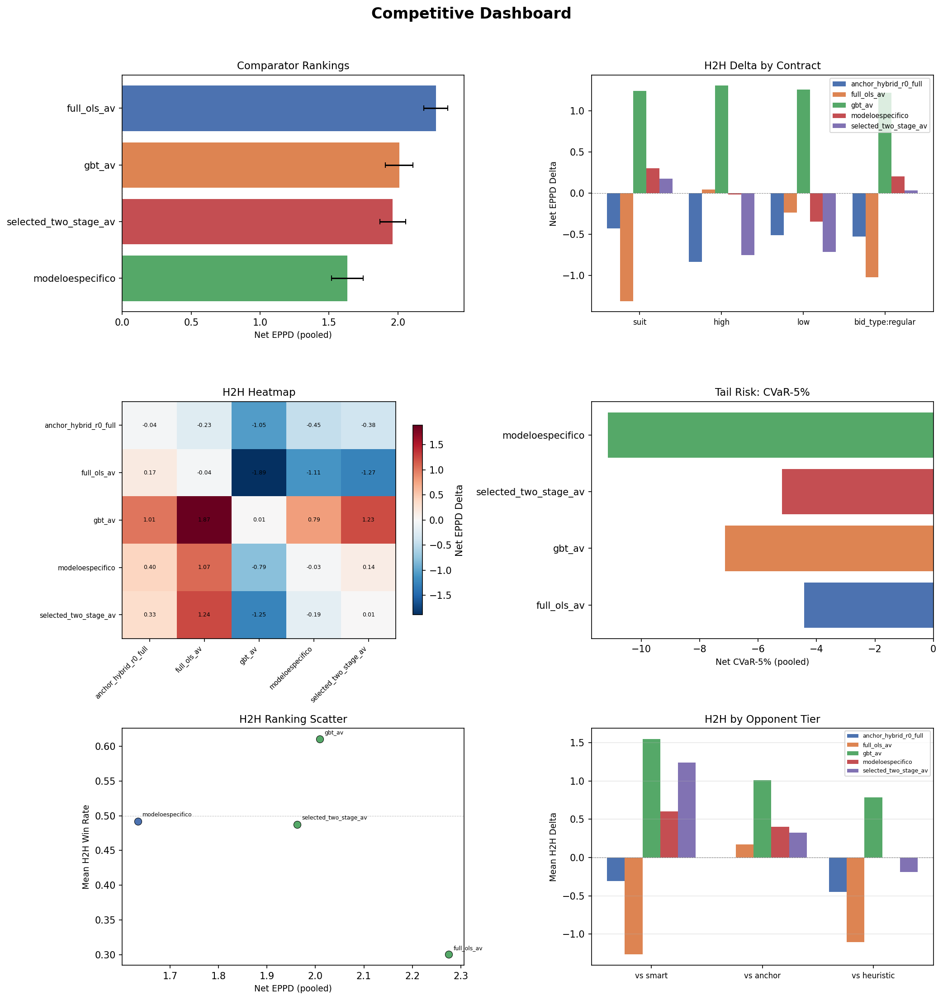

### Chart 2. Health Dashboard

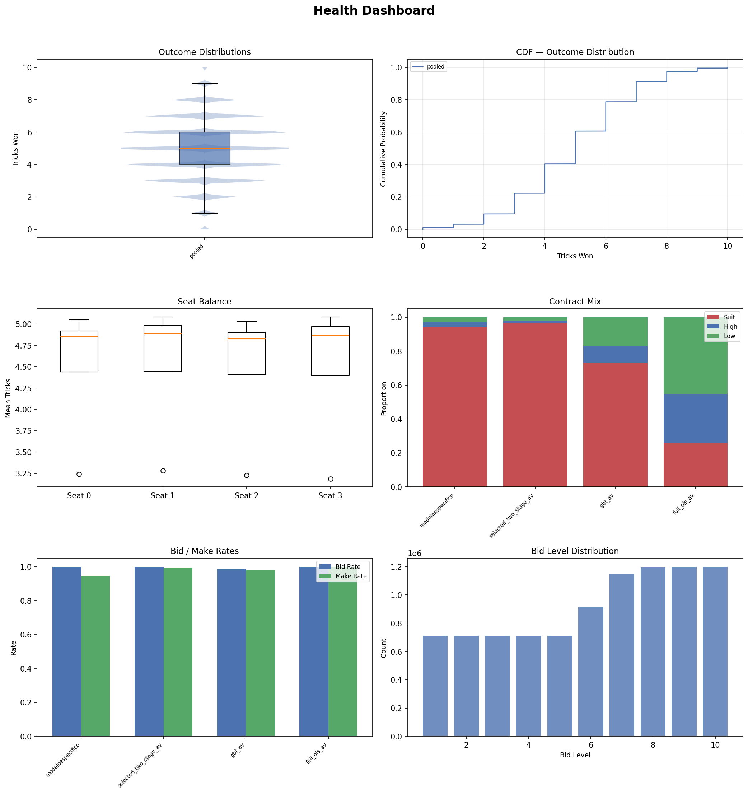

### Chart 3. Model Evaluation Dashboard

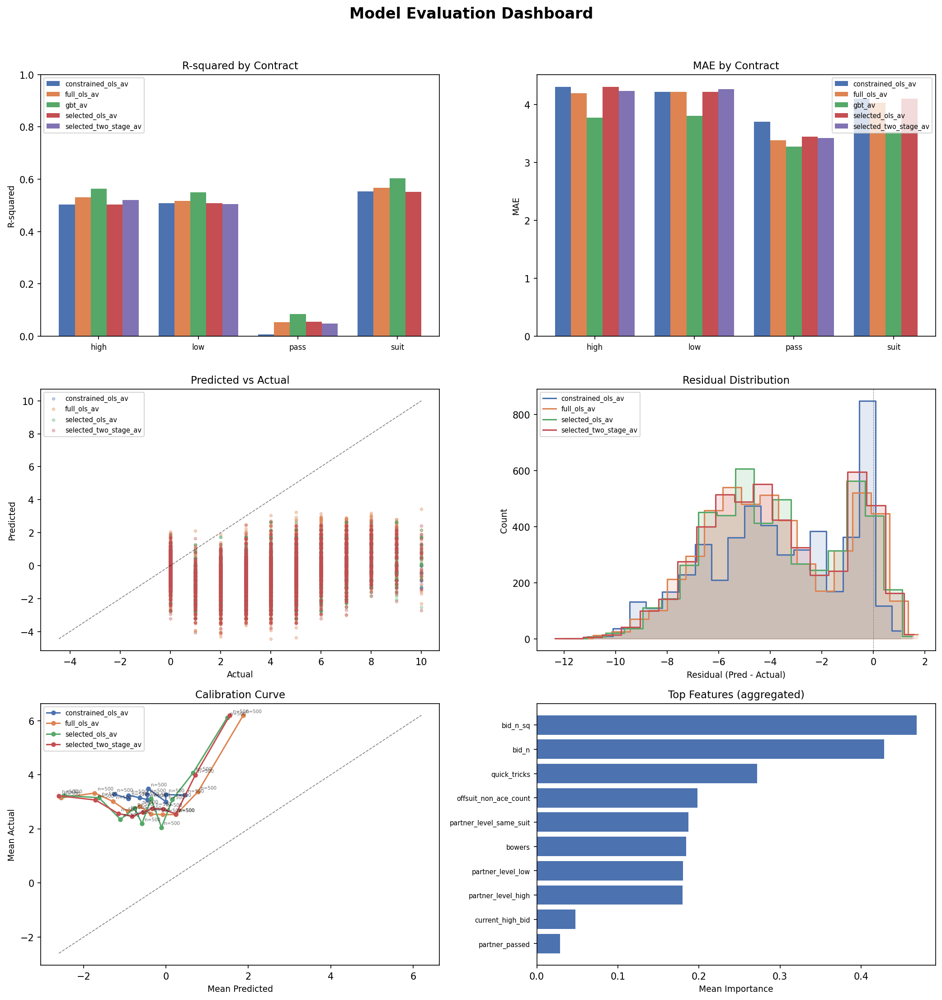

## 1. Data Sanity

| check_name | scope | value | threshold | status | detail |
| --- | --- | --- | --- | --- | --- |
| h2h_cells_populated | h2h | 25.0000 | 25.0000 | PASS | 25/25 cells have metrics |
| h2h_min_deals | h2h | 30000.0000 | 10.0000 | PASS | Minimum deals across cells: 30000 |
| comparator_bidders_present | comparator | 4.0000 | 2.0000 | PASS | 4 bidders in comparator |
| r2_positive_constrained_ols_av_high | training | 0.5029 | 0.0000 | PASS | constrained_ols_av high R²=0.5029 |
| r2_positive_constrained_ols_av_low | training | 0.5088 | 0.0000 | PASS | constrained_ols_av low R²=0.5088 |
| r2_positive_constrained_ols_av_pass | training | 0.0066 | 0.0000 | PASS | constrained_ols_av pass R²=0.0066 |
| r2_positive_constrained_ols_av_suit | training | 0.5524 | 0.0000 | PASS | constrained_ols_av suit R²=0.5524 |
| r2_positive_full_ols_av_high | training | 0.5316 | 0.0000 | PASS | full_ols_av high R²=0.5316 |
| r2_positive_full_ols_av_low | training | 0.5170 | 0.0000 | PASS | full_ols_av low R²=0.5170 |
| r2_positive_full_ols_av_pass | training | 0.0545 | 0.0000 | PASS | full_ols_av pass R²=0.0545 |

*Full table omitted from markdown — see `tables/data_sanity.csv`*

## 2. Offline Model Performance

| model | contract | r_squared | mae | n_train | n_val |
| --- | --- | --- | --- | --- | --- |
| constrained_ols_av | high | 0.5029 | 4.3012 | 121954 | 15184 |
| constrained_ols_av | low | 0.5088 | 4.2198 | 121954 | 15184 |
| constrained_ols_av | pass | 0.0066 | 3.6993 | 16000 | 2000 |
| constrained_ols_av | suit | 0.5524 | 4.0994 | 487816 | 60736 |
| full_ols_av | high | 0.5316 | 4.1923 | 1229966 | 153083 |
| full_ols_av | low | 0.5170 | 4.2174 | 1229966 | 153083 |
| full_ols_av | pass | 0.0545 | 3.3816 | 160000 | 20000 |
| full_ols_av | suit | 0.5669 | 4.0305 | 4919864 | 612332 |
| gbt_av | high | 0.5636 | 3.7721 | 1229966 | 153083 |
| gbt_av | low | 0.5506 | 3.8028 | 1229966 | 153083 |

*Full table omitted from markdown — see `tables/model_performance.csv`*

### Chart 14. R-squared by Contract

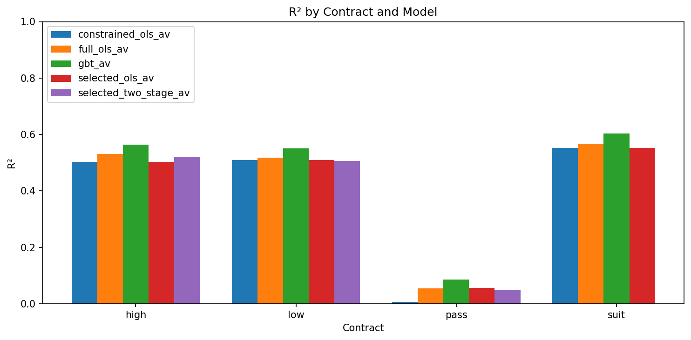

### Chart 15. MAE by Contract

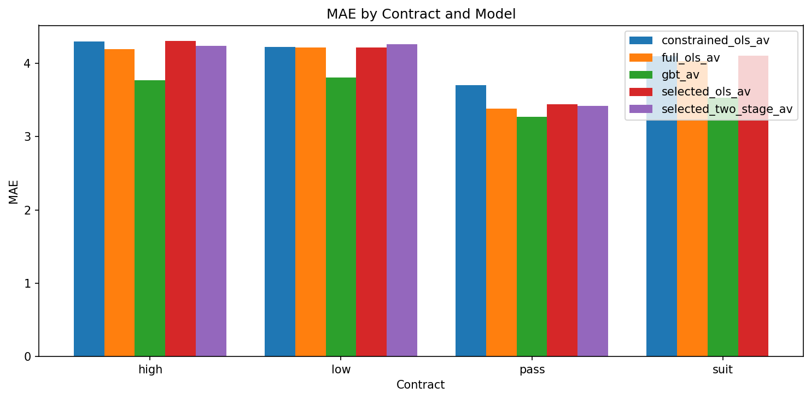

## 3. Offline Diagnostics

### Chart 16. Predicted vs Actual

*Chart not available — source data absent.*

### Chart 17. Residual Distribution

*Chart not available — source data absent.*

### Chart 18. Calibration Curve

*Chart not available — source data absent.*

### Chart 20. Feature Importance

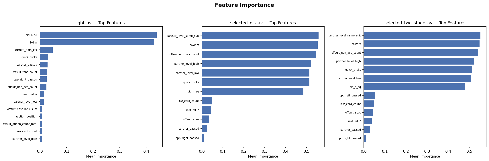

## 4. Model Interpretability

### Chart 19. Selection Path

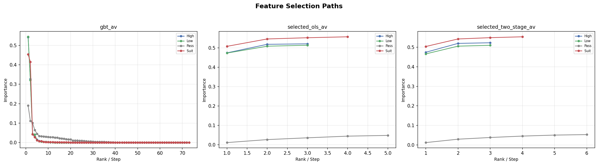

## 5. Cross-Model Decision Analysis

*Decision comparison analysis not yet generated.*

## 6. Comparator Rankings

| model | facet | net_eppd | ci_low | ci_high | bid_rate | make_rate | net_cvar_5 | rank |
| --- | --- | --- | --- | --- | --- | --- | --- | --- |
| full_ols_av | pooled | 2.2750 | 2.1875 | 2.3627 | 1.0000 | 0.9999 | -4.4307 | 1 |
| gbt_av | pooled | 2.0091 | 1.9081 | 2.1084 | 0.9857 | 0.9807 | -7.1382 | 2 |
| selected_two_stage_av | pooled | 1.9621 | 1.8688 | 2.0553 | 1.0000 | 0.9953 | -5.1827 | 3 |
| modeloespecifico | pooled | 1.6332 | 1.5173 | 1.7486 | 1.0000 | 0.9467 | -11.1533 | 4 |

### Chart 4. Comparator Ranking Bars

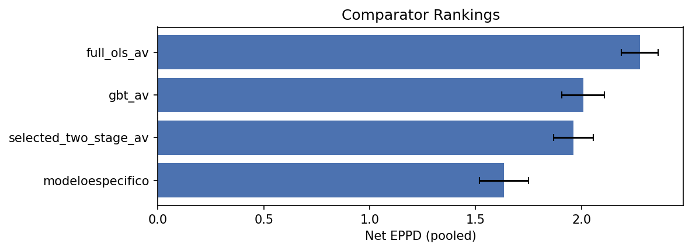

### Chart 5. Tail Risk Panel

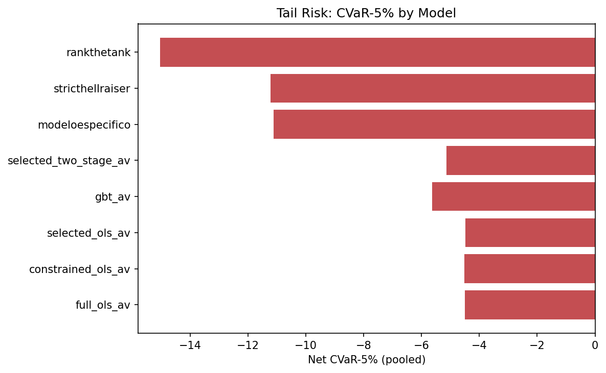

## 7. H2H Battery

### Chart 6. H2H Delta by Contract

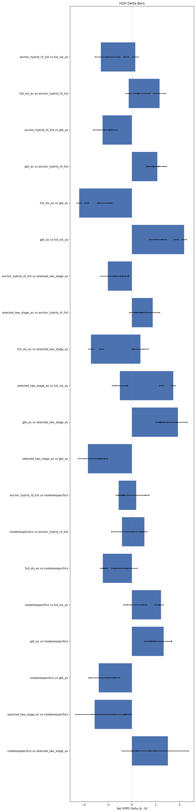

### Chart 7. H2H Heatmap

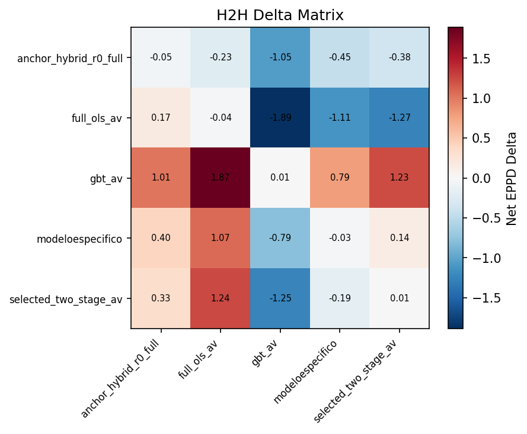

Full H2H Delta Matrix (click to expand)

| team0 | team1 | facet | net_eppd_delta | ci_low | ci_high | win_rate_a | deals_total |
| --- | --- | --- | --- | --- | --- | --- | --- |
| modeloespecifico | modeloespecifico | pooled | -0.0268 | -0.1279 | 0.0751 | 0.4363 | 30000 |
| modeloespecifico | modeloespecifico | suit | -0.0272 | -0.1303 | 0.0764 | 0.4359 | 28248 |
| modeloespecifico | modeloespecifico | high | 0.1027 | -0.5537 | 0.7887 | 0.4504 | 837 |
| modeloespecifico | modeloespecifico | low | -0.1333 | -0.7492 | 0.4849 | 0.4360 | 915 |
| modeloespecifico | modeloespecifico | bid_type:regular | -0.0268 | -0.1279 | 0.0751 | 0.4363 | 30000 |
| modeloespecifico | selected_two_stage_av | pooled | 0.1369 | 0.0319 | 0.2410 | 0.4261 | 30000 |
| modeloespecifico | selected_two_stage_av | suit | 0.1071 | 0.0016 | 0.2130 | 0.4218 | 28691 |
| modeloespecifico | selected_two_stage_av | high | 1.5082 | 0.7477 | 2.3645 | 0.5886 | 547 |
| modeloespecifico | selected_two_stage_av | low | 0.2730 | -0.4066 | 0.9760 | 0.4711 | 762 |
| modeloespecifico | selected_two_stage_av | bid_type:regular | 0.1369 | 0.0319 | 0.2410 | 0.4261 | 30000 |

*Full table omitted from markdown — see `tables/h2h_delta_matrix.csv`*

## 8. Behavioral Analysis

### Pooled Behavior Summary

| model | net_eppd | eppd | bid_rate | pass_rate | make_rate | cvar_5 | net_cvar_5 | mix_suit | mix_high | mix_low | source |
| --- | --- | --- | --- | --- | --- | --- | --- | --- | --- | --- | --- |
| modeloespecifico | 1.6332 | 5.6079 | 1.0000 | 0.0000 | 0.9467 | -4.5907 | -11.1533 | 0.9416 | 0.0279 | 0.0305 | comparator |
| selected_two_stage_av | 1.9621 | 5.9676 | 1.0000 | 0.0000 | 0.9953 | 2.1400 | -5.1827 | 0.9670 | 0.0122 | 0.0208 | comparator |
| gbt_av | 2.0091 | 5.8401 | 0.9857 | 0.0143 | 0.9807 | -0.4553 | -7.1382 | 0.7295 | 0.0999 | 0.1706 | comparator |
| full_ols_av | 2.2750 | 6.1375 | 1.0000 | 0.0000 | 0.9999 | 2.7840 | -4.4307 | 0.2586 | 0.2906 | 0.4507 | comparator |
| modeloespecifico | 4.6780 |  | 0.4991 | 0.5009 | 0.9331 | -3.2210 |  | 0.9416 | 0.0279 | 0.0305 | h2h_self_play |
| selected_two_stage_av | 4.6278 |  | 0.4981 | 0.5019 | 0.9101 | -4.3410 |  | 0.9670 | 0.0122 | 0.0208 | h2h_self_play |
| gbt_av | 4.1613 |  | 0.4929 | 0.5071 | 0.8499 | -6.8580 |  | 0.7295 | 0.0999 | 0.1706 | h2h_self_play |
| full_ols_av | 4.9769 |  | 0.4846 | 0.5154 | 0.9930 | 0.5590 |  | 0.2586 | 0.2906 | 0.4507 | h2h_self_play |
| anchor_hybrid_r0_full | 3.5406 |  | 0.4092 | 0.5908 | 0.8646 | -5.9520 |  | 0.7758 | 0.0934 | 0.1308 | h2h_self_play |

### Behavior by Contract

| model | contract | net_eppd | bid_rate | pass_rate | make_rate | source |
| --- | --- | --- | --- | --- | --- | --- |
| modeloespecifico | pooled | 1.6332 | 1.0000 | 0.0000 | 0.9467 | comparator |
| selected_two_stage_av | pooled | 1.9621 | 1.0000 | 0.0000 | 0.9953 | comparator |
| gbt_av | pooled | 2.0091 | 0.9857 | 0.0143 | 0.9807 | comparator |
| full_ols_av | pooled | 2.2750 | 1.0000 | 0.0000 | 0.9999 | comparator |

### Chart 12. Bid and Make Rates

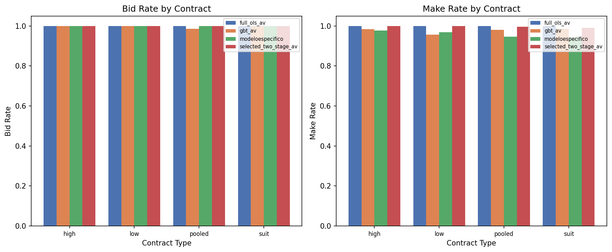

### Chart 11. Contract Mix

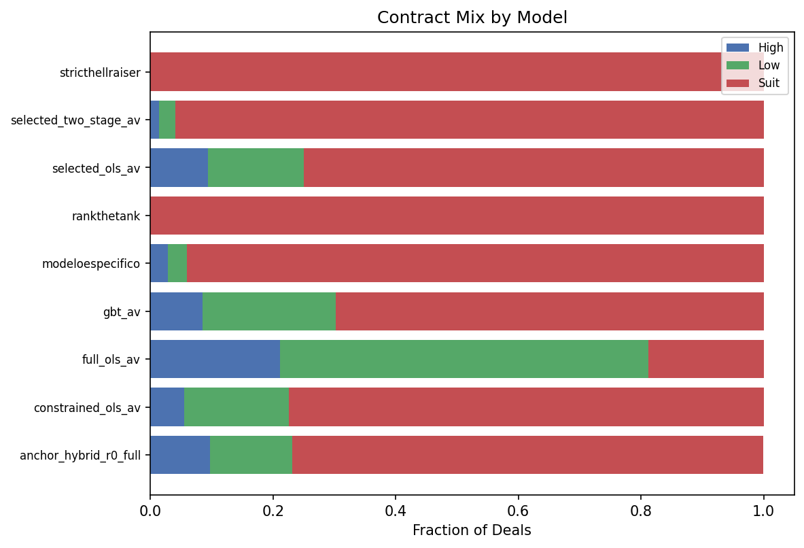

## 9. Sanity Bounds

| model | check_name | value | lower_bound | upper_bound | status |
| --- | --- | --- | --- | --- | --- |
| modeloespecifico | bid_rate_range | 1.0000 | 0.0500 | 0.9500 | FAIL |
| modeloespecifico | make_rate_range | 0.9467 | 0.1000 | 1.0000 | PASS |
| selected_two_stage_av | bid_rate_range | 1.0000 | 0.0500 | 0.9500 | FAIL |
| selected_two_stage_av | make_rate_range | 0.9953 | 0.1000 | 1.0000 | PASS |
| gbt_av | bid_rate_range | 0.9857 | 0.0500 | 0.9500 | FAIL |
| gbt_av | make_rate_range | 0.9807 | 0.1000 | 1.0000 | PASS |
| full_ols_av | bid_rate_range | 1.0000 | 0.0500 | 0.9500 | FAIL |
| full_ols_av | make_rate_range | 0.9999 | 0.1000 | 1.0000 | PASS |
| constrained_ols_av | r2_positive_high | 0.5029 | 0.0000 | 1.0000 | PASS |
| constrained_ols_av | r2_positive_low | 0.5088 | 0.0000 | 1.0000 | PASS |

*Full table omitted from markdown — see `tables/sanity_bounds_check.csv`*

## 10. Data Quality Notes

- **Outcome distributions (Chart 9):** synthetic data — parquet-backed real distributions unavailable for this bundle
- **Sanity: bid_rate_range** — failed. This may be expected for small sample sizes or early rungs.
- **Sanity: bid_rate_range** — failed. This may be expected for small sample sizes or early rungs.
- **Sanity: bid_rate_range** — failed. This may be expected for small sample sizes or early rungs.
- **Sanity: bid_rate_range** — failed. This may be expected for small sample sizes or early rungs.
- **Sanity: r2_positive_suit** — failed. This may be expected for small sample sizes or early rungs.

<!-- gate_status: data sanity checks in §1 above -->
