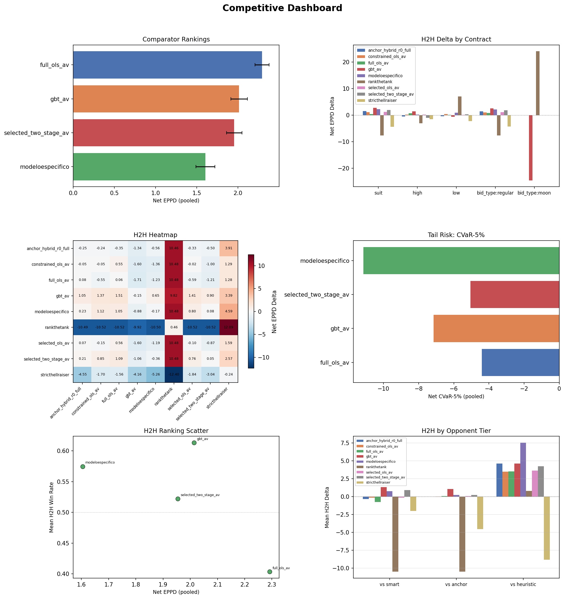
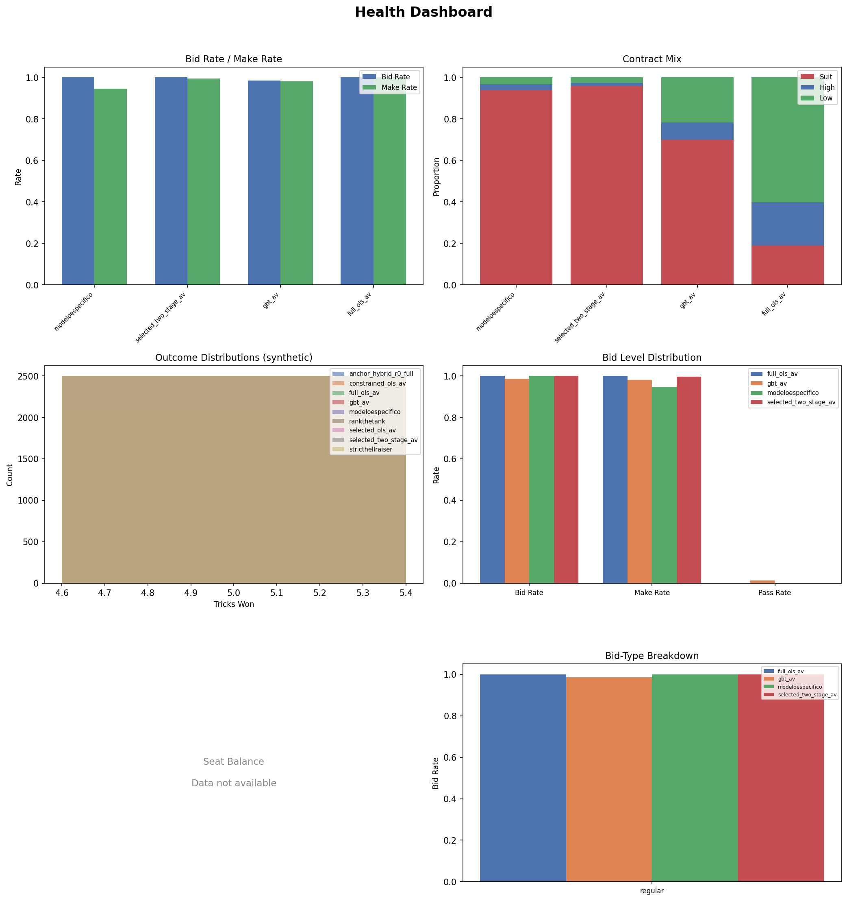
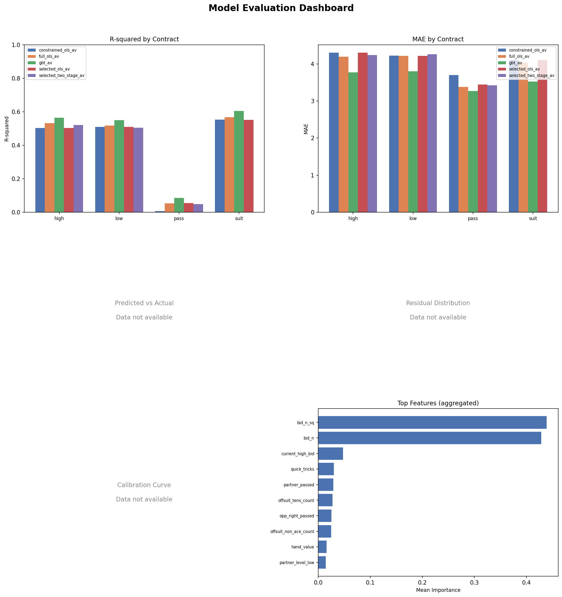
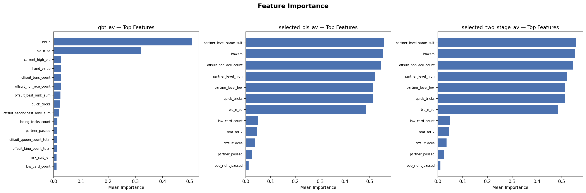
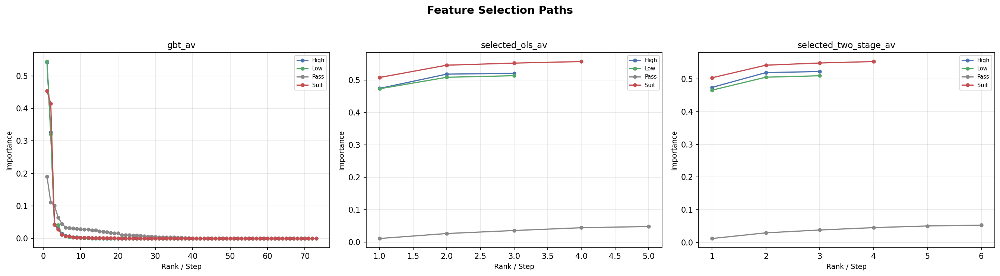
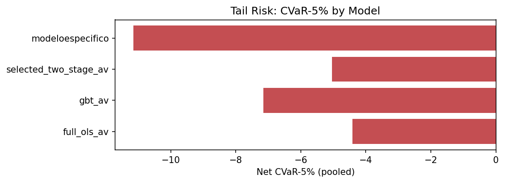
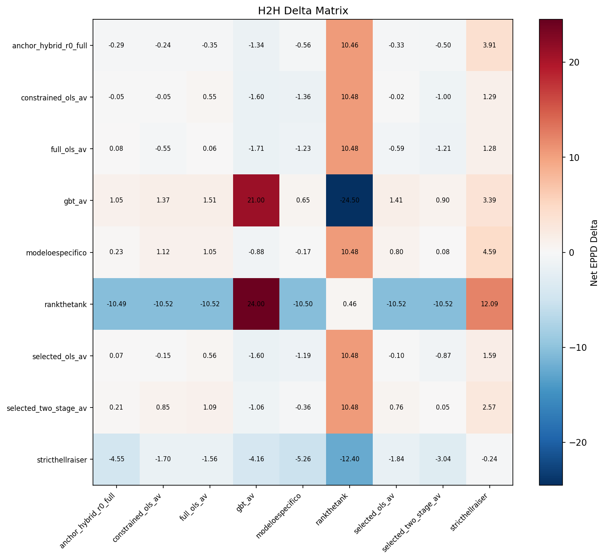
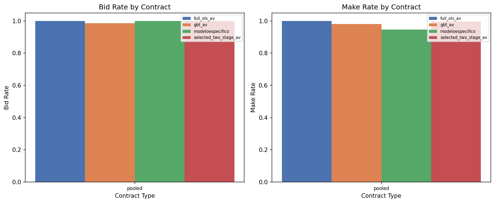

# Rung Results Report

Generated from canonical CSV tables and chart PNGs.

## Dashboards

### Chart 1. Competitive Dashboard

### Chart 2. Health Dashboard

### Chart 3. Model Evaluation Dashboard

## 1. Data Sanity

| check_name | scope | value | threshold | status | detail |
| --- | --- | --- | --- | --- | --- |
| h2h_cells_populated | h2h | 81.0000 | 81.0000 | PASS | 81/81 cells have metrics |
| h2h_min_deals | h2h | 2500.0000 | 10.0000 | PASS | Minimum deals across cells: 2500 |
| comparator_bidders_present | comparator | 4.0000 | 2.0000 | PASS | 4 bidders in comparator |
| r2_positive_constrained_ols_av_high | training | 0.5029 | 0.0000 | PASS | constrained_ols_av high R²=0.5029 |
| r2_positive_constrained_ols_av_low | training | 0.5088 | 0.0000 | PASS | constrained_ols_av low R²=0.5088 |
| r2_positive_constrained_ols_av_pass | training | 0.0066 | 0.0000 | PASS | constrained_ols_av pass R²=0.0066 |
| r2_positive_constrained_ols_av_suit | training | 0.5524 | 0.0000 | PASS | constrained_ols_av suit R²=0.5524 |
| r2_positive_full_ols_av_high | training | 0.5316 | 0.0000 | PASS | full_ols_av high R²=0.5316 |
| r2_positive_full_ols_av_low | training | 0.5170 | 0.0000 | PASS | full_ols_av low R²=0.5170 |
| r2_positive_full_ols_av_pass | training | 0.0545 | 0.0000 | PASS | full_ols_av pass R²=0.0545 |

*Full table omitted from markdown — see `tables/data_sanity.csv`*

## 2. Offline Model Performance

| model | contract | r_squared | mae | n_train | n_val |
| --- | --- | --- | --- | --- | --- |
| constrained_ols_av | high | 0.5029 | 4.3012 | 121954 | 15184 |
| constrained_ols_av | low | 0.5088 | 4.2198 | 121954 | 15184 |
| constrained_ols_av | pass | 0.0066 | 3.6993 | 16000 | 2000 |
| constrained_ols_av | suit | 0.5524 | 4.0994 | 487816 | 60736 |
| full_ols_av | high | 0.5316 | 4.1923 | 1229966 | 153083 |
| full_ols_av | low | 0.5170 | 4.2174 | 1229966 | 153083 |
| full_ols_av | pass | 0.0545 | 3.3816 | 160000 | 20000 |
| full_ols_av | suit | 0.5669 | 4.0305 | 4919864 | 612332 |
| gbt_av | high | 0.5636 | 3.7721 | 1229966 | 153083 |
| gbt_av | low | 0.5506 | 3.8028 | 1229966 | 153083 |

*Full table omitted from markdown — see `tables/model_performance.csv`*

### Chart 14. R-squared by Contract

### Chart 15. MAE by Contract

## 3. Offline Diagnostics

### Chart 16. Predicted vs Actual

*Chart not available — source data absent.*

### Chart 17. Residual Distribution

*Chart not available — source data absent.*

### Chart 18. Calibration Curve

*Chart not available — source data absent.*

### Chart 20. Feature Importance

## 4. Model Interpretability

### Chart 19. Selection Path

## 5. Cross-Model Decision Analysis

*Decision comparison analysis not yet generated.*

## 6. Comparator Rankings

| model | facet | net_eppd | ci_low | ci_high | bid_rate | make_rate | net_cvar_5 | rank |
| --- | --- | --- | --- | --- | --- | --- | --- | --- |
| full_ols_av | pooled | 2.2916 | 2.2052 | 2.3792 | 1.0000 | 1.0000 | -4.4080 | 1 |
| gbt_av | pooled | 2.0136 | 1.9132 | 2.1132 | 0.9860 | 0.9807 | -7.1463 | 2 |
| selected_two_stage_av | pooled | 1.9540 | 1.8624 | 2.0478 | 1.0000 | 0.9960 | -5.0480 | 3 |
| modeloespecifico | pooled | 1.6044 | 1.4888 | 1.7198 | 1.0000 | 0.9468 | -11.1520 | 4 |

### Chart 4. Comparator Ranking Bars

### Chart 5. Tail Risk Panel

## 7. H2H Battery

### Chart 6. H2H Delta by Contract

### Chart 7. H2H Heatmap

Full H2H Delta Matrix (click to expand)

| team0 | team1 | facet | net_eppd_delta | ci_low | ci_high | win_rate_a | deals_total |
| --- | --- | --- | --- | --- | --- | --- | --- |
| modeloespecifico | modeloespecifico | pooled | -0.1724 | -0.3716 | 0.0256 | 0.4204 | 2500 |
| modeloespecifico | modeloespecifico | suit | -0.1600 | -0.3681 | 0.0438 | 0.4209 | 2350 |
| modeloespecifico | modeloespecifico | high | -0.6000 | -1.9714 | 0.8000 | 0.4429 | 70 |
| modeloespecifico | modeloespecifico | low | -0.1625 | -1.4125 | 1.0500 | 0.3875 | 80 |
| modeloespecifico | modeloespecifico | bid_type:regular | -0.1724 | -0.3716 | 0.0256 | 0.4204 | 2500 |
| modeloespecifico | selected_two_stage_av | pooled | 0.0800 | -0.1312 | 0.2948 | 0.4304 | 2500 |
| modeloespecifico | selected_two_stage_av | suit | 0.0617 | -0.1539 | 0.2798 | 0.4260 | 2366 |
| modeloespecifico | selected_two_stage_av | high | -0.4909 | -2.2005 | 1.2000 | 0.4727 | 55 |
| modeloespecifico | selected_two_stage_av | low | 1.0253 | -0.2405 | 2.2785 | 0.5316 | 79 |
| modeloespecifico | selected_two_stage_av | bid_type:regular | 0.0800 | -0.1312 | 0.2948 | 0.4304 | 2500 |

*Full table omitted from markdown — see `tables/h2h_delta_matrix.csv`*

## 8. Behavioral Analysis

### Pooled Behavior Summary

| model | net_eppd | eppd | bid_rate | pass_rate | make_rate | cvar_5 | net_cvar_5 | mix_suit | mix_high | mix_low | source |
| --- | --- | --- | --- | --- | --- | --- | --- | --- | --- | --- | --- |
| modeloespecifico | 1.6044 | 5.5928 | 1.0000 | 0.0000 | 0.9468 | -4.6120 | -11.1520 | 0.9400 | 0.0280 | 0.0320 | comparator |
| selected_two_stage_av | 1.9540 | 5.9654 | 1.0000 | 0.0000 | 0.9960 | 2.2440 | -5.0480 | 0.9592 | 0.0144 | 0.0264 | comparator |
| gbt_av | 2.0136 | 5.8448 | 0.9860 | 0.0140 | 0.9807 | -0.4431 | -7.1463 | 0.6980 | 0.0848 | 0.2172 | comparator |
| full_ols_av | 2.2916 | 6.1458 | 1.0000 | 0.0000 | 1.0000 | 2.7960 | -4.4080 | 0.1880 | 0.2112 | 0.6008 | comparator |
| modeloespecifico | 4.6906 |  | 0.4880 | 0.5120 | 0.9287 | -3.2600 |  | 0.9400 | 0.0280 | 0.0320 | h2h_self_play |
| selected_two_stage_av | 4.6008 |  | 0.5076 | 0.4924 | 0.9117 | -4.5760 |  | 0.9592 | 0.0144 | 0.0264 | h2h_self_play |
| gbt_av | 4.1694 |  | 0.5004 | 0.4996 | 0.8401 | -6.9200 |  | 0.6980 | 0.0848 | 0.2172 | h2h_self_play |
| constrained_ols_av | 4.9456 |  | 0.5028 | 0.4972 | 0.9841 | 0.3120 |  | 0.7748 | 0.0552 | 0.1700 | h2h_self_play |
| selected_ols_av | 4.9614 |  | 0.4912 | 0.5088 | 0.9878 | 0.5280 |  | 0.7500 | 0.0944 | 0.1556 | h2h_self_play |
| full_ols_av | 4.9624 |  | 0.5104 | 0.4896 | 0.9867 | 0.2800 |  | 0.1880 | 0.2112 | 0.6008 | h2h_self_play |

*Full table omitted from markdown — see `tables/behavior_summary.csv`*

### Behavior by Contract

| model | contract | net_eppd | bid_rate | pass_rate | make_rate | source |
| --- | --- | --- | --- | --- | --- | --- |
| modeloespecifico | pooled | 1.6044 | 1.0000 | 0.0000 | 0.9468 | comparator |
| selected_two_stage_av | pooled | 1.9540 | 1.0000 | 0.0000 | 0.9960 | comparator |
| gbt_av | pooled | 2.0136 | 0.9860 | 0.0140 | 0.9807 | comparator |
| full_ols_av | pooled | 2.2916 | 1.0000 | 0.0000 | 1.0000 | comparator |

### Chart 12. Bid and Make Rates

### Chart 11. Contract Mix

## 9. Sanity Bounds

| model | check_name | value | lower_bound | upper_bound | status |
| --- | --- | --- | --- | --- | --- |
| modeloespecifico | bid_rate_range | 1.0000 | 0.0500 | 0.9500 | FAIL |
| modeloespecifico | make_rate_range | 0.9468 | 0.1000 | 1.0000 | PASS |
| selected_two_stage_av | bid_rate_range | 1.0000 | 0.0500 | 0.9500 | FAIL |
| selected_two_stage_av | make_rate_range | 0.9960 | 0.1000 | 1.0000 | PASS |
| gbt_av | bid_rate_range | 0.9860 | 0.0500 | 0.9500 | FAIL |
| gbt_av | make_rate_range | 0.9807 | 0.1000 | 1.0000 | PASS |
| full_ols_av | bid_rate_range | 1.0000 | 0.0500 | 0.9500 | FAIL |
| full_ols_av | make_rate_range | 1.0000 | 0.1000 | 1.0000 | PASS |
| constrained_ols_av | r2_positive_high | 0.5029 | 0.0000 | 1.0000 | PASS |
| constrained_ols_av | r2_positive_low | 0.5088 | 0.0000 | 1.0000 | PASS |

*Full table omitted from markdown — see `tables/sanity_bounds_check.csv`*

## 10. Data Quality Notes

- **Outcome distributions (Chart 9):** synthetic data — parquet-backed real distributions unavailable for this bundle
- **Sanity: unknown** — failed. This may be expected for small sample sizes or early rungs.
- **Sanity: unknown** — failed. This may be expected for small sample sizes or early rungs.
- **Sanity: unknown** — failed. This may be expected for small sample sizes or early rungs.
- **Sanity: unknown** — failed. This may be expected for small sample sizes or early rungs.
- **Sanity: unknown** — failed. This may be expected for small sample sizes or early rungs.
