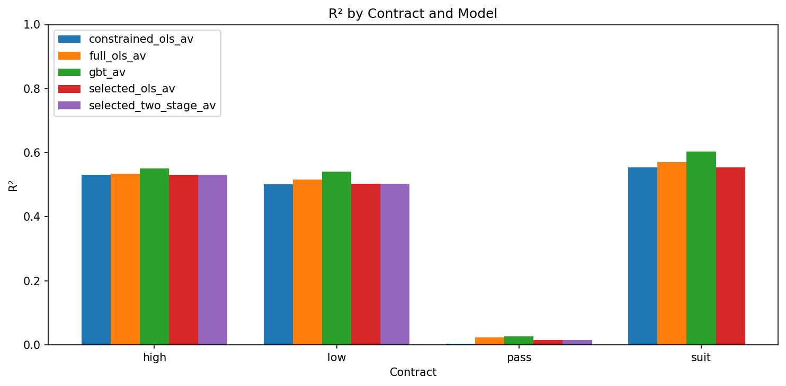
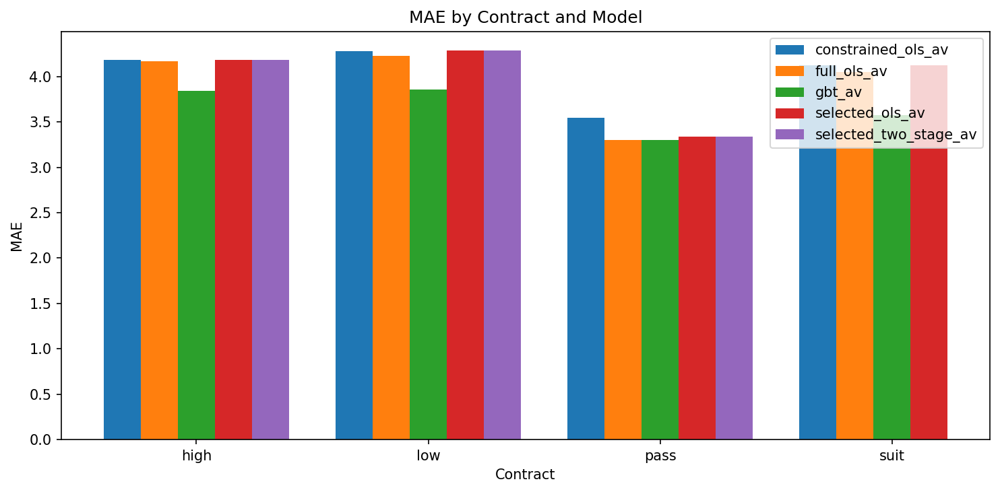
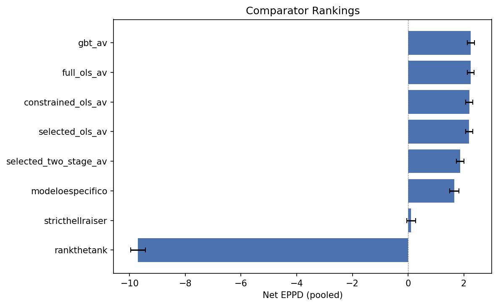
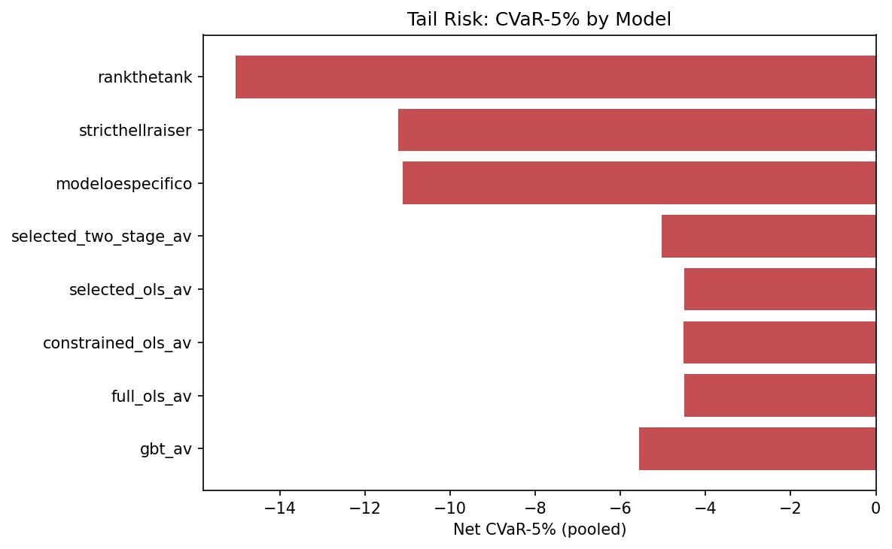
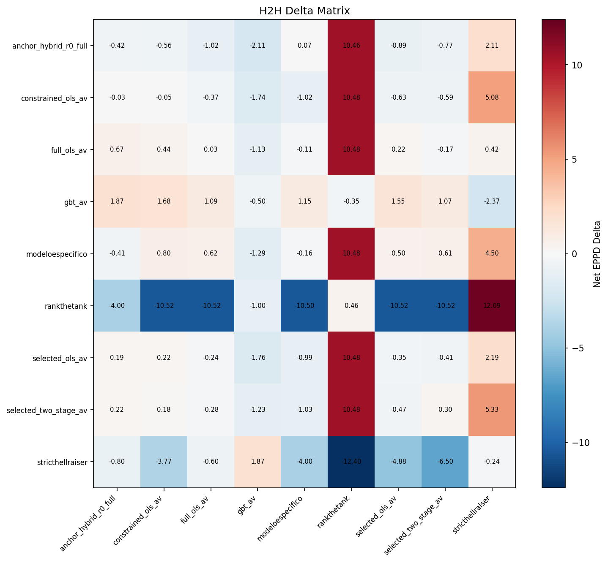
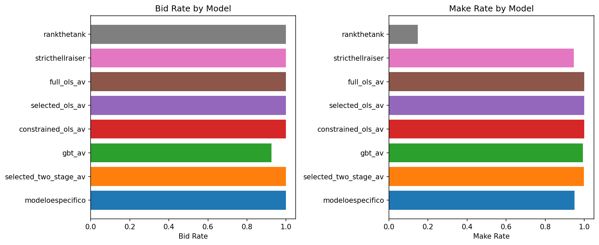
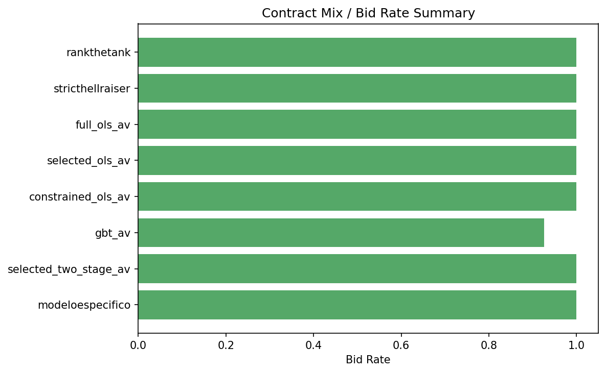

# Rung Results Report

<!-- gate_status: QUICK-COMPLETE -->

Generated from canonical CSV tables and chart PNGs.

## 1. Data Sanity

| check_name | scope | value | threshold | status | detail |
| --- | --- | --- | --- | --- | --- |
| h2h_cells_populated | h2h | 81.0000 | 81.0000 | PASS | 81/81 cells have metrics |
| h2h_min_deals | h2h | 2500.0000 | 10.0000 | PASS | Minimum deals across cells: 2500 |
| comparator_bidders_present | comparator | 8.0000 | 2.0000 | PASS | 8 bidders in comparator |
| r2_positive_constrained_ols_av_high | training | 0.5308 | 0.0000 | PASS | constrained_ols_av high R²=0.5308 |
| r2_positive_constrained_ols_av_low | training | 0.5014 | 0.0000 | PASS | constrained_ols_av low R²=0.5014 |
| r2_positive_constrained_ols_av_pass | training | 0.0027 | 0.0000 | PASS | constrained_ols_av pass R²=0.0027 |
| r2_positive_constrained_ols_av_suit | training | 0.5548 | 0.0000 | PASS | constrained_ols_av suit R²=0.5548 |
| r2_positive_full_ols_av_high | training | 0.5335 | 0.0000 | PASS | full_ols_av high R²=0.5335 |
| r2_positive_full_ols_av_low | training | 0.5159 | 0.0000 | PASS | full_ols_av low R²=0.5159 |
| r2_positive_full_ols_av_pass | training | 0.0235 | 0.0000 | PASS | full_ols_av pass R²=0.0235 |
| r2_positive_full_ols_av_suit | training | 0.5705 | 0.0000 | PASS | full_ols_av suit R²=0.5705 |
| r2_positive_gbt_av_high | training | 0.5513 | 0.0000 | PASS | gbt_av high R²=0.5513 |
| r2_positive_gbt_av_low | training | 0.5406 | 0.0000 | PASS | gbt_av low R²=0.5406 |
| r2_positive_gbt_av_pass | training | 0.0257 | 0.0000 | PASS | gbt_av pass R²=0.0257 |
| r2_positive_gbt_av_suit | training | 0.6028 | 0.0000 | PASS | gbt_av suit R²=0.6028 |
| r2_positive_selected_ols_av_high | training | 0.5308 | 0.0000 | PASS | selected_ols_av high R²=0.5308 |
| r2_positive_selected_ols_av_low | training | 0.5034 | 0.0000 | PASS | selected_ols_av low R²=0.5034 |
| r2_positive_selected_ols_av_pass | training | 0.0154 | 0.0000 | PASS | selected_ols_av pass R²=0.0154 |
| r2_positive_selected_ols_av_suit | training | 0.5545 | 0.0000 | PASS | selected_ols_av suit R²=0.5545 |
| r2_positive_selected_two_stage_av_high | training | 0.5308 | 0.0000 | PASS | selected_two_stage_av high R²=0.5308 |
| r2_positive_selected_two_stage_av_low | training | 0.5034 | 0.0000 | PASS | selected_two_stage_av low R²=0.5034 |
| r2_positive_selected_two_stage_av_pass | training | 0.0154 | 0.0000 | PASS | selected_two_stage_av pass R²=0.0154 |
| r2_positive_selected_two_stage_av_suit | training | 0.0000 | 0.0000 | WARN | selected_two_stage_av suit R²=0.0000 |

## 2. Offline Model Performance

| model | contract | r_squared | mae | n_train | n_val |
| --- | --- | --- | --- | --- | --- |
| constrained_ols_av | high | 0.5308 | 4.1849 | 60937 | 7737 |
| constrained_ols_av | low | 0.5014 | 4.2831 | 60937 | 7737 |
| constrained_ols_av | pass | 0.0027 | 3.5477 | 8000 | 1000 |
| constrained_ols_av | suit | 0.5548 | 4.1231 | 243748 | 30948 |
| full_ols_av | high | 0.5335 | 4.1697 | 60937 | 7737 |
| full_ols_av | low | 0.5159 | 4.2263 | 60937 | 7737 |
| full_ols_av | pass | 0.0235 | 3.3015 | 8000 | 1000 |
| full_ols_av | suit | 0.5705 | 4.0535 | 243748 | 30948 |
| gbt_av | high | 0.5513 | 3.8435 | 60937 | 7737 |
| gbt_av | low | 0.5406 | 3.8595 | 60937 | 7737 |
| gbt_av | pass | 0.0257 | 3.3002 | 8000 | 1000 |
| gbt_av | suit | 0.6028 | 3.5757 | 243748 | 30948 |
| selected_ols_av | high | 0.5308 | 4.1840 | 60937 | 7737 |
| selected_ols_av | low | 0.5034 | 4.2853 | 60937 | 7737 |
| selected_ols_av | pass | 0.0154 | 3.3357 | 8000 | 1000 |
| selected_ols_av | suit | 0.5545 | 4.1251 | 243748 | 30948 |
| selected_two_stage_av | high | 0.5308 | 4.1840 | 60937 | 7737 |
| selected_two_stage_av | low | 0.5034 | 4.2853 | 60937 | 7737 |
| selected_two_stage_av | pass | 0.0154 | 3.3357 | 8000 | 1000 |
| selected_two_stage_av | suit |  |  | 243748 | 30948 |

## 3. Offline Diagnostics

> [chart_name=pred_vs_actual_scatter.png] not yet generated

> [chart_name=residual_distribution.png] not yet generated

> [chart_name=calibration_curve.png] not yet generated

## 4. Model Interpretability

*Interpretability charts not yet generated (PR 3b).*

## 5. Cross-Model Decision Analysis

*Decision comparison analysis not yet generated (PR 3b).*

## 6. Comparator Rankings

| model | facet | net_eppd | ci_low | ci_high | bid_rate | make_rate | net_cvar_5 | rank |
| --- | --- | --- | --- | --- | --- | --- | --- | --- |
| gbt_av | pooled | 2.2548 | 2.1228 | 2.3884 | 0.9256 | 0.9922 | -5.5565 | 1 |
| full_ols_av | pooled | 2.2432 | 2.1216 | 2.3672 | 1.0000 | 1.0000 | -4.4960 | 2 |
| constrained_ols_av | pooled | 2.1976 | 2.0720 | 2.3240 | 1.0000 | 1.0000 | -4.5120 | 3 |
| selected_ols_av | pooled | 2.1928 | 2.0704 | 2.3192 | 1.0000 | 1.0000 | -4.4960 | 4 |
| selected_two_stage_av | pooled | 1.8756 | 1.7412 | 2.0100 | 1.0000 | 0.9980 | -5.0320 | 5 |
| modeloespecifico | pooled | 1.6608 | 1.5008 | 1.8188 | 1.0000 | 0.9496 | -11.1120 | 6 |
| stricthellraiser | pooled | 0.1096 | -0.0440 | 0.2648 | 1.0000 | 0.9472 | -11.2240 | 7 |
| rankthetank | pooled | -9.6972 | -9.9576 | -9.4316 | 1.0000 | 0.1476 | -15.0400 | 8 |

## 7. H2H Battery

| model_a | model_b | facet | net_eppd_delta | ci_low | ci_high | win_rate_a | deals_total |
| --- | --- | --- | --- | --- | --- | --- | --- |
| modeloespecifico | modeloespecifico | pooled | -0.1724 | -0.3716 | 0.0256 | 0.4204 | 2500 |
| modeloespecifico | modeloespecifico | suit | -0.1600 | -0.3681 | 0.0438 | 0.4209 | 2350 |
| modeloespecifico | modeloespecifico | high | -0.6000 | -1.9714 | 0.8000 | 0.4429 | 70 |
| modeloespecifico | modeloespecifico | low | -0.1625 | -1.4125 | 1.0500 | 0.3875 | 80 |
| modeloespecifico | selected_two_stage_av | pooled | -0.0056 | -0.2148 | 0.2076 | 0.4236 | 2500 |
| modeloespecifico | selected_two_stage_av | suit | -0.0237 | -0.2427 | 0.1924 | 0.4186 | 2365 |
| modeloespecifico | selected_two_stage_av | high | -0.1765 | -1.9216 | 1.6275 | 0.5294 | 51 |
| modeloespecifico | selected_two_stage_av | low | 0.6071 | -0.6310 | 1.8452 | 0.5000 | 84 |
| selected_two_stage_av | modeloespecifico | pooled | -0.3428 | -0.5492 | -0.1348 | 0.4408 | 2500 |
| selected_two_stage_av | modeloespecifico | suit | -0.2842 | -0.4966 | -0.0705 | 0.4463 | 2382 |
| selected_two_stage_av | modeloespecifico | high | -2.3636 | -3.9091 | -0.7273 | 0.2727 | 44 |
| selected_two_stage_av | modeloespecifico | low | -1.0270 | -2.2703 | 0.1757 | 0.3649 | 74 |
| modeloespecifico | gbt_av | pooled | -1.0188 | -1.2392 | -0.7928 | 0.3040 | 2500 |
| modeloespecifico | gbt_av | suit | -0.8023 | -1.0518 | -0.5560 | 0.3389 | 1912 |
| modeloespecifico | gbt_av | high | -2.5369 | -3.2857 | -1.7734 | 0.1478 | 203 |
| modeloespecifico | gbt_av | low | -1.2935 | -1.9144 | -0.6286 | 0.2130 | 385 |
| gbt_av | modeloespecifico | pooled | 0.6420 | 0.4132 | 0.8740 | 0.5680 | 2500 |
| gbt_av | modeloespecifico | suit | 0.4485 | 0.1908 | 0.7005 | 0.5301 | 1913 |
| gbt_av | modeloespecifico | high | 1.5050 | 0.6337 | 2.3416 | 0.6931 | 202 |
| gbt_av | modeloespecifico | low | 1.1506 | 0.4675 | 1.8104 | 0.6909 | 385 |
| modeloespecifico | constrained_ols_av | pooled | 1.1416 | 0.9580 | 1.3240 | 0.6172 | 2500 |
| modeloespecifico | constrained_ols_av | suit | 1.2263 | 1.0329 | 1.4174 | 0.6296 | 2214 |
| modeloespecifico | constrained_ols_av | high | -0.1000 | -1.2200 | 0.9900 | 0.5200 | 100 |
| modeloespecifico | constrained_ols_av | low | 0.8011 | 0.0753 | 1.5216 | 0.5215 | 186 |
| constrained_ols_av | modeloespecifico | pooled | -1.3736 | -1.5492 | -1.1916 | 0.2196 | 2500 |
| constrained_ols_av | modeloespecifico | suit | -1.3924 | -1.5830 | -1.2009 | 0.2085 | 2240 |
| constrained_ols_av | modeloespecifico | high | -1.6375 | -2.7750 | -0.5000 | 0.3125 | 80 |
| constrained_ols_av | modeloespecifico | low | -1.0222 | -1.7333 | -0.2722 | 0.3167 | 180 |
| modeloespecifico | selected_ols_av | pooled | 0.8048 | 0.6136 | 0.9972 | 0.5648 | 2500 |
| modeloespecifico | selected_ols_av | suit | 0.9245 | 0.7237 | 1.1249 | 0.5842 | 2186 |
| modeloespecifico | selected_ols_av | high | -0.8908 | -1.9328 | 0.1513 | 0.3950 | 119 |
| modeloespecifico | selected_ols_av | low | 0.4974 | -0.2256 | 1.2256 | 0.4513 | 195 |
| selected_ols_av | modeloespecifico | pooled | -1.1904 | -1.3696 | -1.0016 | 0.2604 | 2500 |
| selected_ols_av | modeloespecifico | suit | -1.2529 | -1.4474 | -1.0557 | 0.2425 | 2206 |
| selected_ols_av | modeloespecifico | high | -0.2857 | -1.3125 | 0.7679 | 0.4464 | 112 |
| selected_ols_av | modeloespecifico | low | -0.9890 | -1.7527 | -0.2308 | 0.3626 | 182 |
| modeloespecifico | full_ols_av | pooled | 1.0696 | 0.8852 | 1.2560 | 0.5932 | 2500 |
| modeloespecifico | full_ols_av | suit | 1.1784 | 0.9765 | 1.3751 | 0.6198 | 2125 |
| modeloespecifico | full_ols_av | high | 0.0377 | -1.0755 | 1.1509 | 0.4906 | 106 |
| modeloespecifico | full_ols_av | low | 0.6171 | -0.0558 | 1.3011 | 0.4238 | 269 |
| full_ols_av | modeloespecifico | pooled | -1.1644 | -1.3468 | -0.9768 | 0.2476 | 2500 |
| full_ols_av | modeloespecifico | suit | -1.2796 | -1.4745 | -1.0799 | 0.2193 | 2139 |
| full_ols_av | modeloespecifico | high | -1.5368 | -2.6105 | -0.4211 | 0.3053 | 95 |
| full_ols_av | modeloespecifico | low | -0.1053 | -0.7406 | 0.5263 | 0.4549 | 266 |
| modeloespecifico | stricthellraiser | pooled | 4.5912 | 4.2820 | 4.9000 | 0.5348 | 2500 |
| modeloespecifico | stricthellraiser | suit | 4.5897 | 4.2772 | 4.8901 | 0.5335 | 2493 |
| modeloespecifico | stricthellraiser | high | 6.0000 | 2.0000 | 10.0000 | 1.0000 | 3 |
| modeloespecifico | stricthellraiser | low | 4.5000 | 3.0000 | 6.0000 | 1.0000 | 4 |
| stricthellraiser | modeloespecifico | pooled | -5.2608 | -5.5596 | -4.9592 | 0.3436 | 2500 |
| stricthellraiser | modeloespecifico | suit | -5.2651 | -5.5716 | -4.9639 | 0.3446 | 2493 |
| stricthellraiser | modeloespecifico | high | -3.0000 | -4.0000 | -2.0000 | 0.0000 | 2 |
| stricthellraiser | modeloespecifico | low | -4.0000 | -7.2000 | -0.8000 | 0.0000 | 5 |
| modeloespecifico | rankthetank | pooled | 10.4808 | 10.2456 | 10.7100 | 0.8996 | 2500 |
| modeloespecifico | rankthetank | suit | 10.4808 | 10.2456 | 10.7100 | 0.8996 | 2500 |
| rankthetank | modeloespecifico | pooled | -10.5044 | -10.7368 | -10.2652 | 0.1024 | 2500 |
| rankthetank | modeloespecifico | suit | -10.5044 | -10.7368 | -10.2652 | 0.1024 | 2500 |
| modeloespecifico | anchor_hybrid_r0_full | pooled | 0.2320 | 0.0248 | 0.4452 | 0.4548 | 2500 |
| modeloespecifico | anchor_hybrid_r0_full | suit | 0.3443 | 0.1282 | 0.5646 | 0.4735 | 2129 |
| modeloespecifico | anchor_hybrid_r0_full | high | -0.4150 | -1.4694 | 0.6735 | 0.3605 | 147 |
| modeloespecifico | anchor_hybrid_r0_full | low | -0.4107 | -1.2366 | 0.4421 | 0.3393 | 224 |
| anchor_hybrid_r0_full | modeloespecifico | pooled | -0.5584 | -0.7636 | -0.3456 | 0.3988 | 2500 |
| anchor_hybrid_r0_full | modeloespecifico | suit | -0.6416 | -0.8642 | -0.4214 | 0.3751 | 2157 |
| anchor_hybrid_r0_full | modeloespecifico | high | -0.1857 | -1.2643 | 0.8357 | 0.5214 | 140 |
| anchor_hybrid_r0_full | modeloespecifico | low | 0.0690 | -0.7931 | 0.9458 | 0.5665 | 203 |
| selected_two_stage_av | selected_two_stage_av | pooled | 0.0708 | -0.1336 | 0.2740 | 0.4388 | 2500 |
| selected_two_stage_av | selected_two_stage_av | suit | 0.0493 | -0.1584 | 0.2587 | 0.4354 | 2393 |
| selected_two_stage_av | selected_two_stage_av | high | 1.1212 | -1.0606 | 3.3030 | 0.6061 | 33 |
| selected_two_stage_av | selected_two_stage_av | low | 0.2973 | -0.9324 | 1.5811 | 0.4730 | 74 |
| selected_two_stage_av | gbt_av | pooled | -1.1064 | -1.3164 | -0.8904 | 0.2964 | 2500 |
| selected_two_stage_av | gbt_av | suit | -0.9561 | -1.1907 | -0.7173 | 0.3230 | 1935 |
| selected_two_stage_av | gbt_av | high | -2.5988 | -3.3397 | -1.8332 | 0.1728 | 162 |
| selected_two_stage_av | gbt_av | low | -1.2283 | -1.8337 | -0.6203 | 0.2184 | 403 |
| gbt_av | selected_two_stage_av | pooled | 0.9956 | 0.7792 | 1.2120 | 0.5820 | 2500 |
| gbt_av | selected_two_stage_av | suit | 0.8817 | 0.6523 | 1.1029 | 0.5550 | 1944 |
| gbt_av | selected_two_stage_av | high | 2.2089 | 1.3608 | 3.0063 | 0.7405 | 158 |
| gbt_av | selected_two_stage_av | low | 1.0704 | 0.4220 | 1.7111 | 0.6508 | 398 |
| selected_two_stage_av | constrained_ols_av | pooled | 0.9820 | 0.8100 | 1.1508 | 0.5596 | 2500 |
| selected_two_stage_av | constrained_ols_av | suit | 1.1190 | 0.9391 | 1.2953 | 0.5790 | 2235 |
| selected_two_stage_av | constrained_ols_av | high | -0.9294 | -2.1059 | 0.2588 | 0.3412 | 85 |
| selected_two_stage_av | constrained_ols_av | low | 0.1833 | -0.5167 | 0.8889 | 0.4222 | 180 |
| constrained_ols_av | selected_two_stage_av | pooled | -1.0924 | -1.2660 | -0.9200 | 0.2820 | 2500 |
| constrained_ols_av | selected_two_stage_av | suit | -1.2139 | -1.3913 | -1.0348 | 0.2647 | 2244 |
| constrained_ols_av | selected_two_stage_av | high | 0.9674 | -0.1848 | 2.0761 | 0.5652 | 92 |
| constrained_ols_av | selected_two_stage_av | low | -0.5854 | -1.3902 | 0.2075 | 0.3598 | 164 |
| selected_two_stage_av | selected_ols_av | pooled | 0.9036 | 0.7280 | 1.0744 | 0.5476 | 2500 |
| selected_two_stage_av | selected_ols_av | suit | 1.1274 | 0.9485 | 1.3064 | 0.5739 | 2213 |
| selected_two_stage_av | selected_ols_av | high | -1.5102 | -2.5000 | -0.4592 | 0.2755 | 98 |
| selected_two_stage_av | selected_ols_av | low | -0.4656 | -1.1217 | 0.1958 | 0.3810 | 189 |
| selected_ols_av | selected_two_stage_av | pooled | -1.0300 | -1.2044 | -0.8568 | 0.2988 | 2500 |
| selected_ols_av | selected_two_stage_av | suit | -1.1697 | -1.3471 | -0.9892 | 0.2766 | 2227 |
| selected_ols_av | selected_two_stage_av | high | 0.9612 | -0.0680 | 1.9806 | 0.5825 | 103 |
| selected_ols_av | selected_two_stage_av | low | -0.4059 | -1.1882 | 0.3882 | 0.4176 | 170 |
| selected_two_stage_av | full_ols_av | pooled | 1.2784 | 1.1188 | 1.4364 | 0.5760 | 2500 |
| selected_two_stage_av | full_ols_av | suit | 1.8148 | 1.6457 | 1.9895 | 0.6418 | 1809 |
| selected_two_stage_av | full_ols_av | high | 0.2857 | -0.4233 | 0.9894 | 0.4550 | 189 |
| selected_two_stage_av | full_ols_av | low | -0.2809 | -0.6853 | 0.1036 | 0.3845 | 502 |
| full_ols_av | selected_two_stage_av | pooled | -1.3828 | -1.5476 | -1.2196 | 0.2564 | 2500 |
| full_ols_av | selected_two_stage_av | suit | -1.8738 | -2.0447 | -1.7018 | 0.1859 | 1791 |
| full_ols_av | selected_two_stage_av | high | -0.0792 | -0.7030 | 0.5743 | 0.4109 | 202 |
| full_ols_av | selected_two_stage_av | low | -0.1677 | -0.5976 | 0.2584 | 0.4438 | 507 |
| selected_two_stage_av | stricthellraiser | pooled | 2.5628 | 2.2860 | 2.8396 | 0.4176 | 2500 |
| selected_two_stage_av | stricthellraiser | suit | 2.5595 | 2.2815 | 2.8326 | 0.4169 | 2497 |
| selected_two_stage_av | stricthellraiser | low | 5.3333 | 4.0000 | 6.0000 | 1.0000 | 3 |
| stricthellraiser | selected_two_stage_av | pooled | -3.0660 | -3.3396 | -2.7944 | 0.3916 | 2500 |
| stricthellraiser | selected_two_stage_av | suit | -3.0605 | -3.3409 | -2.7876 | 0.3922 | 2496 |
| stricthellraiser | selected_two_stage_av | low | -6.5000 | -9.0000 | -3.5000 | 0.0000 | 4 |
| selected_two_stage_av | rankthetank | pooled | 10.4836 | 10.2476 | 10.7120 | 0.8996 | 2500 |
| selected_two_stage_av | rankthetank | suit | 10.4836 | 10.2476 | 10.7120 | 0.8996 | 2500 |
| rankthetank | selected_two_stage_av | pooled | -10.5200 | -10.7516 | -10.2816 | 0.1024 | 2500 |
| rankthetank | selected_two_stage_av | suit | -10.5200 | -10.7516 | -10.2816 | 0.1024 | 2500 |
| selected_two_stage_av | anchor_hybrid_r0_full | pooled | 0.1980 | -0.0060 | 0.4096 | 0.4236 | 2500 |
| selected_two_stage_av | anchor_hybrid_r0_full | suit | 0.0169 | -0.2284 | 0.2640 | 0.4100 | 1773 |
| selected_two_stage_av | anchor_hybrid_r0_full | high | 1.1534 | 0.6012 | 1.7331 | 0.5337 | 326 |
| selected_two_stage_av | anchor_hybrid_r0_full | low | 0.2219 | -0.2868 | 0.7382 | 0.3940 | 401 |
| anchor_hybrid_r0_full | selected_two_stage_av | pooled | -0.4804 | -0.6828 | -0.2708 | 0.4408 | 2500 |
| anchor_hybrid_r0_full | selected_two_stage_av | suit | -0.3491 | -0.6030 | -0.0986 | 0.4577 | 1796 |
| anchor_hybrid_r0_full | selected_two_stage_av | high | -0.8873 | -1.5176 | -0.2852 | 0.3944 | 284 |
| anchor_hybrid_r0_full | selected_two_stage_av | low | -0.7667 | -1.2714 | -0.2833 | 0.4000 | 420 |
| gbt_av | gbt_av | pooled | -0.2160 | -0.4596 | 0.0256 | 0.4368 | 2500 |
| gbt_av | gbt_av | suit | -0.1458 | -0.4152 | 0.1214 | 0.4402 | 1763 |
| gbt_av | gbt_av | high | -0.1667 | -0.9722 | 0.6270 | 0.4405 | 252 |
| gbt_av | gbt_av | low | -0.4969 | -1.1381 | 0.1258 | 0.4227 | 485 |
| gbt_av | constrained_ols_av | pooled | 1.6336 | 1.4472 | 1.8132 | 0.6332 | 2500 |
| gbt_av | constrained_ols_av | suit | 1.5855 | 1.3729 | 1.7975 | 0.6344 | 1778 |
| gbt_av | constrained_ols_av | high | 1.8592 | 1.3203 | 2.3838 | 0.6479 | 284 |
| gbt_av | constrained_ols_av | low | 1.6826 | 1.1712 | 2.1895 | 0.6187 | 438 |
| constrained_ols_av | gbt_av | pooled | -1.6536 | -1.8376 | -1.4652 | 0.2228 | 2500 |
| constrained_ols_av | gbt_av | suit | -1.5472 | -1.7619 | -1.3313 | 0.2292 | 1802 |
| constrained_ols_av | gbt_av | high | -2.2432 | -2.8417 | -1.6178 | 0.1931 | 259 |
| constrained_ols_av | gbt_av | low | -1.7426 | -2.2255 | -1.2460 | 0.2141 | 439 |
| gbt_av | selected_ols_av | pooled | 1.6028 | 1.4168 | 1.7856 | 0.6280 | 2500 |
| gbt_av | selected_ols_av | suit | 1.5756 | 1.3642 | 1.7841 | 0.6318 | 1779 |
| gbt_av | selected_ols_av | high | 1.8592 | 1.3032 | 2.4188 | 0.6318 | 277 |
| gbt_av | selected_ols_av | low | 1.5518 | 1.0405 | 2.0563 | 0.6104 | 444 |
| selected_ols_av | gbt_av | pooled | -1.6480 | -1.8340 | -1.4592 | 0.2220 | 2500 |
| selected_ols_av | gbt_av | suit | -1.5542 | -1.7678 | -1.3389 | 0.2237 | 1779 |
| selected_ols_av | gbt_av | high | -2.0821 | -2.6604 | -1.4813 | 0.2052 | 268 |
| selected_ols_av | gbt_av | low | -1.7594 | -2.2252 | -1.2671 | 0.2252 | 453 |
| gbt_av | full_ols_av | pooled | 1.8484 | 1.6668 | 2.0252 | 0.6424 | 2500 |
| gbt_av | full_ols_av | suit | 2.1729 | 1.9647 | 2.3754 | 0.6959 | 1585 |
| gbt_av | full_ols_av | high | 1.6933 | 1.1832 | 2.1901 | 0.6133 | 300 |
| gbt_av | full_ols_av | low | 1.0878 | 0.6699 | 1.5106 | 0.5187 | 615 |
| full_ols_av | gbt_av | pooled | -1.8192 | -2.0016 | -1.6360 | 0.2068 | 2500 |
| full_ols_av | gbt_av | suit | -2.0634 | -2.2764 | -1.8499 | 0.1633 | 1592 |
| full_ols_av | gbt_av | high | -1.9785 | -2.5520 | -1.3978 | 0.2186 | 279 |
| full_ols_av | gbt_av | low | -1.1304 | -1.5246 | -0.7377 | 0.3116 | 629 |
| gbt_av | stricthellraiser | pooled | 3.1180 | 2.8028 | 3.4324 | 0.5596 | 2500 |
| gbt_av | stricthellraiser | suit | 3.8270 | 3.4979 | 4.1452 | 0.5564 | 2191 |
| gbt_av | stricthellraiser | high | 1.1220 | -1.3171 | 3.4390 | 0.7805 | 41 |
| gbt_av | stricthellraiser | low | -2.3731 | -3.3695 | -1.3693 | 0.5522 | 268 |
| stricthellraiser | gbt_av | pooled | -3.8704 | -4.1872 | -3.5532 | 0.3168 | 2500 |
| stricthellraiser | gbt_av | suit | -4.5922 | -4.9176 | -4.2627 | 0.3108 | 2185 |
| stricthellraiser | gbt_av | high | -3.6429 | -4.9048 | -2.1667 | 0.0714 | 42 |
| stricthellraiser | gbt_av | low | 1.8718 | 0.8718 | 2.8571 | 0.4029 | 273 |
| gbt_av | rankthetank | pooled | 10.2460 | 10.0024 | 10.4896 | 0.8932 | 2500 |
| gbt_av | rankthetank | suit | 10.3994 | 10.1562 | 10.6323 | 0.8981 | 2464 |
| gbt_av | rankthetank | high | -0.1250 | -5.2500 | 5.0000 | 0.5625 | 16 |
| gbt_av | rankthetank | low | -0.3500 | -5.0500 | 4.2500 | 0.5500 | 20 |
| rankthetank | gbt_av | pooled | -10.2304 | -10.4764 | -9.9796 | 0.1104 | 2500 |
| rankthetank | gbt_av | suit | -10.3957 | -10.6324 | -10.1501 | 0.1053 | 2459 |
| rankthetank | gbt_av | high | 0.0769 | -3.7308 | 3.9240 | 0.4231 | 26 |
| rankthetank | gbt_av | low | -1.0000 | -6.6000 | 4.7333 | 0.4000 | 15 |
| gbt_av | anchor_hybrid_r0_full | pooled | 1.3020 | 1.0816 | 1.5212 | 0.5716 | 2500 |
| gbt_av | anchor_hybrid_r0_full | suit | 1.0957 | 0.8458 | 1.3380 | 0.5495 | 1849 |
| gbt_av | anchor_hybrid_r0_full | high | 1.9225 | 1.2394 | 2.5880 | 0.6338 | 284 |
| gbt_av | anchor_hybrid_r0_full | low | 1.8712 | 1.2110 | 2.5260 | 0.6384 | 365 |
| anchor_hybrid_r0_full | gbt_av | pooled | -1.5036 | -1.7220 | -1.2824 | 0.3144 | 2500 |
| anchor_hybrid_r0_full | gbt_av | suit | -1.2667 | -1.5203 | -1.0142 | 0.3319 | 1826 |
| anchor_hybrid_r0_full | gbt_av | high | -2.2365 | -2.8851 | -1.5709 | 0.2669 | 296 |
| anchor_hybrid_r0_full | gbt_av | low | -2.1075 | -2.7044 | -1.4973 | 0.2715 | 372 |
| constrained_ols_av | constrained_ols_av | pooled | -0.0736 | -0.2348 | 0.0904 | 0.4036 | 2500 |
| constrained_ols_av | constrained_ols_av | suit | -0.0359 | -0.2226 | 0.1481 | 0.4148 | 1837 |
| constrained_ols_av | constrained_ols_av | high | -0.4512 | -1.0791 | 0.1676 | 0.3628 | 215 |
| constrained_ols_av | constrained_ols_av | low | -0.0469 | -0.4443 | 0.3504 | 0.3772 | 448 |
| constrained_ols_av | selected_ols_av | pooled | -0.1292 | -0.2928 | 0.0320 | 0.4032 | 2500 |
| constrained_ols_av | selected_ols_av | suit | 0.0203 | -0.1668 | 0.2047 | 0.4221 | 1822 |
| constrained_ols_av | selected_ols_av | high | -0.3288 | -0.9550 | 0.2883 | 0.3829 | 222 |
| constrained_ols_av | selected_ols_av | low | -0.6294 | -1.0395 | -0.2236 | 0.3377 | 456 |
| selected_ols_av | constrained_ols_av | pooled | -0.0024 | -0.1644 | 0.1588 | 0.4100 | 2500 |
| selected_ols_av | constrained_ols_av | suit | -0.0235 | -0.2075 | 0.1589 | 0.4129 | 1831 |
| selected_ols_av | constrained_ols_av | high | -0.2870 | -0.9213 | 0.3472 | 0.3750 | 216 |
| selected_ols_av | constrained_ols_av | low | 0.2185 | -0.1832 | 0.6203 | 0.4150 | 453 |
| constrained_ols_av | full_ols_av | pooled | 0.6616 | 0.4980 | 0.8224 | 0.4876 | 2500 |
| constrained_ols_av | full_ols_av | suit | 1.7592 | 1.5672 | 1.9512 | 0.6248 | 1250 |
| constrained_ols_av | full_ols_av | high | -0.6510 | -1.1846 | -0.1174 | 0.3792 | 298 |
| constrained_ols_av | full_ols_av | low | -0.3687 | -0.6439 | -0.0903 | 0.3414 | 952 |
| full_ols_av | constrained_ols_av | pooled | -0.6756 | -0.8324 | -0.5160 | 0.3224 | 2500 |
| full_ols_av | constrained_ols_av | suit | -1.7351 | -1.9308 | -1.5418 | 0.1924 | 1242 |
| full_ols_av | constrained_ols_av | high | 0.1136 | -0.4432 | 0.6777 | 0.4286 | 273 |
| full_ols_av | constrained_ols_av | low | 0.4416 | 0.1797 | 0.7036 | 0.4569 | 985 |
| constrained_ols_av | stricthellraiser | pooled | 1.2884 | 1.0580 | 1.5216 | 0.3604 | 2500 |
| constrained_ols_av | stricthellraiser | suit | 1.2637 | 1.0298 | 1.4996 | 0.3563 | 2484 |
| constrained_ols_av | stricthellraiser | high | 5.3333 | 2.0000 | 10.0000 | 1.0000 | 3 |
| constrained_ols_av | stricthellraiser | low | 5.0769 | 3.8462 | 6.4615 | 1.0000 | 13 |
| stricthellraiser | constrained_ols_av | pooled | -1.6560 | -1.8932 | -1.4196 | 0.4000 | 2500 |
| stricthellraiser | constrained_ols_av | suit | -1.6495 | -1.8889 | -1.4169 | 0.4016 | 2485 |
| stricthellraiser | constrained_ols_av | high | 4.0000 | -4.0000 | 12.0000 | 0.5000 | 2 |
| stricthellraiser | constrained_ols_av | low | -3.7692 | -6.0038 | -0.6923 | 0.0769 | 13 |
| constrained_ols_av | rankthetank | pooled | 10.4836 | 10.2476 | 10.7120 | 0.8996 | 2500 |
| constrained_ols_av | rankthetank | suit | 10.4836 | 10.2476 | 10.7120 | 0.8996 | 2500 |
| rankthetank | constrained_ols_av | pooled | -10.5200 | -10.7516 | -10.2816 | 0.1024 | 2500 |
| rankthetank | constrained_ols_av | suit | -10.5200 | -10.7516 | -10.2816 | 0.1024 | 2500 |
| constrained_ols_av | anchor_hybrid_r0_full | pooled | -0.0540 | -0.2524 | 0.1528 | 0.3684 | 2500 |
| constrained_ols_av | anchor_hybrid_r0_full | suit | -0.0935 | -0.3206 | 0.1287 | 0.3636 | 1903 |
| constrained_ols_av | anchor_hybrid_r0_full | high | 0.2398 | -0.5656 | 1.0680 | 0.4027 | 221 |
| constrained_ols_av | anchor_hybrid_r0_full | low | -0.0266 | -0.5851 | 0.5452 | 0.3723 | 376 |
| anchor_hybrid_r0_full | constrained_ols_av | pooled | -0.2380 | -0.4368 | -0.0340 | 0.4736 | 2500 |
| anchor_hybrid_r0_full | constrained_ols_av | suit | -0.1519 | -0.3757 | 0.0725 | 0.4825 | 1890 |
| anchor_hybrid_r0_full | constrained_ols_av | high | -0.4141 | -1.1454 | 0.2996 | 0.4493 | 227 |
| anchor_hybrid_r0_full | constrained_ols_av | low | -0.5587 | -1.1175 | -0.0208 | 0.4439 | 383 |
| selected_ols_av | selected_ols_av | pooled | -0.0672 | -0.2328 | 0.0972 | 0.4088 | 2500 |
| selected_ols_av | selected_ols_av | suit | 0.0238 | -0.1692 | 0.2090 | 0.4185 | 1809 |
| selected_ols_av | selected_ols_av | high | -0.2072 | -0.8333 | 0.4144 | 0.3919 | 222 |
| selected_ols_av | selected_ols_av | low | -0.3518 | -0.7655 | 0.0597 | 0.3795 | 469 |
| selected_ols_av | full_ols_av | pooled | 0.8172 | 0.6552 | 0.9804 | 0.5088 | 2500 |
| selected_ols_av | full_ols_av | suit | 1.8693 | 1.6765 | 2.0629 | 0.6430 | 1255 |
| selected_ols_av | full_ols_av | high | -0.2626 | -0.8149 | 0.2761 | 0.4175 | 297 |
| selected_ols_av | full_ols_av | low | -0.2373 | -0.5201 | 0.0432 | 0.3597 | 948 |
| full_ols_av | selected_ols_av | pooled | -0.8660 | -1.0216 | -0.7064 | 0.3056 | 2500 |
| full_ols_av | selected_ols_av | suit | -1.9077 | -2.0939 | -1.7207 | 0.1742 | 1246 |
| full_ols_av | selected_ols_av | high | -0.0143 | -0.5571 | 0.5179 | 0.4143 | 280 |
| full_ols_av | selected_ols_av | low | 0.2218 | -0.0503 | 0.4908 | 0.4425 | 974 |
| selected_ols_av | stricthellraiser | pooled | 1.5984 | 1.3544 | 1.8476 | 0.3548 | 2500 |
| selected_ols_av | stricthellraiser | suit | 1.5944 | 1.3488 | 1.8429 | 0.3516 | 2483 |
| selected_ols_av | stricthellraiser | high | 2.0000 | 2.0000 | 2.0000 | 1.0000 | 1 |
| selected_ols_av | stricthellraiser | low | 2.1875 | -1.2500 | 5.1875 | 0.8125 | 16 |
| stricthellraiser | selected_ols_av | pooled | -1.8656 | -2.1144 | -1.6228 | 0.4092 | 2500 |
| stricthellraiser | selected_ols_av | suit | -1.8453 | -2.0951 | -1.6005 | 0.4120 | 2483 |
| stricthellraiser | selected_ols_av | high | -4.0000 | -4.0000 | -4.0000 | 0.0000 | 1 |
| stricthellraiser | selected_ols_av | low | -4.8750 | -6.2500 | -3.6250 | 0.0000 | 16 |
| selected_ols_av | rankthetank | pooled | 10.4836 | 10.2476 | 10.7120 | 0.8996 | 2500 |
| selected_ols_av | rankthetank | suit | 10.4836 | 10.2476 | 10.7120 | 0.8996 | 2500 |
| rankthetank | selected_ols_av | pooled | -10.5200 | -10.7516 | -10.2816 | 0.1024 | 2500 |
| rankthetank | selected_ols_av | suit | -10.5200 | -10.7516 | -10.2816 | 0.1024 | 2500 |
| selected_ols_av | anchor_hybrid_r0_full | pooled | 0.0956 | -0.1052 | 0.3036 | 0.3924 | 2500 |
| selected_ols_av | anchor_hybrid_r0_full | suit | 0.0240 | -0.2020 | 0.2521 | 0.3831 | 1916 |
| selected_ols_av | anchor_hybrid_r0_full | high | 0.5516 | -0.2692 | 1.3722 | 0.4484 | 223 |
| selected_ols_av | anchor_hybrid_r0_full | low | 0.1939 | -0.3906 | 0.7895 | 0.4072 | 361 |
| anchor_hybrid_r0_full | selected_ols_av | pooled | -0.3648 | -0.5660 | -0.1572 | 0.4620 | 2500 |
| anchor_hybrid_r0_full | selected_ols_av | suit | -0.2272 | -0.4591 | -0.0016 | 0.4760 | 1893 |
| anchor_hybrid_r0_full | selected_ols_av | high | -0.6395 | -1.3777 | 0.0773 | 0.4335 | 233 |
| anchor_hybrid_r0_full | selected_ols_av | low | -0.8904 | -1.4572 | -0.3208 | 0.4091 | 374 |
| full_ols_av | full_ols_av | pooled | 0.0164 | -0.1468 | 0.1812 | 0.4132 | 2500 |
| full_ols_av | full_ols_av | suit | 0.0713 | -0.2419 | 0.3907 | 0.4279 | 645 |
| full_ols_av | full_ols_av | high | -0.0976 | -0.5255 | 0.3127 | 0.4146 | 451 |
| full_ols_av | full_ols_av | low | 0.0278 | -0.1852 | 0.2465 | 0.4060 | 1404 |
| full_ols_av | stricthellraiser | pooled | 1.1884 | 0.9592 | 1.4220 | 0.3972 | 2500 |
| full_ols_av | stricthellraiser | suit | 1.2530 | 1.0195 | 1.4905 | 0.3644 | 2253 |
| full_ols_av | stricthellraiser | high | 3.5000 | -0.5714 | 6.5714 | 0.8571 | 14 |
| full_ols_av | stricthellraiser | low | 0.4249 | -0.4807 | 1.2920 | 0.6867 | 233 |
| stricthellraiser | full_ols_av | pooled | -1.4068 | -1.6364 | -1.1760 | 0.3760 | 2500 |
| stricthellraiser | full_ols_av | suit | -1.4785 | -1.7151 | -1.2428 | 0.3930 | 2257 |
| stricthellraiser | full_ols_av | high | -2.8667 | -5.4667 | 0.5333 | 0.1333 | 15 |
| stricthellraiser | full_ols_av | low | -0.6009 | -1.4737 | 0.2896 | 0.2237 | 228 |
| full_ols_av | rankthetank | pooled | 10.4836 | 10.2476 | 10.7120 | 0.8996 | 2500 |
| full_ols_av | rankthetank | suit | 10.4836 | 10.2476 | 10.7120 | 0.8996 | 2500 |
| rankthetank | full_ols_av | pooled | -10.5200 | -10.7516 | -10.2816 | 0.1024 | 2500 |
| rankthetank | full_ols_av | suit | -10.5200 | -10.7516 | -10.2816 | 0.1024 | 2500 |
| full_ols_av | anchor_hybrid_r0_full | pooled | 0.0788 | -0.1180 | 0.2836 | 0.3836 | 2500 |
| full_ols_av | anchor_hybrid_r0_full | suit | -0.2603 | -0.4980 | -0.0169 | 0.3413 | 1717 |
| full_ols_av | anchor_hybrid_r0_full | high | 1.0175 | 0.4561 | 1.5789 | 0.5029 | 342 |
| full_ols_av | anchor_hybrid_r0_full | low | 0.6712 | 0.1564 | 1.1882 | 0.4558 | 441 |
| anchor_hybrid_r0_full | full_ols_av | pooled | -0.3736 | -0.5736 | -0.1644 | 0.4652 | 2500 |
| anchor_hybrid_r0_full | full_ols_av | suit | -0.0487 | -0.3003 | 0.2018 | 0.5163 | 1685 |
| anchor_hybrid_r0_full | full_ols_av | high | -1.0788 | -1.6303 | -0.5242 | 0.3455 | 330 |
| anchor_hybrid_r0_full | full_ols_av | low | -1.0227 | -1.4845 | -0.5567 | 0.3691 | 485 |
| stricthellraiser | stricthellraiser | pooled | -0.2352 | -0.6036 | 0.1284 | 0.4912 | 2500 |
| stricthellraiser | stricthellraiser | suit | -0.2352 | -0.6036 | 0.1284 | 0.4912 | 2500 |
| stricthellraiser | rankthetank | pooled | -12.3992 | -12.6684 | -12.1260 | 0.0768 | 2500 |
| stricthellraiser | rankthetank | suit | -12.3992 | -12.6684 | -12.1260 | 0.0768 | 2500 |
| rankthetank | stricthellraiser | pooled | 12.0920 | 11.8064 | 12.3776 | 0.9148 | 2500 |
| rankthetank | stricthellraiser | suit | 12.0920 | 11.8064 | 12.3776 | 0.9148 | 2500 |
| stricthellraiser | anchor_hybrid_r0_full | pooled | -4.5468 | -4.8464 | -4.2556 | 0.3080 | 2500 |
| stricthellraiser | anchor_hybrid_r0_full | suit | -4.6230 | -4.9183 | -4.3199 | 0.3096 | 2448 |
| stricthellraiser | anchor_hybrid_r0_full | high | -1.1818 | -3.5909 | 1.5909 | 0.1818 | 22 |
| stricthellraiser | anchor_hybrid_r0_full | low | -0.8000 | -3.4667 | 2.1000 | 0.2667 | 30 |
| anchor_hybrid_r0_full | stricthellraiser | pooled | 3.9140 | 3.6212 | 4.2080 | 0.5460 | 2500 |
| anchor_hybrid_r0_full | stricthellraiser | suit | 3.9522 | 3.6540 | 4.2553 | 0.5413 | 2448 |
| anchor_hybrid_r0_full | stricthellraiser | high | 2.1250 | -0.6250 | 4.6667 | 0.7500 | 24 |
| anchor_hybrid_r0_full | stricthellraiser | low | 2.1071 | 0.0714 | 3.7857 | 0.7857 | 28 |
| rankthetank | rankthetank | pooled | 0.4572 | -0.0144 | 0.9180 | 0.5192 | 2500 |
| rankthetank | rankthetank | suit | 0.4572 | -0.0144 | 0.9180 | 0.5192 | 2500 |
| rankthetank | anchor_hybrid_r0_full | pooled | -10.4936 | -10.7268 | -10.2544 | 0.1024 | 2500 |
| rankthetank | anchor_hybrid_r0_full | suit | -10.4962 | -10.7263 | -10.2565 | 0.1024 | 2499 |
| rankthetank | anchor_hybrid_r0_full | high | -4.0000 | -4.0000 | -4.0000 | 0.0000 | 1 |
| anchor_hybrid_r0_full | rankthetank | pooled | 10.4624 | 10.2252 | 10.6928 | 0.8992 | 2500 |
| anchor_hybrid_r0_full | rankthetank | suit | 10.4624 | 10.2252 | 10.6928 | 0.8992 | 2500 |
| anchor_hybrid_r0_full | anchor_hybrid_r0_full | pooled | -0.2452 | -0.4540 | -0.0252 | 0.3652 | 2500 |
| anchor_hybrid_r0_full | anchor_hybrid_r0_full | suit | -0.2403 | -0.5244 | 0.0426 | 0.4412 | 1598 |
| anchor_hybrid_r0_full | anchor_hybrid_r0_full | high | -0.5468 | -1.4532 | 0.3892 | 0.4138 | 203 |
| anchor_hybrid_r0_full | anchor_hybrid_r0_full | low | -0.4245 | -1.2122 | 0.3669 | 0.4460 | 278 |

## 8. Behavioral Analysis

### Pooled Behavior Summary

| model | net_eppd | eppd | bid_rate | make_rate | cvar_5 | net_cvar_5 | source |
| --- | --- | --- | --- | --- | --- | --- | --- |
| modeloespecifico | 1.6608 | 5.6320 | 1.0000 | 0.9496 | -4.5120 | -11.1120 | comparator |
| selected_two_stage_av | 1.8756 | 5.9316 | 1.0000 | 0.9980 | 2.3600 | -5.0320 | comparator |
| gbt_av | 2.2548 | 5.7228 | 0.9256 | 0.9922 | 1.5130 | -5.5565 | comparator |
| constrained_ols_av | 2.1976 | 6.0988 | 1.0000 | 1.0000 | 2.7440 | -4.5120 | comparator |
| selected_ols_av | 2.1928 | 6.0964 | 1.0000 | 1.0000 | 2.7520 | -4.4960 | comparator |
| full_ols_av | 2.2432 | 6.1216 | 1.0000 | 1.0000 | 2.7520 | -4.4960 | comparator |
| stricthellraiser | 0.1096 | 4.9284 | 1.0000 | 0.9472 | -3.0000 | -11.2240 | comparator |
| rankthetank | -9.6972 | -5.5808 | 1.0000 | 0.1476 | -9.2480 | -15.0400 | comparator |
| modeloespecifico | 4.6906 |  | 0.4880 | 0.9287 | -3.2600 |  | h2h_self_play |
| selected_two_stage_av | 4.6178 |  | 0.5128 | 0.9150 | -4.3640 |  | h2h_self_play |
| gbt_av | 4.2716 |  | 0.4884 | 0.8640 | -6.8000 |  | h2h_self_play |
| constrained_ols_av | 4.9528 |  | 0.4932 | 0.9862 | 0.4080 |  | h2h_self_play |
| selected_ols_av | 4.9488 |  | 0.4964 | 0.9823 | 0.2840 |  | h2h_self_play |
| full_ols_av | 4.9690 |  | 0.5008 | 0.9872 | 0.3920 |  | h2h_self_play |
| stricthellraiser | 2.2032 |  | 0.5072 | 0.4306 | -6.0000 |  | h2h_self_play |
| rankthetank | -1.6218 |  | 0.4756 | 0.1102 | -9.5160 |  | h2h_self_play |
| anchor_hybrid_r0_full | 3.5846 |  | 0.4024 | 0.8539 | -5.9080 |  | h2h_self_play |

### Behavior by Contract

| model | contract | net_eppd | bid_rate | make_rate | source |
| --- | --- | --- | --- | --- | --- |
| modeloespecifico | pooled | 1.6608 | 1.0000 | 0.9496 | comparator |
| selected_two_stage_av | pooled | 1.8756 | 1.0000 | 0.9980 | comparator |
| gbt_av | pooled | 2.2548 | 0.9256 | 0.9922 | comparator |
| constrained_ols_av | pooled | 2.1976 | 1.0000 | 1.0000 | comparator |
| selected_ols_av | pooled | 2.1928 | 1.0000 | 1.0000 | comparator |
| full_ols_av | pooled | 2.2432 | 1.0000 | 1.0000 | comparator |
| stricthellraiser | pooled | 0.1096 | 1.0000 | 0.9472 | comparator |
| rankthetank | pooled | -9.6972 | 1.0000 | 0.1476 | comparator |

## 9. Sanity Bounds

| model | check_name | value | lower_bound | upper_bound | status |
| --- | --- | --- | --- | --- | --- |
| modeloespecifico | bid_rate_range | 1.0000 | 0.0500 | 0.9500 | FAIL |
| modeloespecifico | make_rate_range | 0.9496 | 0.1000 | 1.0000 | PASS |
| selected_two_stage_av | bid_rate_range | 1.0000 | 0.0500 | 0.9500 | FAIL |
| selected_two_stage_av | make_rate_range | 0.9980 | 0.1000 | 1.0000 | PASS |
| gbt_av | bid_rate_range | 0.9256 | 0.0500 | 0.9500 | PASS |
| gbt_av | make_rate_range | 0.9922 | 0.1000 | 1.0000 | PASS |
| constrained_ols_av | bid_rate_range | 1.0000 | 0.0500 | 0.9500 | FAIL |
| constrained_ols_av | make_rate_range | 1.0000 | 0.1000 | 1.0000 | PASS |
| selected_ols_av | bid_rate_range | 1.0000 | 0.0500 | 0.9500 | FAIL |
| selected_ols_av | make_rate_range | 1.0000 | 0.1000 | 1.0000 | PASS |
| full_ols_av | bid_rate_range | 1.0000 | 0.0500 | 0.9500 | FAIL |
| full_ols_av | make_rate_range | 1.0000 | 0.1000 | 1.0000 | PASS |
| stricthellraiser | bid_rate_range | 1.0000 | 0.0500 | 0.9500 | FAIL |
| stricthellraiser | make_rate_range | 0.9472 | 0.1000 | 1.0000 | PASS |
| rankthetank | bid_rate_range | 1.0000 | 0.0500 | 0.9500 | FAIL |
| rankthetank | make_rate_range | 0.1476 | 0.1000 | 1.0000 | PASS |
| constrained_ols_av | r2_positive_high | 0.5308 | 0.0000 | 1.0000 | PASS |
| constrained_ols_av | r2_positive_low | 0.5014 | 0.0000 | 1.0000 | PASS |
| constrained_ols_av | r2_positive_pass | 0.0027 | 0.0000 | 1.0000 | PASS |
| constrained_ols_av | r2_positive_suit | 0.5548 | 0.0000 | 1.0000 | PASS |
| full_ols_av | r2_positive_high | 0.5335 | 0.0000 | 1.0000 | PASS |
| full_ols_av | r2_positive_low | 0.5159 | 0.0000 | 1.0000 | PASS |
| full_ols_av | r2_positive_pass | 0.0235 | 0.0000 | 1.0000 | PASS |
| full_ols_av | r2_positive_suit | 0.5705 | 0.0000 | 1.0000 | PASS |
| gbt_av | r2_positive_high | 0.5513 | 0.0000 | 1.0000 | PASS |
| gbt_av | r2_positive_low | 0.5406 | 0.0000 | 1.0000 | PASS |
| gbt_av | r2_positive_pass | 0.0257 | 0.0000 | 1.0000 | PASS |
| gbt_av | r2_positive_suit | 0.6028 | 0.0000 | 1.0000 | PASS |
| selected_ols_av | r2_positive_high | 0.5308 | 0.0000 | 1.0000 | PASS |
| selected_ols_av | r2_positive_low | 0.5034 | 0.0000 | 1.0000 | PASS |
| selected_ols_av | r2_positive_pass | 0.0154 | 0.0000 | 1.0000 | PASS |
| selected_ols_av | r2_positive_suit | 0.5545 | 0.0000 | 1.0000 | PASS |
| selected_two_stage_av | r2_positive_high | 0.5308 | 0.0000 | 1.0000 | PASS |
| selected_two_stage_av | r2_positive_low | 0.5034 | 0.0000 | 1.0000 | PASS |
| selected_two_stage_av | r2_positive_pass | 0.0154 | 0.0000 | 1.0000 | PASS |
| selected_two_stage_av | r2_positive_suit | 0.0000 | 0.0000 | 1.0000 | FAIL |
