# Rung Results Report

Generated from canonical CSV tables and chart PNGs.

## Dashboards

### Chart 1. Competitive Dashboard

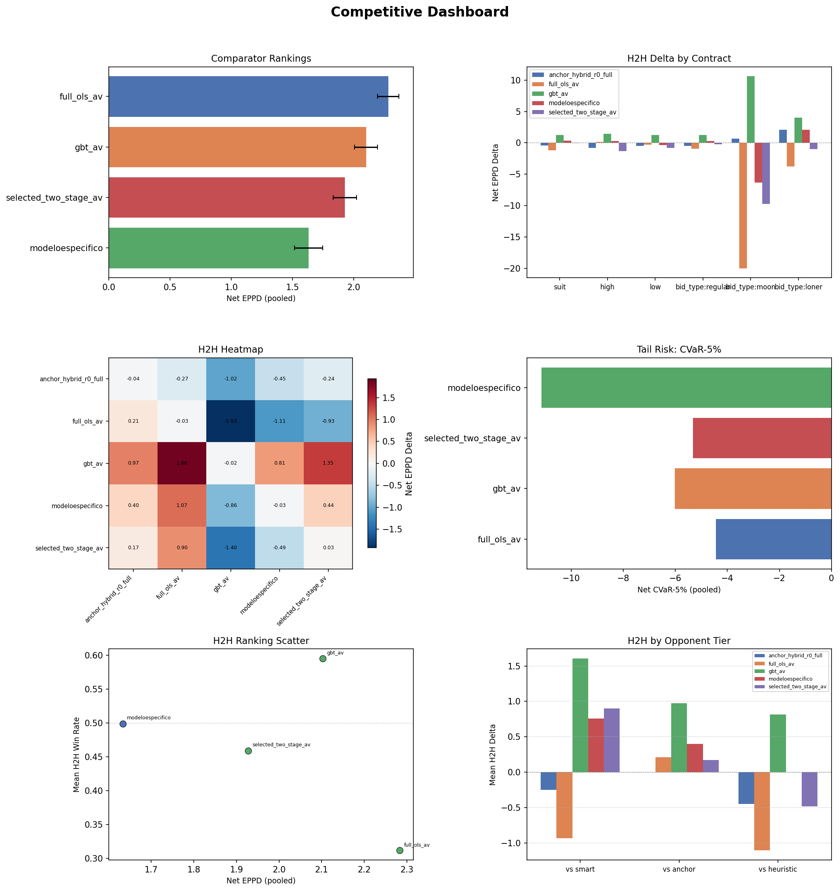

### Chart 2. Health Dashboard

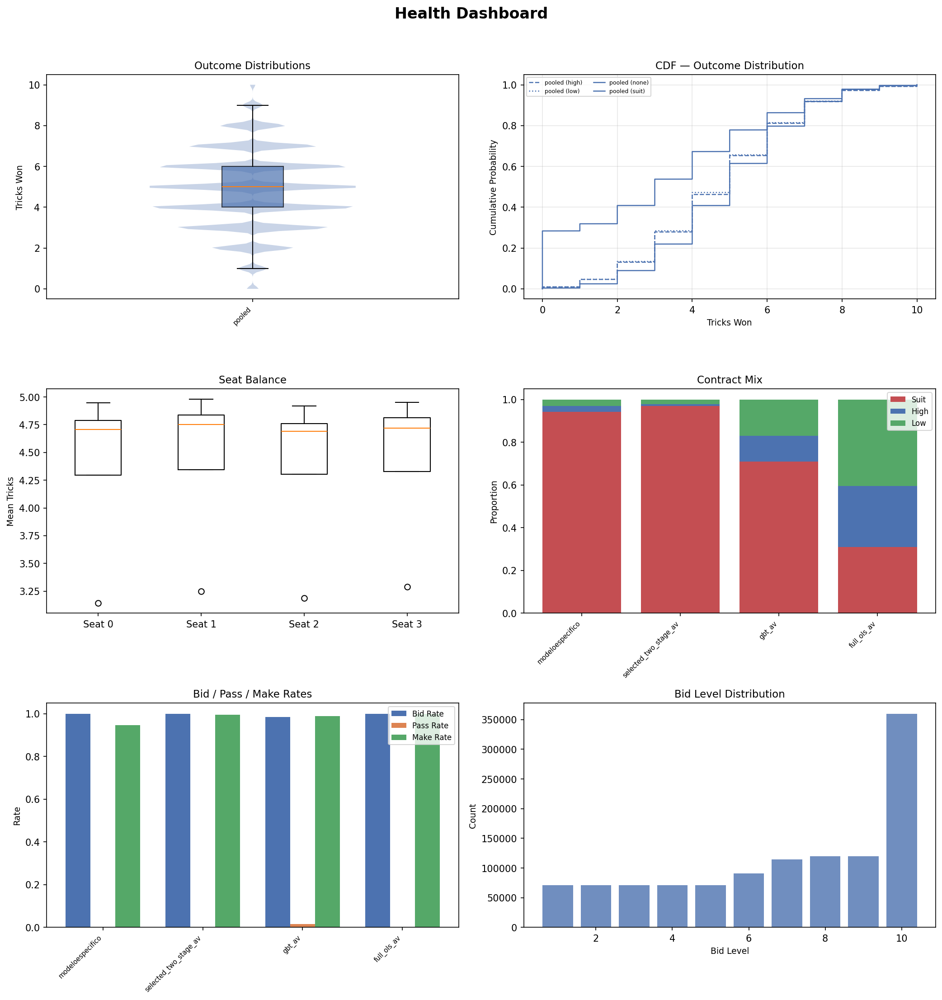

### Chart 3. Model Evaluation Dashboard

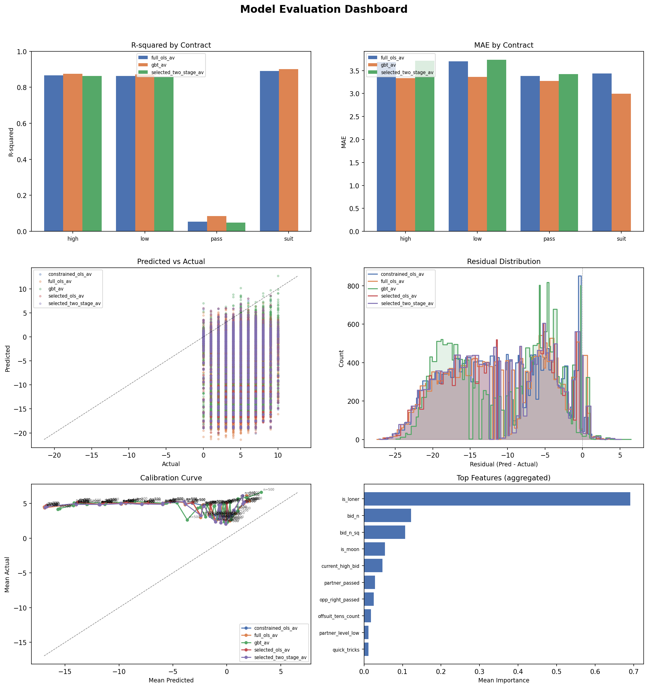

## 1. Data Sanity

| check_name | scope | value | threshold | status | detail |
| --- | --- | --- | --- | --- | --- |
| h2h_cells_populated | h2h | 25.0000 | 25.0000 | PASS | 25/25 cells have metrics |
| h2h_min_deals | h2h | 30000.0000 | 10.0000 | PASS | Minimum deals across cells: 30000 |
| comparator_bidders_present | comparator | 4.0000 | 2.0000 | PASS | 4 bidders in comparator |
| r2_positive_full_ols_av_high | training | 0.8661 | 0.0000 | PASS | full_ols_av high R²=0.8661 |
| r2_positive_full_ols_av_low | training | 0.8625 | 0.0000 | PASS | full_ols_av low R²=0.8625 |
| r2_positive_full_ols_av_pass | training | 0.0545 | 0.0000 | PASS | full_ols_av pass R²=0.0545 |
| r2_positive_full_ols_av_suit | training | 0.8902 | 0.0000 | PASS | full_ols_av suit R²=0.8902 |
| r2_positive_gbt_av_high | training | 0.8752 | 0.0000 | PASS | gbt_av high R²=0.8752 |
| r2_positive_gbt_av_low | training | 0.8721 | 0.0000 | PASS | gbt_av low R²=0.8721 |
| r2_positive_gbt_av_pass | training | 0.0854 | 0.0000 | PASS | gbt_av pass R²=0.0854 |

*Full table omitted from markdown — see `tables/data_sanity.csv`*

## 2. Offline Model Performance

| model | contract | r_squared | mae | n_train | n_val |
| --- | --- | --- | --- | --- | --- |
| full_ols_av | high | 0.8661 | 3.6854 | 1549966 | 193083 |
| full_ols_av | low | 0.8625 | 3.6996 | 1549966 | 193083 |
| full_ols_av | pass | 0.0545 | 3.3816 | 160000 | 20000 |
| full_ols_av | suit | 0.8902 | 3.4376 | 6199864 | 772332 |
| gbt_av | high | 0.8752 | 3.3317 | 1549966 | 193083 |
| gbt_av | low | 0.8721 | 3.3615 | 1549966 | 193083 |
| gbt_av | pass | 0.0854 | 3.2702 | 160000 | 20000 |
| gbt_av | suit | 0.8999 | 2.9986 | 6199864 | 772332 |
| selected_two_stage_av | high | 0.8633 | 3.7166 | 1549966 | 193083 |
| selected_two_stage_av | low | 0.8595 | 3.7340 | 1549966 | 193083 |
| selected_two_stage_av | pass | 0.0484 | 3.4208 | 160000 | 20000 |
| selected_two_stage_av | suit |  |  | 6199864 | 772332 |

### Chart 14. R-squared by Contract

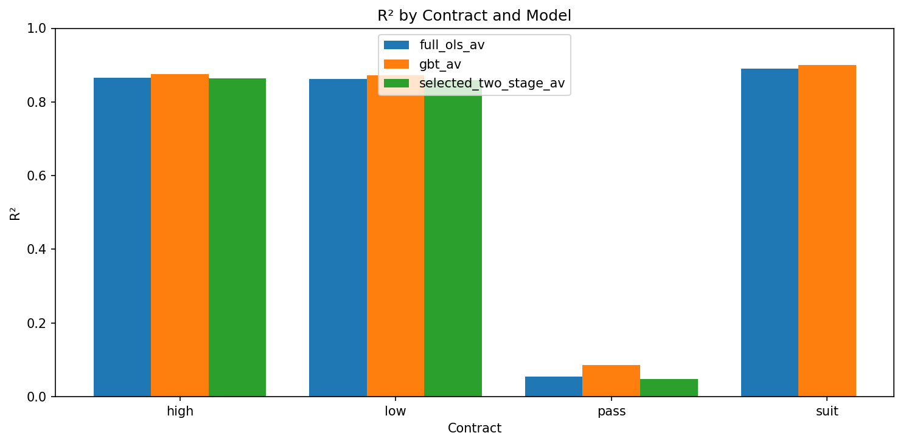

### Chart 15. MAE by Contract

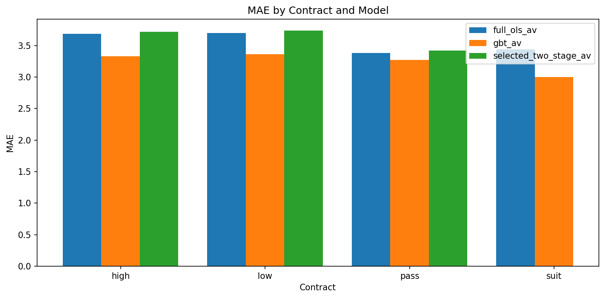

## 3. Offline Diagnostics

### Chart 16. Predicted vs Actual

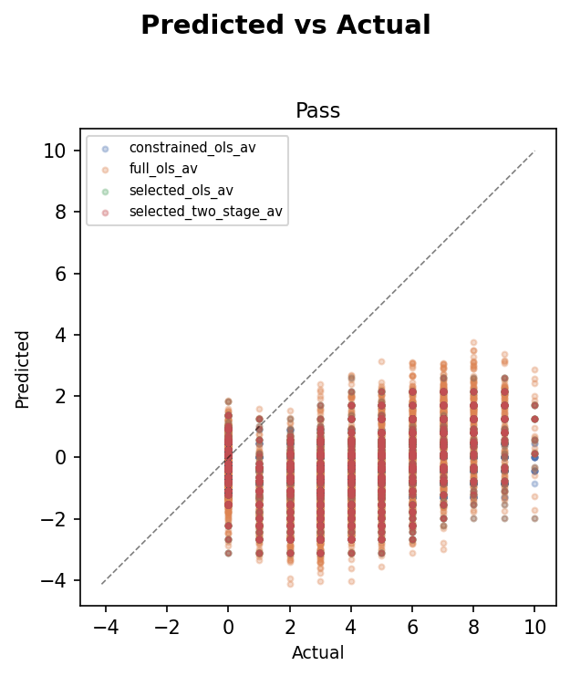

### Chart 17. Residual Distribution

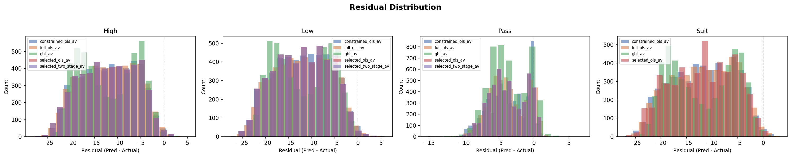

### Chart 18. Calibration Curve

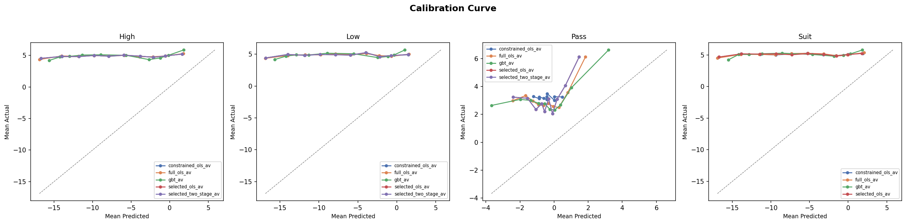

### Chart 20. Feature Importance

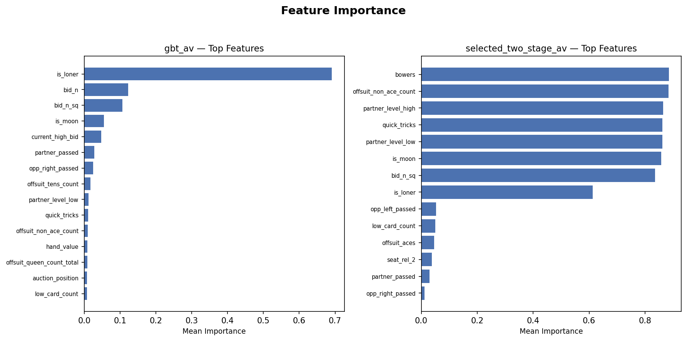

## 4. Model Interpretability

### Chart 19. Selection Path

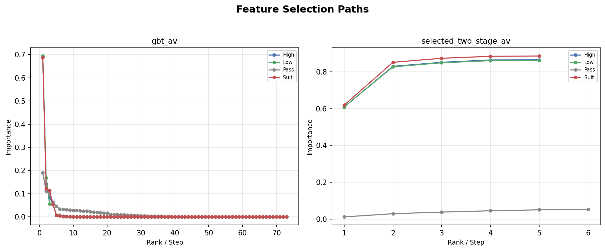

## 5. Cross-Model Decision Analysis

*Decision comparison analysis not yet generated.*

## 6. Comparator Rankings

| model | facet | net_eppd | ci_low | ci_high | bid_rate | make_rate | net_cvar_5 | rank |
| --- | --- | --- | --- | --- | --- | --- | --- | --- |
| full_ols_av | pooled | 2.2829 | 2.1948 | 2.3706 | 1.0000 | 0.9999 | -4.4413 | 1 |
| gbt_av | pooled | 2.1024 | 2.0080 | 2.1967 | 0.9841 | 0.9888 | -6.0166 | 2 |
| selected_two_stage_av | pooled | 1.9276 | 1.8339 | 2.0227 | 0.9999 | 0.9939 | -5.3288 | 3 |
| modeloespecifico | pooled | 1.6332 | 1.5173 | 1.7486 | 1.0000 | 0.9467 | -11.1533 | 4 |

### Chart 4. Comparator Ranking Bars

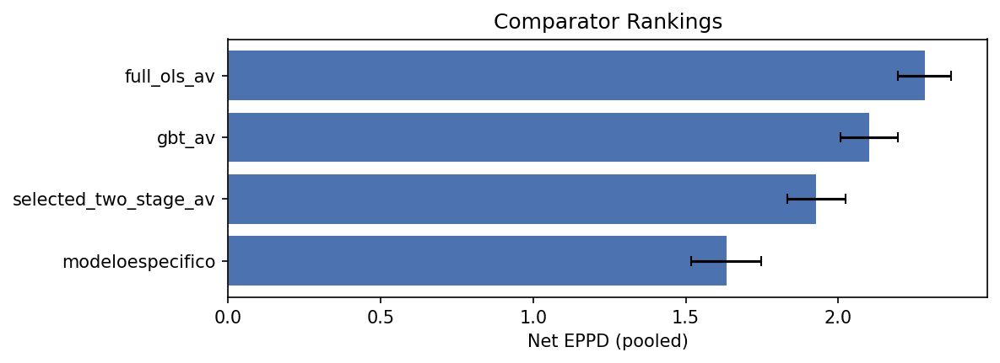

### Chart 5. Tail Risk Panel

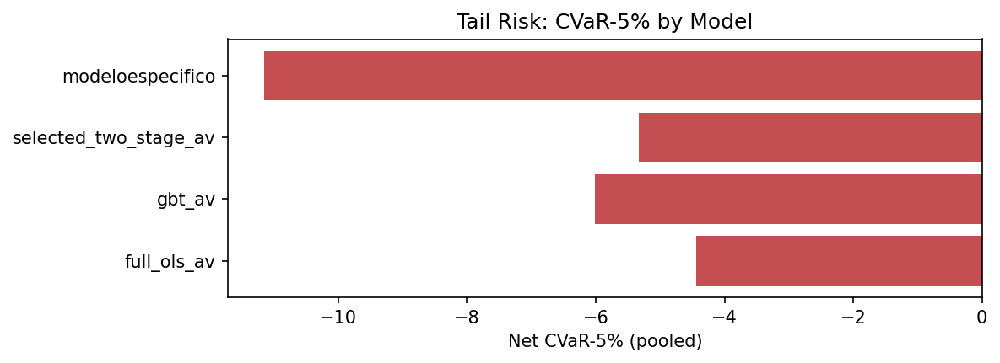

## 7. H2H Battery

### Chart 6. H2H Delta by Contract

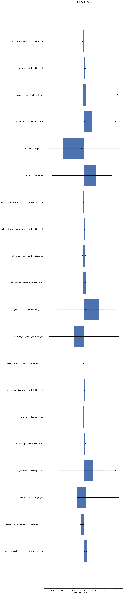

### Chart 7. H2H Heatmap

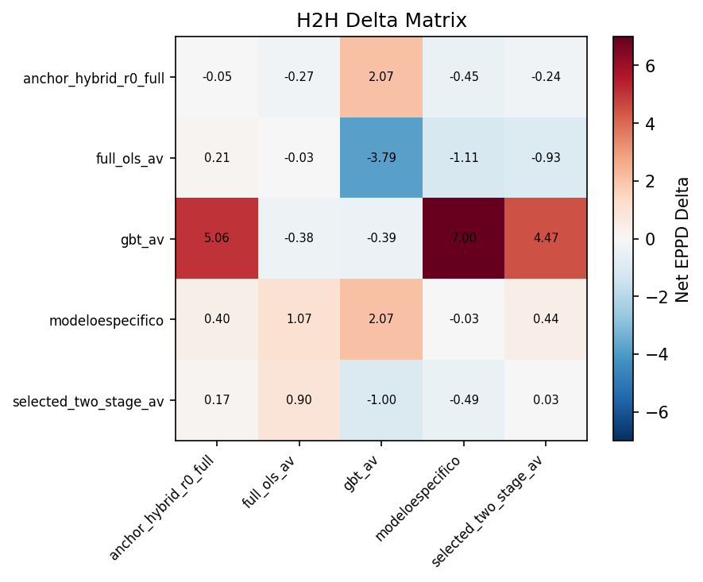

Full H2H Delta Matrix (click to expand)

| team0 | team1 | facet | net_eppd_delta | ci_low | ci_high | win_rate_a | deals_total |
| --- | --- | --- | --- | --- | --- | --- | --- |
| modeloespecifico | modeloespecifico | pooled | -0.0268 | -0.1279 | 0.0751 | 0.4363 | 30000 |
| modeloespecifico | modeloespecifico | suit | -0.0272 | -0.1303 | 0.0764 | 0.4359 | 28248 |
| modeloespecifico | modeloespecifico | high | 0.1027 | -0.5537 | 0.7887 | 0.4504 | 837 |
| modeloespecifico | modeloespecifico | low | -0.1333 | -0.7492 | 0.4849 | 0.4360 | 915 |
| modeloespecifico | modeloespecifico | bid_type:regular | -0.0268 | -0.1279 | 0.0751 | 0.4363 | 30000 |
| modeloespecifico | selected_two_stage_av | pooled | 0.4386 | 0.3341 | 0.5418 | 0.4529 | 30000 |
| modeloespecifico | selected_two_stage_av | suit | 0.3929 | 0.2856 | 0.5003 | 0.4466 | 28545 |
| modeloespecifico | selected_two_stage_av | high | 2.9394 | 2.2270 | 3.6369 | 0.7394 | 545 |
| modeloespecifico | selected_two_stage_av | low | 0.3736 | -0.2342 | 0.9899 | 0.4802 | 910 |
| modeloespecifico | selected_two_stage_av | bid_type:regular | 0.4386 | 0.3341 | 0.5418 | 0.4529 | 30000 |

*Full table omitted from markdown — see `tables/h2h_delta_matrix.csv`*

## 8. Behavioral Analysis

### Pooled Behavior Summary

| model | net_eppd | eppd | bid_rate | pass_rate | make_rate | cvar_5 | net_cvar_5 | mix_suit | mix_high | mix_low | source |
| --- | --- | --- | --- | --- | --- | --- | --- | --- | --- | --- | --- |
| modeloespecifico | 1.6332 | 5.6079 | 1.0000 | 0.0000 | 0.9467 | -4.5907 | -11.1533 | 0.9416 | 0.0279 | 0.0305 | comparator |
| selected_two_stage_av | 1.9276 | 5.9469 | 0.9999 | 0.0001 | 0.9939 | 2.0107 | -5.3288 | 0.9698 | 0.0082 | 0.0220 | comparator |
| gbt_av | 2.1024 | 5.9240 | 0.9841 | 0.0159 | 0.9888 | 0.9956 | -6.0166 | 0.7091 | 0.1202 | 0.1707 | comparator |
| full_ols_av | 2.2829 | 6.1414 | 1.0000 | 0.0000 | 0.9999 | 2.7787 | -4.4413 | 0.3093 | 0.2850 | 0.4056 | comparator |
| modeloespecifico | 4.6780 |  | 0.4991 | 0.5009 | 0.9331 | -3.2210 |  | 0.9416 | 0.0279 | 0.0305 | h2h_self_play |
| selected_two_stage_av | 4.5972 |  | 0.4922 | 0.5078 | 0.9013 | -4.8040 |  | 0.9698 | 0.0082 | 0.0220 | h2h_self_play |
| gbt_av | 4.2968 |  | 0.4946 | 0.5054 | 0.8625 | -6.6490 |  | 0.7091 | 0.1202 | 0.1707 | h2h_self_play |
| full_ols_av | 4.9756 |  | 0.4845 | 0.5155 | 0.9924 | 0.4530 |  | 0.3093 | 0.2850 | 0.4056 | h2h_self_play |
| anchor_hybrid_r0_full | 3.5406 |  | 0.4092 | 0.5908 | 0.8646 | -5.9520 |  | 0.7758 | 0.0934 | 0.1308 | h2h_self_play |

### Behavior by Contract

| model | contract | net_eppd | bid_rate | pass_rate | make_rate | source |
| --- | --- | --- | --- | --- | --- | --- |
| modeloespecifico | suit | 1.5742 | 1.0000 | 0.0000 | 0.9472 | comparator |
| selected_two_stage_av | suit | 2.0204 | 1.0000 | 0.0000 | 0.9864 | comparator |
| gbt_av | suit | 2.1402 | 1.0000 | 0.0000 | 0.9930 | comparator |
| constrained_ols_av | suit | 2.2513 | 1.0000 | 0.0000 | 1.0000 | comparator |
| selected_ols_av | suit | 2.1645 | 1.0000 | 0.0000 | 1.0000 | comparator |
| full_ols_av | suit | 2.4584 | 1.0000 | 0.0000 | 1.0000 | comparator |
| stricthellraiser | suit | 0.1096 | 1.0000 | 0.0000 | 0.9472 | comparator |
| rankthetank | suit | -9.7004 | 1.0000 | 0.0000 | 0.1474 | comparator |
| modeloespecifico | high | 2.5814 | 1.0000 | 0.0000 | 0.9767 | comparator |
| selected_two_stage_av | high | 1.8261 | 1.0000 | 0.0000 | 1.0000 | comparator |

*Full table omitted from markdown — see `tables/behavior_by_contract.csv`*

### Chart 12. Bid and Make Rates

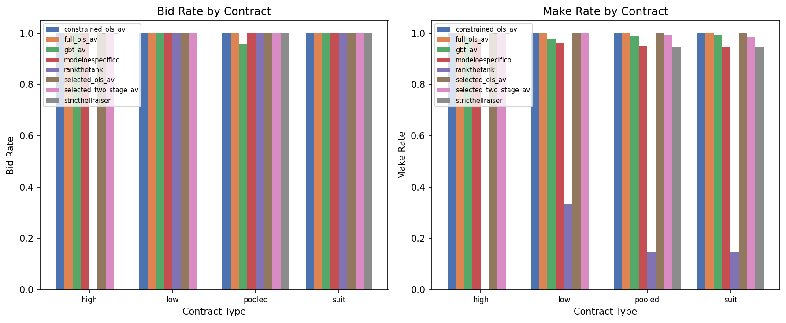

### Chart 11. Contract Mix

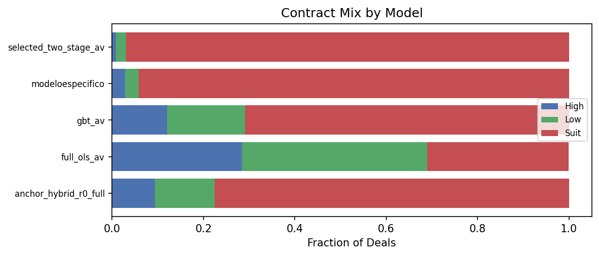

## 9. Sanity Bounds

| model | check_name | value | lower_bound | upper_bound | status |
| --- | --- | --- | --- | --- | --- |
| modeloespecifico | bid_rate_range | 1.0000 | 0.0500 | 0.9500 | FAIL |
| modeloespecifico | make_rate_range | 0.9467 | 0.1000 | 1.0000 | PASS |
| selected_two_stage_av | bid_rate_range | 0.9999 | 0.0500 | 0.9500 | FAIL |
| selected_two_stage_av | make_rate_range | 0.9939 | 0.1000 | 1.0000 | PASS |
| gbt_av | bid_rate_range | 0.9841 | 0.0500 | 0.9500 | FAIL |
| gbt_av | make_rate_range | 0.9888 | 0.1000 | 1.0000 | PASS |
| full_ols_av | bid_rate_range | 1.0000 | 0.0500 | 0.9500 | FAIL |
| full_ols_av | make_rate_range | 0.9999 | 0.1000 | 1.0000 | PASS |
| full_ols_av | r2_positive_high | 0.8661 | 0.0000 | 1.0000 | PASS |
| full_ols_av | r2_positive_low | 0.8625 | 0.0000 | 1.0000 | PASS |

*Full table omitted from markdown — see `tables/sanity_bounds_check.csv`*

## 10. Data Quality Notes

- **Sanity: bid_rate_range** — failed (4 models). Trained models may exceed the conservative [0.05, 0.95] bid rate bounds by design when optimized for net_eppd.
- **Sanity: r2_positive_suit** — failed (selected_two_stage_av). Value 0.0; R² of zero means model coefficients are absent or the model was not trained for this contract.

<!-- gate_status: data sanity checks in §1 above -->
