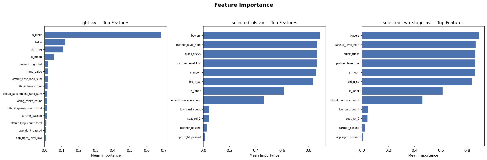
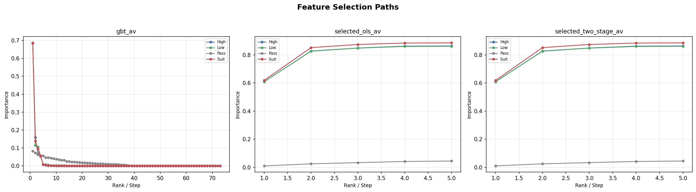

# Rung Results Report

Generated from canonical CSV tables and chart PNGs.

## Dashboards

### Chart 1. Competitive Dashboard

### Chart 2. Health Dashboard

### Chart 3. Model Evaluation Dashboard

## 1. Data Sanity

| check_name | scope | value | threshold | status | detail |
| --- | --- | --- | --- | --- | --- |
| h2h_cells_populated | h2h | 81.0000 | 81.0000 | PASS | 81/81 cells have metrics |
| h2h_min_deals | h2h | 2500.0000 | 10.0000 | PASS | Minimum deals across cells: 2500 |
| comparator_bidders_present | comparator | 8.0000 | 2.0000 | PASS | 8 bidders in comparator |
| r2_positive_constrained_ols_av_high | training | 0.8720 | 0.0000 | PASS | constrained_ols_av high R²=0.8720 |
| r2_positive_constrained_ols_av_low | training | 0.8654 | 0.0000 | PASS | constrained_ols_av low R²=0.8654 |
| r2_positive_constrained_ols_av_pass | training | 0.0077 | 0.0000 | PASS | constrained_ols_av pass R²=0.0077 |
| r2_positive_constrained_ols_av_suit | training | 0.8837 | 0.0000 | PASS | constrained_ols_av suit R²=0.8837 |
| r2_positive_full_ols_av_high | training | 0.8737 | 0.0000 | PASS | full_ols_av high R²=0.8737 |
| r2_positive_full_ols_av_low | training | 0.8681 | 0.0000 | PASS | full_ols_av low R²=0.8681 |
| r2_positive_full_ols_av_pass | training | 0.0514 | 0.0000 | PASS | full_ols_av pass R²=0.0514 |

*Full table omitted from markdown — see `tables/data_sanity.csv`*

## 2. Offline Model Performance

| model | contract | r_squared | mae | n_train | n_val |
| --- | --- | --- | --- | --- | --- |
| constrained_ols_av | high | 0.8720 | 3.6495 | 154449 | 19324 |
| constrained_ols_av | low | 0.8654 | 3.7082 | 154449 | 19324 |
| constrained_ols_av | pass | 0.0077 | 3.6569 | 16000 | 2000 |
| constrained_ols_av | suit | 0.8837 | 3.4962 | 617796 | 77296 |
| full_ols_av | high | 0.8737 | 3.6333 | 154449 | 19324 |
| full_ols_av | low | 0.8681 | 3.6679 | 154449 | 19324 |
| full_ols_av | pass | 0.0514 | 3.4038 | 16000 | 2000 |
| full_ols_av | suit | 0.8872 | 3.4611 | 617796 | 77296 |
| gbt_av | high | 0.8793 | 3.3114 | 154449 | 19324 |
| gbt_av | low | 0.8716 | 3.3888 | 154449 | 19324 |

*Full table omitted from markdown — see `tables/model_performance.csv`*

### Chart 14. R-squared by Contract

### Chart 15. MAE by Contract

## 3. Offline Diagnostics

### Chart 16. Predicted vs Actual

*Chart not available — source data absent.*

### Chart 17. Residual Distribution

*Chart not available — source data absent.*

### Chart 18. Calibration Curve

*Chart not available — source data absent.*

### Chart 20. Feature Importance

## 4. Model Interpretability

### Chart 19. Selection Path

## 5. Cross-Model Decision Analysis

*Decision comparison analysis not yet generated.*

## 6. Comparator Rankings

| model | facet | net_eppd | ci_low | ci_high | bid_rate | make_rate | net_cvar_5 | rank |
| --- | --- | --- | --- | --- | --- | --- | --- | --- |
| full_ols_av | pooled | 2.2816 | 2.1592 | 2.4032 | 1.0000 | 1.0000 | -4.4320 | 1 |
| constrained_ols_av | pooled | 2.1944 | 2.0728 | 2.3192 | 1.0000 | 1.0000 | -4.4800 | 2 |
| selected_ols_av | pooled | 2.0784 | 1.9528 | 2.2048 | 1.0000 | 1.0000 | -4.5760 | 3 |
| gbt_av | pooled | 1.9968 | 1.8616 | 2.1280 | 0.9600 | 0.9900 | -6.0000 | 4 |
| selected_two_stage_av | pooled | 1.8688 | 1.7364 | 2.0020 | 1.0000 | 0.9936 | -5.3920 | 5 |
| modeloespecifico | pooled | 1.6608 | 1.5008 | 1.8188 | 1.0000 | 0.9496 | -11.1120 | 6 |
| stricthellraiser | pooled | 0.1096 | -0.0440 | 0.2648 | 1.0000 | 0.9472 | -11.2240 | 7 |
| rankthetank | pooled | -9.6972 | -9.9576 | -9.4316 | 1.0000 | 0.1476 | -15.0400 | 8 |

### Chart 4. Comparator Ranking Bars

### Chart 5. Tail Risk Panel

## 7. H2H Battery

### Chart 6. H2H Delta by Contract

### Chart 7. H2H Heatmap

Full H2H Delta Matrix (click to expand)

| team0 | team1 | facet | net_eppd_delta | ci_low | ci_high | win_rate_a | deals_total |
| --- | --- | --- | --- | --- | --- | --- | --- |
| modeloespecifico | modeloespecifico | pooled | -0.1724 | -0.3716 | 0.0256 | 0.4204 | 2500 |
| modeloespecifico | modeloespecifico | suit | -0.1600 | -0.3681 | 0.0438 | 0.4209 | 2350 |
| modeloespecifico | modeloespecifico | high | -0.6000 | -1.9714 | 0.8000 | 0.4429 | 70 |
| modeloespecifico | modeloespecifico | low | -0.1625 | -1.4125 | 1.0500 | 0.3875 | 80 |
| modeloespecifico | modeloespecifico | bid_type:regular | -0.1724 | -0.3716 | 0.0256 | 0.4204 | 2500 |
| modeloespecifico | selected_two_stage_av | pooled | 0.2100 | -0.0040 | 0.4268 | 0.4360 | 2500 |
| modeloespecifico | selected_two_stage_av | suit | 0.1810 | -0.0406 | 0.4022 | 0.4304 | 2342 |
| modeloespecifico | selected_two_stage_av | high | 0.5962 | -1.1731 | 2.2500 | 0.6154 | 52 |
| modeloespecifico | selected_two_stage_av | low | 0.6604 | -0.4057 | 1.7264 | 0.4717 | 106 |
| modeloespecifico | selected_two_stage_av | bid_type:regular | 0.2100 | -0.0040 | 0.4268 | 0.4360 | 2500 |

*Full table omitted from markdown — see `tables/h2h_delta_matrix.csv`*

## 8. Behavioral Analysis

### Pooled Behavior Summary

| model | net_eppd | eppd | bid_rate | pass_rate | make_rate | cvar_5 | net_cvar_5 | mix_suit | mix_high | mix_low | source |
| --- | --- | --- | --- | --- | --- | --- | --- | --- | --- | --- | --- |
| modeloespecifico | 1.6608 | 5.6320 | 1.0000 | 0.0000 | 0.9496 | -4.5120 | -11.1120 | 0.9400 | 0.0280 | 0.0320 | comparator |
| selected_two_stage_av | 1.8688 | 5.9156 | 1.0000 | 0.0000 | 0.9936 | 1.9280 | -5.3920 | 0.9584 | 0.0084 | 0.0332 | comparator |
| gbt_av | 1.9968 | 5.7652 | 0.9600 | 0.0400 | 0.9900 | 1.1417 | -6.0000 | 0.7664 | 0.0964 | 0.1372 | comparator |
| constrained_ols_av | 2.1944 | 6.0972 | 1.0000 | 0.0000 | 1.0000 | 2.7600 | -4.4800 | 0.7500 | 0.0680 | 0.1820 | comparator |
| selected_ols_av | 2.0784 | 6.0392 | 1.0000 | 0.0000 | 1.0000 | 2.7120 | -4.5760 | 0.7272 | 0.0896 | 0.1832 | comparator |
| full_ols_av | 2.2816 | 6.1408 | 1.0000 | 0.0000 | 1.0000 | 2.7840 | -4.4320 | 0.4232 | 0.2748 | 0.3020 | comparator |
| stricthellraiser | 0.1096 | 4.9284 | 1.0000 | 0.0000 | 0.9472 | -3.0000 | -11.2240 | 1.0000 | 0.0000 | 0.0000 | comparator |
| rankthetank | -9.6972 | -5.5808 | 1.0000 | 0.0000 | 0.1476 | -9.2480 | -15.0400 | 1.0000 | 0.0000 | 0.0000 | comparator |
| modeloespecifico | 4.6906 |  | 0.4880 | 0.5120 | 0.9287 | -3.2600 |  | 0.9400 | 0.0280 | 0.0320 | h2h_self_play |
| selected_two_stage_av | 4.6084 |  | 0.4928 | 0.5072 | 0.9091 | -4.5520 |  | 0.9584 | 0.0084 | 0.0332 | h2h_self_play |

*Full table omitted from markdown — see `tables/behavior_summary.csv`*

### Behavior by Contract

| model | contract | net_eppd | bid_rate | pass_rate | make_rate | source |
| --- | --- | --- | --- | --- | --- | --- |
| modeloespecifico | pooled | 1.6608 | 1.0000 | 0.0000 | 0.9496 | comparator |
| selected_two_stage_av | pooled | 1.8688 | 1.0000 | 0.0000 | 0.9936 | comparator |
| gbt_av | pooled | 1.9968 | 0.9600 | 0.0400 | 0.9900 | comparator |
| constrained_ols_av | pooled | 2.1944 | 1.0000 | 0.0000 | 1.0000 | comparator |
| selected_ols_av | pooled | 2.0784 | 1.0000 | 0.0000 | 1.0000 | comparator |
| full_ols_av | pooled | 2.2816 | 1.0000 | 0.0000 | 1.0000 | comparator |
| stricthellraiser | pooled | 0.1096 | 1.0000 | 0.0000 | 0.9472 | comparator |
| rankthetank | pooled | -9.6972 | 1.0000 | 0.0000 | 0.1476 | comparator |

### Chart 12. Bid and Make Rates

### Chart 11. Contract Mix

## 9. Sanity Bounds

| model | check_name | value | lower_bound | upper_bound | status |
| --- | --- | --- | --- | --- | --- |
| modeloespecifico | bid_rate_range | 1.0000 | 0.0500 | 0.9500 | FAIL |
| modeloespecifico | make_rate_range | 0.9496 | 0.1000 | 1.0000 | PASS |
| selected_two_stage_av | bid_rate_range | 1.0000 | 0.0500 | 0.9500 | FAIL |
| selected_two_stage_av | make_rate_range | 0.9936 | 0.1000 | 1.0000 | PASS |
| gbt_av | bid_rate_range | 0.9600 | 0.0500 | 0.9500 | FAIL |
| gbt_av | make_rate_range | 0.9900 | 0.1000 | 1.0000 | PASS |
| constrained_ols_av | bid_rate_range | 1.0000 | 0.0500 | 0.9500 | FAIL |
| constrained_ols_av | make_rate_range | 1.0000 | 0.1000 | 1.0000 | PASS |
| selected_ols_av | bid_rate_range | 1.0000 | 0.0500 | 0.9500 | FAIL |
| selected_ols_av | make_rate_range | 1.0000 | 0.1000 | 1.0000 | PASS |

*Full table omitted from markdown — see `tables/sanity_bounds_check.csv`*

<\!-- gate_status: data sanity checks in §1 above -->
