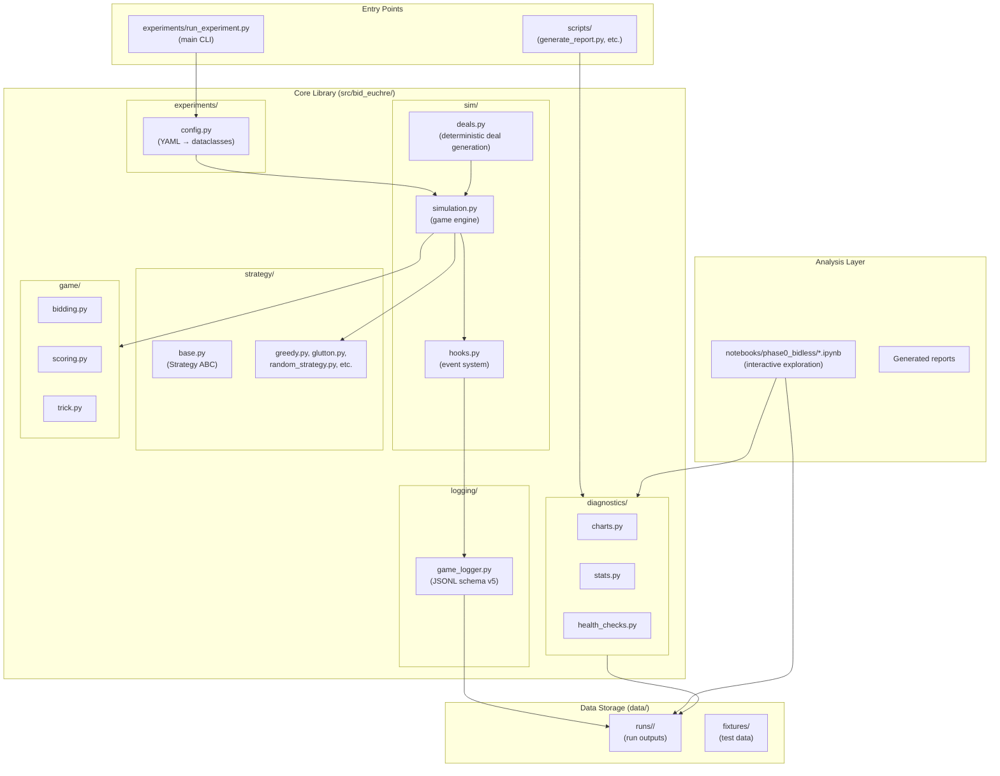
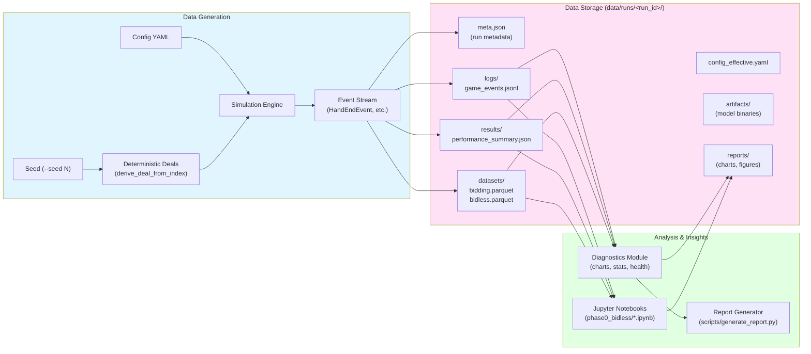
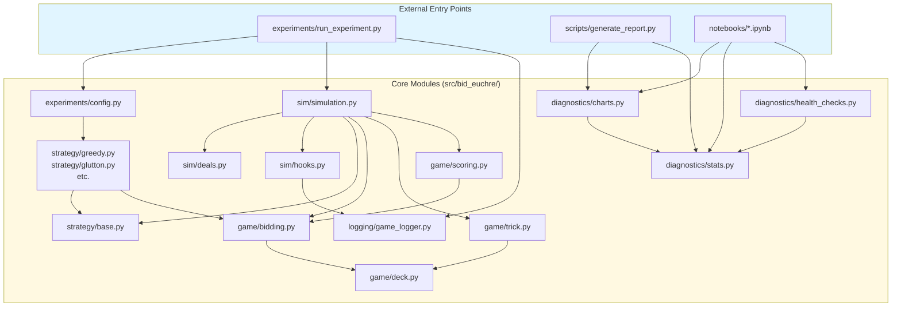
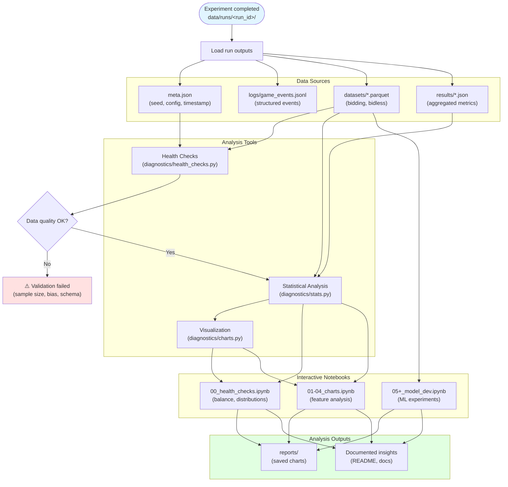
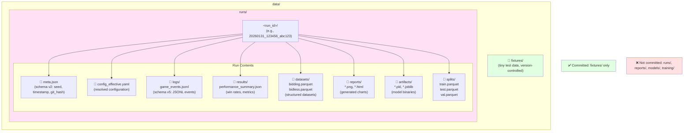
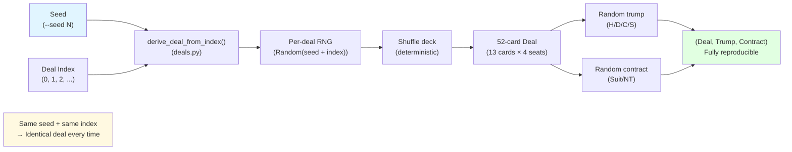
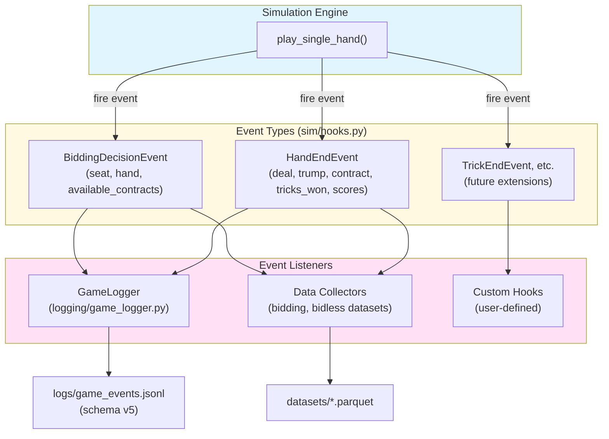

# Repository Flow Diagram and Data Architecture

This document provides visual diagrams showing how modules flow together to generate data and how that data is organized, summarized, and analyzed in the Bid Euchre repository.

## Overview

The Bid Euchre repository implements a simulation framework for analyzing card game strategies. The system follows a clean separation of concerns:

- **Experiment execution** generates deterministic game data
- **Structured logging** captures game events and outcomes
- **Analysis tools** process outputs to extract insights
- **Notebooks** provide interactive exploration and visualization

All data generation is reproducible via explicit seeds, and outputs are strictly confined to `data/runs/<run_id>/` directories.

---

## Architecture Layers



---

## Experiment Execution Flow

```mermaid
flowchart TD
    Start([User runs:<br/>python experiments/run_experiment.py<br/>--config CONFIG --seed SEED])

    Start --> LoadConfig["Load YAML config<br/>(experiments/configs/*.yaml)"]
    LoadConfig --> ParseConfig["Parse & validate<br/>(config.py → StrategyConfig)"]

    ParseConfig --> CreateRunID["Generate run_id<br/>(timestamp-based)"]
    CreateRunID --> CreateRunDir["Create data/runs/&lt;run_id&gt;/"]

    CreateRunDir --> SaveMeta["Save meta.json<br/>(schema v2: seed, timestamp, config)"]
    SaveMeta --> SaveEffectiveConfig["Save config_effective.yaml<br/>(resolved configuration)"]

    SaveEffectiveConfig --> InitLogger["Initialize GameLogger<br/>(JSONL schema v5)"]
    InitLogger --> InitStrategies["Instantiate strategies<br/>(GreedyStrategy, etc.)"]

    InitStrategies --> GenerateDeals["Generate deals<br/>(deals.derive_deal_from_index)"]

    GenerateDeals --> SimLoop["For each deal..."]

    subgraph Simulation["Simulation Loop (simulation.py)"]
        SimLoop --> PlayHand["play_single_hand()"]
        PlayHand --> Bidding["Bidding phase<br/>(fire BiddingDecisionEvent)"]
        Bidding --> PlayTricks["Play tricks<br/>(trick.py logic)"]
        PlayTricks --> Score["Score hand<br/>(scoring.py)"]
        Score --> LogEvents["Log events<br/>(HandEndEvent, etc.)"]
        LogEvents --> NextDeal{More deals?}
        NextDeal -->|Yes| PlayHand
    end

    NextDeal -->|No| Aggregate["Aggregate results<br/>(win rates, metrics)"]
    Aggregate --> SaveResults["Save results/<br/>(performance_summary.json)"]
    SaveResults --> SaveLogs["Save logs/<br/>(game_events.jsonl)"]
    SaveLogs --> SaveDatasets["Save datasets/<br/>(bidding.parquet, etc.)"]
    SaveDatasets --> End([Experiment complete<br/>Output: data/runs/&lt;run_id&gt;/])

    style Start fill:#e1f5ff
    style End fill:#e1ffe1
    style Simulation fill:#fff9e1
```



---

## Data Pipeline



---

## Module Dependencies



---

## Analysis Workflow



---

## Data Organization Detail



---

## Deterministic Deal Generation



---

## Event System (Hooks)



---

## Key Principles

### Reproducibility
- All experiments require `--seed <int>` for deterministic execution
- Same seed + same config → identical results every time
- Deal generation uses `derive_deal_from_index(seed, index)` for per-deal reproducibility

### Data Contract
- **Outputs confined to**: `data/runs/<run_id>/` only
- **Version control**: `data/fixtures/` only (tiny test data)
- **Never commit**: `data/runs/`, `data/reports/`, `data/models/`, `data/training/`

### Validation Gates
- Health checks enforce sample size minimums (≥2,000 deals for bias detection)
- Statistical tests required for inference claims (ANOVA, t-tests, effect sizes)
- Schema validation ensures compatibility across pipeline stages

### Canonical Entry Points
- **Experiment execution**: `experiments/run_experiment.py` (only runner)
- **Configuration**: YAML files in `experiments/configs/`
- **Reporting**: `scripts/generate_report.py`
- **Interactive analysis**: `notebooks/phase0_bidless/*.ipynb`

---

## Quick Reference

### Run an experiment
```bash
python experiments/run_experiment.py \
  --config experiments/configs/quick_test.yaml \
  --seed 42
```

### Validate before PR
```bash
make check  # repo-lint + ruff + pytest
```

### Generate analysis
```bash
# Interactive exploration
jupyter notebook notebooks/phase0_bidless/00_health_checks.ipynb

# Automated reporting
python scripts/generate_report.py --run-id <run_id>
```

---

## References

- **Architecture**: `docs/01_core/ARCHITECTURE.md`
- **Data Contract**: `docs/01_core/DATA_CONTRACT.md`
- **Reproducibility**: `docs/01_core/REPRODUCIBILITY.md`
- **Metrics**: `docs/01_core/METRICS.md`
- **Experiment Design**: `docs/01_core/EXPERIMENTS.md`
