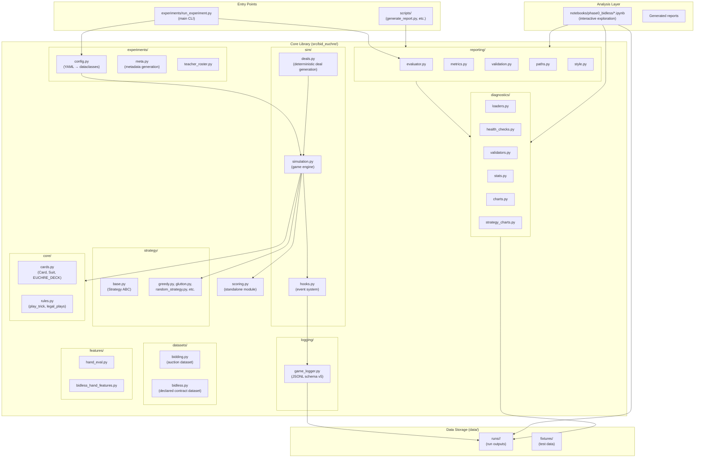
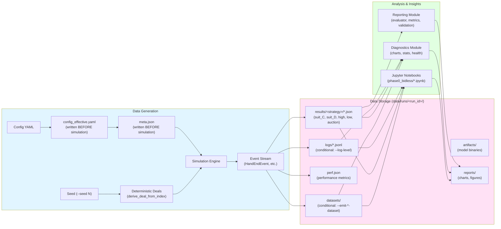
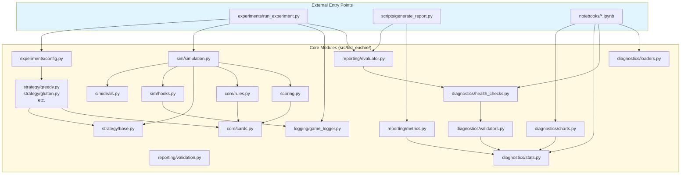
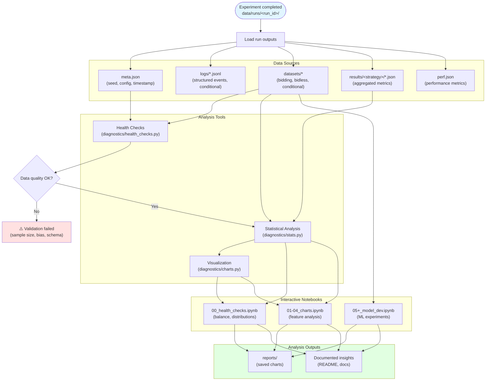
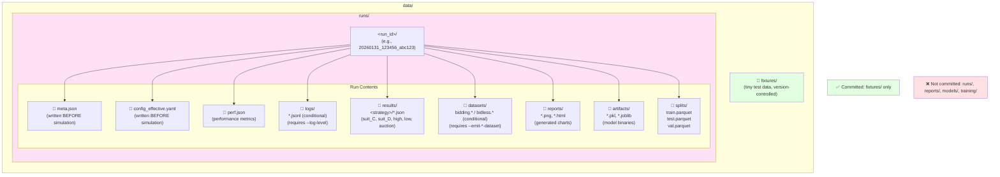
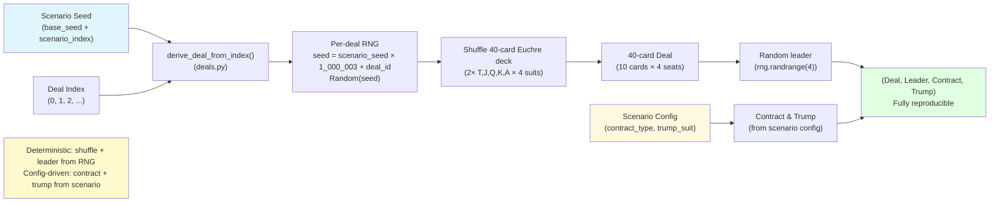
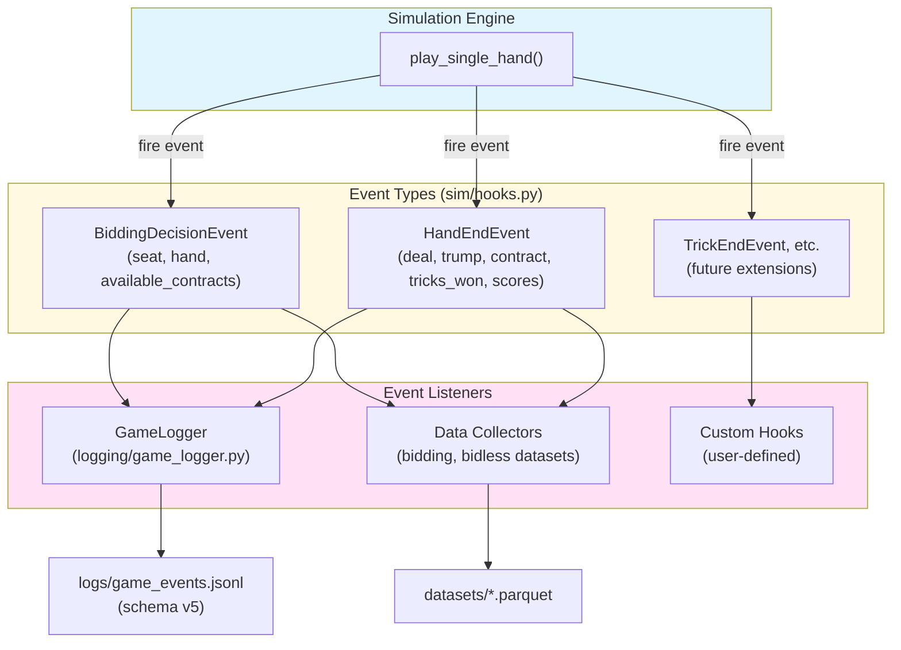

# Repository Flow Diagram and Data Architecture

This document provides visual diagrams showing how modules flow together to generate data and how that data is organized, summarized, and analyzed in the Bid Euchre repository.

## Overview

The Bid Euchre repository implements a simulation framework for analyzing card game strategies. The system follows a clean separation of concerns:

- **Experiment execution** generates deterministic game data
- **Structured logging** captures game events and outcomes
- **Analysis tools** process outputs to extract insights
- **Notebooks** provide interactive exploration and visualization

All data generation is reproducible via explicit seeds, and outputs are strictly confined to `data/runs/<run_id>/` directories.

---

## Architecture Layers



---

## Experiment Execution Flow

```mermaid
flowchart TD
    Start([User runs:<br/>python experiments/run_experiment.py<br/>--config CONFIG --seed SEED])

    Start --> LoadConfig["Load YAML config<br/>(experiments/configs/*.yaml)"]
    LoadConfig --> ParseConfig["Parse & validate<br/>(config.py → StrategyConfig)"]

    ParseConfig --> CreateRunID["Generate run_id<br/>(timestamp-based)"]
    CreateRunID --> CreateRunDir["Create data/runs/&lt;run_id&gt;/"]

    CreateRunDir --> SaveEffectiveConfig["Save config_effective.yaml<br/>(resolved configuration)"]
    SaveEffectiveConfig --> SaveMeta["Save meta.json<br/>(schema v2: seed, timestamp, git_hash)"]

    SaveMeta --> InitLogger["Initialize GameLogger<br/>(JSONL schema v5)"]
    InitLogger --> InitStrategies["Instantiate strategies<br/>(GreedyStrategy, etc.)"]

    InitStrategies --> GenerateDeals["Generate deals<br/>(deals.derive_deal_from_index)"]

    GenerateDeals --> SimLoop["For each deal..."]

    subgraph Simulation["Simulation Loop (simulation.py)"]
        SimLoop --> PlayHand["play_single_hand()"]
        PlayHand --> Bidding["Bidding phase<br/>(fire BiddingDecisionEvent)"]
        Bidding --> PlayTricks["Play tricks<br/>(trick.py logic)"]
        PlayTricks --> Score["Score hand<br/>(scoring.py)"]
        Score --> LogEvents["Log events<br/>(HandEndEvent, etc.)"]
        LogEvents --> NextDeal{More deals?}
        NextDeal -->|Yes| PlayHand
    end

    NextDeal -->|No| Aggregate["Aggregate results<br/>(win rates, metrics)"]
    Aggregate --> SaveResults["Save results/&lt;strategy&gt;/*.json<br/>(suit_C.json, suit_D.json, high.json,<br/>low.json, auction.json)"]
    SaveResults --> SavePerf["Save perf.json<br/>(performance metrics)"]
    SavePerf --> SaveLogs["Save logs/*.jsonl<br/>(if --log-level != none)"]
    SaveLogs --> SaveDatasets["Save datasets/<br/>(if --emit-bidding-dataset or<br/>--emit-bidless-dataset)"]
    SaveDatasets --> End([Experiment complete<br/>Output: data/runs/&lt;run_id&gt;/])

    style Start fill:#e1f5ff
    style End fill:#e1ffe1
    style Simulation fill:#fff9e1
```



---

## Data Pipeline



---

## Module Dependencies



---

## Analysis Workflow



---

## Data Organization Detail



---

## Run Invariants vs Optional Artifacts

Every run directory has a guaranteed structure and conditional outputs based on CLI flags.

### Always Present (Guaranteed)

These files are created for every experiment run:

- **meta.json** - Run metadata (seed, timestamp, git_hash), written BEFORE simulation starts
- **config_effective.yaml** - Resolved configuration with all defaults applied, written BEFORE simulation
- **perf.json** - Performance metrics (execution time, deals processed), written AFTER simulation completes
- **results/** - Per-strategy metric rollups, organized by execution mode:
  - `self_play`: `results/<strategy>/*.json`
  - `head_to_head`: `results/<team0>_vs_<team1>/*.json`
  - `head_to_head_matrix`: `results/<strat_a>_vs_<strat_b>/*.json`
- **logs/** - Directory always created (contents conditional on --log-level)
- **reports/** - Directory for generated visualizations
- **splits/** - Reserved directory for train/test/val splits
- **artifacts/** - Reserved directory for model binaries

### Conditional Artifacts (Flag-Dependent)

These files are only created when specific flags are provided:

| Artifact | CLI Flag | When Generated | Notes |
|----------|----------|----------------|-------|
| `logs/*.jsonl` | `--log-level hand` or `--log-level trick` | During simulation | JSONL schema v5 event stream |
| `datasets/bidding.*` | `--emit-bidding-dataset` | After simulation | Only in auction mode (contract_type: null) |
| `datasets/bidless.*` | `--emit-bidless-dataset` | After simulation | Only in declared contract mode |

### Checking for Conditional Artifacts

When analyzing runs programmatically, always check for existence:

```python
from pathlib import Path

run_dir = Path("data/runs/<run_id>")

# Always present
assert (run_dir / "meta.json").exists()
assert (run_dir / "perf.json").exists()
assert (run_dir / "config_effective.yaml").exists()

# Conditional - check before loading
logs_file = run_dir / "logs" / "game_events.jsonl"
if logs_file.exists():
    # Process logs
    pass

bidding_dataset = run_dir / "datasets" / "bidding.parquet"
if bidding_dataset.exists():
    # Analyze bidding decisions
    pass
```

---

## Modes and Scenario Types

### Execution Modes

The experiment runner supports three execution modes that determine how strategies compete:

**self_play** (default):
- All 4 seats use the same strategy
- Results organized in: `results/<strategy>/`
- One run per strategy listed in config
- Example: Testing how well GreedyStrategy performs against itself

**head_to_head**:
- Team 0 (seats 0 & 2) vs Team 1 (seats 1 & 3)
- Results organized in: `results/<team0>_vs_<team1>/`
- Requires `--team1-strategy` CLI flag
- Example: `--strategy greedy --team1-strategy random` → `results/greedy_vs_random/`

**head_to_head_matrix**:
- All-vs-all matchups from config
- Results organized in: `results/<strat_a>_vs_<strat_b>/` for each matchup
- Requires `matchups:` list in YAML config
- Example config:
  ```yaml
  matchups:
    - [greedy, random]
    - [greedy, glutton]
    - [random, glutton]
  ```

### Contract Modes

Scenarios can operate in two fundamentally different contract modes:

**Declared Contract** (contract_type specified):
- No bidding phase - contract and trump are predetermined
- Contract type and trump suit come from scenario configuration
- Enables `--emit-bidless-dataset` collection
- Result filenames by contract type:
  - `suit_C.json` (Club contract)
  - `suit_D.json` (Diamond contract)
  - `suit_H.json` (Heart contract)
  - `suit_S.json` (Spade contract)
  - `high.json` (High no-trump contract)
  - `low.json` (Low no-trump contract)

**Auction Mode** (contract_type: null):
- Bidding phase where strategies compete to set contract
- Winner of auction chooses trump suit and contract type
- Enables `--emit-bidding-dataset` collection
- Result filename: `auction.json`

### Example Directory Structure by Mode

```
# Self-play mode
data/runs/<run_id>/results/
├── greedy/
│   ├── suit_C.json
│   ├── suit_D.json
│   └── auction.json
└── random/
    ├── suit_C.json
    └── high.json

# Head-to-head mode
data/runs/<run_id>/results/
└── greedy_vs_random/
    ├── suit_C.json
    └── auction.json

# Head-to-head matrix mode
data/runs/<run_id>/results/
├── greedy_vs_random/
│   └── auction.json
├── greedy_vs_glutton/
│   └── auction.json
└── random_vs_glutton/
    └── auction.json
```

---

## Deterministic Deal Generation



---

## Event System (Hooks)



---

## Key Principles

### Reproducibility

#### Deterministic Execution
- All experiments require `--seed <int>` for deterministic execution
- Same seed + same config → identical results every time
- Deal generation uses `derive_deal_from_index(seed, index)` for per-deal reproducibility

#### Deck Specification
- **40-card Euchre deck**: 2 copies of each (Ten, Jack, Queen, King, Ace) × 4 suits
- **Hand size**: 10 cards per player (entire deck is dealt, no cards left over)
- Total: 4 suits × 5 ranks × 2 copies = 40 cards

#### RNG Formula
Each deal gets a unique, deterministic random seed:

```python
# Scenario seed combines base seed with scenario index
scenario_seed = base_seed + scenario_index

# Deal seed uses large prime to avoid collisions
rng_seed = scenario_seed * 1_000_003 + deal_id
rng = random.Random(rng_seed)
```

This ensures:
- Different scenarios never share deals (scenario_index offset)
- Different deals within a scenario are independent (deal_id offset)
- Same base seed reproduces entire experiment exactly

#### What's Deterministic vs Config-Driven

**Deterministic (from RNG)**:
- ✅ Card shuffle - `rng.shuffle(deck)`
- ✅ Leader selection - `rng.randrange(4)`
- ✅ Dealer selection in auction mode - `rng.randrange(4)`

**Config-Driven (from scenario)**:
- ❌ Contract type - specified in scenario YAML (`contract_type: suit`, `high`, `low`, or `null` for auction)
- ❌ Trump suit - specified in scenario YAML (`trump_suit: C/D/H/S`) or chosen by auction winner

This separation ensures reproducibility while allowing exploration of different contract scenarios.

### Data Contract
- **Outputs confined to**: `data/runs/<run_id>/` only
- **Version control**: `data/fixtures/` only (tiny test data)
- **Never commit**: `data/runs/`, `data/reports/`, `data/models/`, `data/training/`

### Validation Gates
- Health checks enforce sample size minimums (≥2,000 deals for bias detection)
- Statistical tests required for inference claims (ANOVA, t-tests, effect sizes)
- Schema validation ensures compatibility across pipeline stages

### Canonical Entry Points
- **Experiment execution**: `experiments/run_experiment.py` (only runner)
- **Configuration**: YAML files in `experiments/configs/`
- **Reporting**: `scripts/generate_report.py`
- **Interactive analysis**: `notebooks/phase0_bidless/*.ipynb`

---

## Quick Reference

### Run an experiment
```bash
python experiments/run_experiment.py --config experiments/configs/quick_test.yaml --seed 42
```

### Validate before PR
```bash
make check  # repo-lint + ruff + pytest
```

### Generate analysis
```bash
# Interactive exploration
jupyter notebook notebooks/phase0_bidless/00_health_checks.ipynb

# Automated reporting
python scripts/generate_report.py --run-id <run_id>
```

---

## References

- **Architecture**: `docs/01_core/ARCHITECTURE.md`
- **Data Contract**: `docs/01_core/DATA_CONTRACT.md`
- **Reproducibility**: `docs/01_core/REPRODUCIBILITY.md`
- **Metrics**: `docs/01_core/METRICS.md`
- **Experiment Design**: `docs/01_core/EXPERIMENTS.md`
