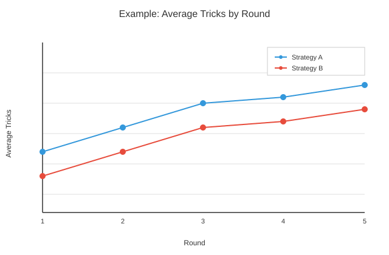

# Plotting Style Guide

This guide standardizes plot formatting and themes across the repository.
It applies to Matplotlib/Seaborn and Plotly and should be used for any new
visualization or report.

## Why this exists
- Consistent formatting makes comparisons across plots faster and less error-prone.
- Standard palettes and typography improve readability and accessibility.
- Shared helpers reduce ad-hoc styling decisions and bugs.

## Core principles (evidence-based)
- Prefer encodings with higher perceptual accuracy (position/length over area/angle).
  Use bar charts, dot plots, and line charts before pies or complex 3D charts.
  Source: Cleveland and McGill on graphical perception.
- Label directly when possible; use legends only when direct labeling would clutter.
  Source: US Web Design System (Data Visualization Standards).
- Choose color deliberately and use accessible contrasts; color should not be the
  only encoding of meaning. Source: Royal Statistical Society Data Vis Guide.

## Standard formatting rules
Use the shared helpers in `src/bid_euchre/reporting/style.py`:
- Matplotlib: `apply_report_style()`
- Seaborn: `apply_seaborn_style()`
- Plotly: `get_plotly_template()` and `apply_plotly_template()`

Standardized typography and layout:
- Font sizes, line widths, and grid styles are controlled by `REPORT_STYLE`.
- Figure sizes use `FIGSIZE_*` constants.
- Gridlines: off by default; enable per-plot where they aid reading.
- Titles use sentence case and describe what the viewer should learn.

## Color system
Color meanings are consistent across plots:
- Outcomes: win/lose/push from `OUTCOME_COLORS`.
- Strategies: `STRATEGY_COLORS`.
- Contracts: `CONTRACT_COLORS`.

Rules:
- Use the shared palette first; do not invent new colors unless required.
- Avoid red/green-only encoding; add shape/label or order to disambiguate.
- Keep background white and foreground dark for contrast.

## Axes, labels, and legends
- Label axes with units and meaning (e.g., "Tricks Won", "Win Rate (%)").
- Prefer direct labels to reduce legend scanning.
- When legends are necessary:
  - Use descriptive legend titles (not "Legend").
  - Order categories meaningfully (descending or logical order).
  - Place legends outside plot area when they obscure data.

## Statistical annotations
When reporting uncertainty:
- Use confidence intervals where appropriate.
- Prefer compact annotations like `95% CI [low, high]`.
- Use consistent formatting via helpers in `style.py` (e.g., `format_ci`).

## File naming and outputs
- Use descriptive, stable filenames that reflect the plot purpose.
- Keep plots in report output folders and follow existing reporting paths.
- Avoid overwriting historical output; use existing archive patterns.

## Library-specific usage

### Matplotlib
```python
from bid_euchre.reporting.style import apply_report_style, FIGSIZE_SINGLE_PLOT

apply_report_style()
fig, ax = plt.subplots(figsize=FIGSIZE_SINGLE_PLOT)
```

### Seaborn
```python
from bid_euchre.reporting.style import apply_seaborn_style, FIGSIZE_SINGLE_PLOT

apply_seaborn_style()
fig, ax = plt.subplots(figsize=FIGSIZE_SINGLE_PLOT)
```

### Plotly
```python
from bid_euchre.reporting.style import apply_plotly_template

apply_plotly_template()
fig = px.line(df, x="x", y="y", title="Example")
```

## Checklist
- Apply shared style helper before plotting.
- Use a shared color palette.
- Ensure labels are clear and units are explicit.
- Avoid chart junk and unnecessary 3D effects.
- Verify accessibility (contrast, not color-only).

## Example figure


## Sources
- US Web Design System: Data Visualization Standards (labels, legends)
  https://xdgov.github.io/data-design-standards/
- Royal Statistical Society Data Visualization Guide (styling, accessibility)
  https://royal-statistical-society.github.io/datavisguide/docs/styling.html
- Cleveland, W. S., & McGill, R. (1984/1985) Graphical Perception
  https://www.tandfonline.com/doi/abs/10.1080/01621459.1984.10478080
