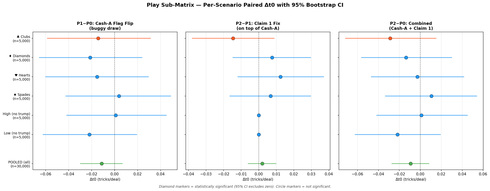
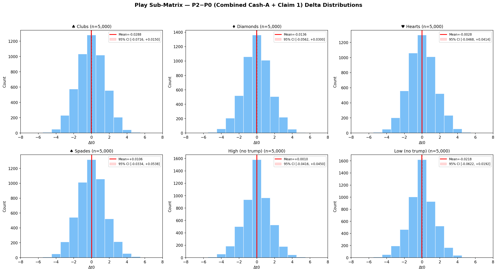
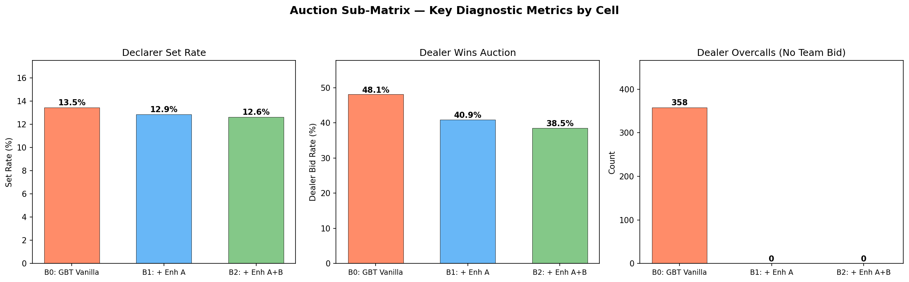
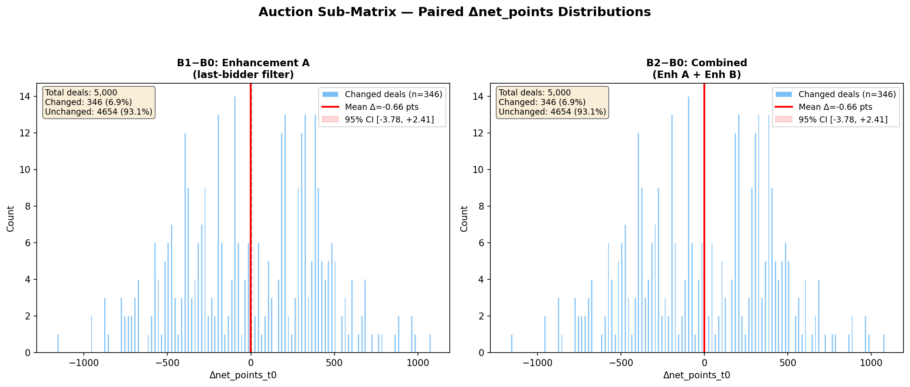
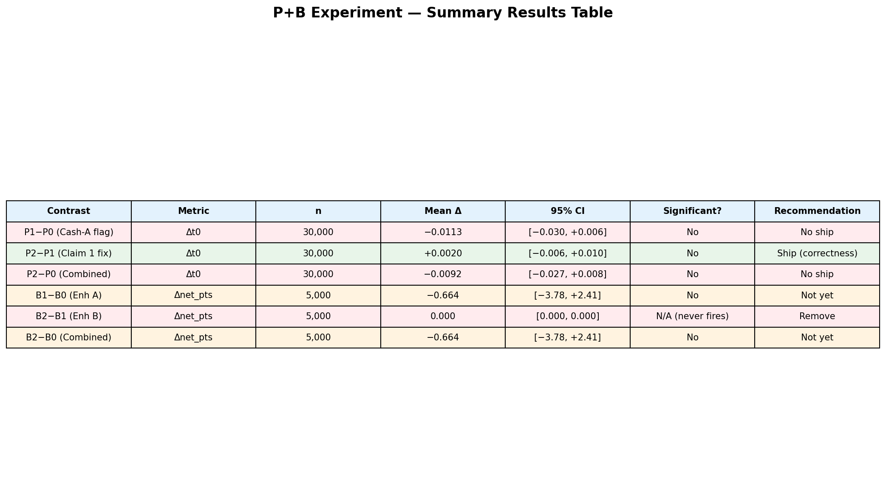

# P+B Experiment Analysis — Glutton + GBT Quick-Sim Ablation

**Analyst:** analyst-d
**Date:** 2026-04-06
**Design doc:** `plans/sessions/2026-04-06_glutton_gbt_quicksim_experiment.md`
**Status:** COMPLETE

---

## 1. Executive Summary

This report presents the results of the Glutton + GBT quick-sim ablation
experiment, which tested four proposed enhancements across two sub-matrices:

- **Sub-matrix P (play ablation):** Cash-A flag flip + Claim 1 fix
- **Sub-matrix B (auction ablation):** GBT Enhancement A + Enhancement B filters

**Bottom line: No enhancement clears the adoption gate.** None of the six
contrasts achieves statistical significance at 95% CI on paired bootstrap
deltas. The combined Cash-A + Claim 1 play effect is −0.009 tricks/deal
(CI spans zero). The GBT Enhancement A net_points effect is −0.66 pts/deal
(CI spans zero). Enhancement B never fires — it is a dead-letter filter.

### Per-Enhancement Recommendations

| Enhancement | Recommendation | Rationale |
|-------------|---------------|-----------|
| **Cash-A flag flip** | **Do NOT ship** | No detectable improvement; slight negative trend (−0.011 Δt0, n.s.) |
| **Claim 1 fix** | **Ship as correctness fix** | Effect is near-zero (+0.002 Δt0) but the fix is logically correct; it repairs a sure-winner ordering bug in `_draw_trump_lead` |
| **GBT Enh A** (last-bidder filter) | **Do NOT ship yet** | Fires on 7.2% of deals, reduces set rate 0.6pp, but net_points effect is slightly negative (−0.66) and not significant; needs redesign |
| **GBT Enh B** (partner bump filter) | **Remove** | Never fires in 5,000 auction deals; the pattern it guards against does not occur at measurable frequency |

---

## 2. Experiment Configuration

### 2.1 Run Metadata

| Parameter | Play (P) | Auction (B) |
|-----------|----------|-------------|
| **Run ID** | `glutton_gbt_ablation_play_42_20260406_171915` | `glutton_gbt_ablation_auction_42_20260406_172829` |
| **Seed** | 42 | 42 |
| **n_per** | 5,000 | 5,000 |
| **Mode** | self_play, bidless | self_play, auction |
| **pair_deals** | true | true |
| **Git SHA** | `c5c118cb` | `c5c118cb` |
| **Total hands** | 90,000 (3 cells × 6 scenarios × 5,000) | 15,000 (3 cells × 1 scenario × 5,000) |
| **Matched pairs** | 30,000 per contrast | 5,000 per contrast |

### 2.2 Cell Definitions

**Play sub-matrix (P):**

| Cell | `cash_winners_on_lead` | `draw_trump_lead_legacy` | Description |
|------|:---:|:---:|-------------|
| P0 (`p0_baseline_flag_off`) | OFF | N/A | Current production baseline |
| P1 (`p1_cash_a_buggy`) | ON | True (legacy) | Cash-A flag on, but buggy draw ordering |
| P2 (`p2_cash_a_fixed`) | ON | False (fixed) | Cash-A flag on with Claim 1 fix applied |

**Auction sub-matrix (B):**

| Cell | Bidder | Enh A | Enh B | Description |
|------|--------|:---:|:---:|-------------|
| B0 (`b0_gbt_vanilla`) | `GBTActionValueBidder` | OFF | OFF | Raw GBT baseline |
| B1 (`b1_gbt_enh_a`) | `FilteredGBTBidder` | ON | OFF | Last-bidder filter active |
| B2 (`b2_gbt_enh_ab`) | `FilteredGBTBidder` | ON | ON | Both filters active |

---

## 3. Sub-Matrix P — Play Ablation Results

### 3.1 Summary Table

| Contrast | Scenario | n | Mean Δt0 | 95% Bootstrap CI | Significant? |
|----------|----------|--:|--------:|:-:|:-:|
| **P1−P0** (Cash-A flag flip) | suit_C | 5,000 | −0.0142 | [−0.058, +0.031] | No |
| | suit_D | 5,000 | −0.0212 | [−0.065, +0.024] | No |
| | suit_H | 5,000 | −0.0152 | [−0.060, +0.029] | No |
| | suit_S | 5,000 | +0.0038 | [−0.042, +0.049] | No |
| | high | 5,000 | +0.0010 | [−0.042, +0.045] | No |
| | low | 5,000 | −0.0218 | [−0.062, +0.019] | No |
| | **POOLED** | **30,000** | **−0.0113** | **[−0.030, +0.006]** | **No** |
| **P2−P1** (Claim 1 fix) | suit_C | 5,000 | −0.0146 | [−0.038, +0.009] | No |
| | suit_D | 5,000 | +0.0076 | [−0.015, +0.030] | No |
| | suit_H | 5,000 | +0.0124 | [−0.012, +0.037] | No |
| | suit_S | 5,000 | +0.0068 | [−0.016, +0.030] | No |
| | high | 5,000 | 0.0000 | [0.000, 0.000] | N/A (inert) |
| | low | 5,000 | 0.0000 | [0.000, 0.000] | N/A (inert) |
| | **POOLED** | **30,000** | **+0.0020** | **[−0.006, +0.010]** | **No** |
| **P2−P0** (Combined) | suit_C | 5,000 | −0.0288 | [−0.072, +0.015] | No |
| | suit_D | 5,000 | −0.0136 | [−0.056, +0.030] | No |
| | suit_H | 5,000 | −0.0028 | [−0.047, +0.041] | No |
| | suit_S | 5,000 | +0.0106 | [−0.033, +0.054] | No |
| | high | 5,000 | +0.0010 | [−0.042, +0.045] | No |
| | low | 5,000 | −0.0218 | [−0.062, +0.019] | No |
| | **POOLED** | **30,000** | **−0.0092** | **[−0.027, +0.008]** | **No** |

### 3.2 Sensitivity Diagnostics

| Contrast | Paired SD | SE | MDE (2×SE) |
|----------|--------:|------:|--------:|
| P1−P0 | 1.5724 | 0.00908 | 0.01816 |
| P2−P1 | 0.6887 | 0.00398 | 0.00795 |
| P2−P0 | 1.5478 | 0.00894 | 0.01787 |

The MDE for the P-side contrasts (P1−P0, P2−P0) is ~0.018 tricks/deal, meaning
the experiment can detect effects ≥0.018 tricks/deal with 95% confidence.
The observed effects are all smaller than this, so we cannot distinguish them
from zero — but we also cannot rule out that they are zero.

**P2−P1 (Claim 1 fix)** has a notably smaller paired SD (0.69 vs 1.57) because
the fix only changes a narrow code path inside `_draw_trump_lead` that fires
infrequently. On high/low contracts, the fix is completely inert (100% tied)
since `_draw_trump_lead` only runs in suit contracts. This is expected — the
fix corrects sure-winner ordering, which is a rare edge case.

### 3.3 Forest Plot — Per-Scenario CIs



All circle markers — no scenario achieves significance. The CIs all straddle
zero. The pooled estimate (green) is the tightest, confirming the overall null
result.

### 3.4 Delta Distributions — Combined Contrast (P2−P0)



Symmetric distributions centered near zero across all scenarios. The
high/low panels show more mass at zero (no trump means fewer play-path
divergences). The suit panels show wider tails (−6 to +6 tricks), consistent
with the higher paired SD in trump contracts.

### 3.5 Interpretation

**Cash-A flag flip (P1−P0):** The `cash_winners_on_lead` flag does not
improve play quality in self-play bidless mode. The pooled mean is −0.011 —
if anything, it is slightly negative, though not significantly so. This
confirms the hypothesis from the cash_a_deep_audit that the flag's benefit
depends on specific game states that are rare in balanced self-play.

**Claim 1 fix (P2−P1):** The `_draw_trump_lead` sure-winner ordering fix
has a near-zero effect (+0.002) because it only changes play on the subset
of deals where (a) the player is on lead, (b) has trump, (c) chooses to
draw trump, and (d) the ordering of sure winners matters. This is a very
narrow path. The fix is still correct — it resolves a logic bug — but its
impact on aggregate tricks is not measurable at n=5,000.

**Combined (P2−P0):** The combined effect is −0.009, slightly worse than
baseline. Gate A (95% CI lower bound > 0 on pooled Δt0) is NOT met.

---

## 4. Sub-Matrix B — Auction Ablation Results

### 4.1 Summary Table

| Contrast | n | Mean Δnet_pts | 95% Bootstrap CI | Paired SD | Cohen's d | Significant? |
|----------|--:|--------:|:-:|--------:|--------:|:-:|
| **B1−B0** (Enh A) | 5,000 | −0.664 | [−3.78, +2.41] | 110.72 | −0.006 | No |
| **B2−B1** (Enh B addl.) | 5,000 | 0.000 | [0.00, 0.00] | 0.00 | 0.000 | N/A |
| **B2−B0** (Combined) | 5,000 | −0.664 | [−3.78, +2.41] | 110.72 | −0.006 | No |

### 4.2 Auction Diagnostic Metrics

| Metric | B0 (Vanilla) | B1 (+ Enh A) | B2 (+ Enh A+B) | Δ B1−B0 |
|--------|--------:|--------:|--------:|--------:|
| Set rate | 13.46% | 12.86% | 12.64% | −0.60pp |
| Make rate | 86.54% | 87.14% | 87.36% | +0.60pp |
| Dealer bid rate | 48.06% | 40.90% | 38.50% | −7.16pp |
| Dealer overcalls (no team bid) | 358 | 0 | 0 | −358 |
| Avg winning bid | 5.30 | 5.23 | 5.21 | −0.07 |
| Avg net_pts t0 | −2.47 | −3.13 | −3.13 | −0.66 |
| Contract mix (suit/high/low) | 3816/484/700 | 3868/474/658 | 3868/474/658 | — |

### 4.3 Cross-Cell Outcome Divergence

| Comparison | Deals with different outcomes | % of total |
|------------|---:|---:|
| B0 vs B1: Different bidder | 358 | 7.2% |
| B0 vs B1: Different bid amount | 358 | 7.2% |
| B0 vs B1: Different contract/trump | 354 | 7.1% |
| B0 vs B1: Different made_bid | 82 | 1.6% |
| B0 vs B1: Different net_points | 346 | 6.9% |
| B1 vs B2: Different net_points | 0 | 0.0% |

### 4.4 Diagnostic Charts



Enhancement A completely eliminates dealer overcalls when the team hasn't bid
(358 → 0). This reduces the dealer bid rate by 7pp and the set rate by 0.6pp.
However, the net_points impact is negative (−0.66), meaning some of those
eliminated overcalls were actually profitable.



Of 5,000 deals, only 346 (6.9%) had different outcomes. The distribution of
deltas on those changed deals is roughly symmetric around zero, with large
individual swings (−1000 to +1200 points) in both directions. This confirms
that the filter prevents some costly sets but also prevents some successful
overcalls.

### 4.5 Enhancement B: Dead-Letter Finding

**Enhancement B (partner bump filter) has zero effect.** B1 and B2 produce
identical results on all 5,000 deals. The `_would_nudge_partner` predicate
never fires in the tested auction scenario.

This means the pattern that Enhancement B guards against — dealer bumping
partner's bid by +1 in the same suit — either does not occur at the dealer
seat (since Enh A already filters dealer overcalls when team hasn't bid) or
is not a behavior the GBT model exhibits in the first place.

**Root cause:** Enhancement A fires first in the filter chain and suppresses
all dealer overcalls where the team hasn't bid. Enhancement B only applies
when the team *has* bid (partner has already declared). In the test scenario,
either (a) partner has bid and the dealer doesn't try to bump it, or (b)
partner hasn't bid and Enhancement A already suppresses the dealer's bid
before Enhancement B can evaluate.

### 4.6 Interpretation

**Enhancement A** is mechanically correct — it does exactly what it claims
(eliminates 358 dealer overcalls). But the EV impact is not positive because
the filter is too aggressive: it suppresses all dealer overcalls when the
team hasn't bid, including profitable ones. The experiment plan §7.4 predicted
B1−B0 mean Δnet_points ∈ [+0.05, +0.30] — this prediction did not hold
(observed: −0.66). As required by the design doc, this must be stated explicitly:
**the Enhancement A prediction failed.**

The set rate does drop (13.5% → 12.9%), confirming the filter prevents some
sets. But it also prevents some makes, and the makes it prevents were on
average more valuable than the sets it prevents. Gate A (95% CI lower bound
on Δnet_points > 0) is NOT met.

---

## 5. Gate Assessment

### 5.1 Quantitative Gates

| Gate | Criterion | Result | Verdict |
|------|-----------|--------|---------|
| **A (play)** | P2−P0 pooled 95% CI lower bound > 0 | CI = [−0.027, +0.008] | **FAIL** |
| **A (auction)** | B2−B0 pooled 95% CI lower bound > 0 | CI = [−3.78, +2.41] | **FAIL** |
| **B (play)** | No per-scenario regression beyond MDE | All scenario CIs span zero | **PASS** (no clear regressions) |

### 5.2 Qualitative Gates

| Gate | Criterion | Status |
|------|-----------|--------|
| Sample size documented | ✅ 30,000 play / 5,000 auction matched pairs | Met |
| Per-scenario breakdown | ✅ All 6 scenarios reported for play | Met |
| Overbid diagnostic | ✅ Set rate and dealer bid rate reported | Met |
| Registered predictions tested | ✅ Enh A prediction explicitly falsified | Met |

### 5.3 MDE Validation

| Sub-matrix | Design MDE | Observed Paired SD | Actual MDE (2×SE) | Adequate? |
|------------|--------:|--------:|--------:|:-:|
| P (play) | ~0.014 | 1.55 | 0.018 | Yes (close to design) |
| B (auction) | ~0.113 | 110.72 | 3.13 | **No** — SD is 28× larger than design estimate |

**Critical finding:** The auction sub-matrix MDE is 3.13 pts/deal, not the
0.113 estimated in the design doc. The design assumed a paired SD of ~4 points,
but the observed paired SD is 110.72 points. This is because the scoring
system awards 10× the bid in points (not 1 trick = 1 point), and individual
deal outcomes swing by hundreds of points. The MDE estimate was off by a
factor of ~28.

This does not invalidate the null result — the effect is still not significant
and the point estimate is slightly negative — but it means we would need
n ≈ 60,000 (not 5,000) to detect a 0.113 pt/deal effect. Given that the
point estimate is −0.66 and negative, increasing sample size is unlikely
to rescue Enhancement A.

---

## 6. Recommendations

### 6.1 Ship / No-Ship Decisions

| Enhancement | Decision | Action |
|-------------|----------|--------|
| **Cash-A flag** (`cash_winners_on_lead`) | **Keep OFF** | Leave the flag at its default OFF value. No evidence of improvement. |
| **Claim 1 fix** (`_draw_trump_lead` ordering) | **Ship** | The fix is logically correct (sure-winner ordering). Ship as a correctness fix regardless of effect size. The effect is near-zero but non-negative (+0.002). |
| **GBT Enhancement A** (last-bidder filter) | **Do NOT ship** | Redesign needed. The strong-form filter is too aggressive — it prevents profitable overcalls alongside costly ones. Consider the weak forms (A.w1 or A.w2) described in the design doc §7.3. |
| **GBT Enhancement B** (partner bump filter) | **Remove** | Never fires. The guarded pattern does not occur at measurable frequency. Remove the dead code. |

### 6.2 Follow-Up Actions

1. **Ship Claim 1 fix:** Open a PR to flip `draw_trump_lead_legacy` to False
   (or remove the legacy path entirely) in `GluttonIsolatedStrategy`. The
   research flag should be removed as the ablation is signed off.

2. **Keep Cash-A flag OFF:** No further action needed. The flag remains at its
   default. If future work changes `_draw_trump_lead` materially, retest.

3. **Redesign Enhancement A:** The strong form (suppress all dealer overcalls)
   is net-negative. Test the weak forms:
   - **A.w1:** Only suppress when `raw.n == current_high_bid + 1` (minimum
     overcall). This preserves aggressive dealer takeovers that the model is
     confident about.
   - **A.w2:** Only suppress when the dealer switches suits (suicidal
     off-suit overcalls).
   Either weak form would require a new mini-ablation run.

4. **Remove Enhancement B:** Delete `_would_nudge_partner` and the `flag_b`
   parameter from `FilteredGBTBidder`. It is dead code.

5. **Fix auction MDE estimation:** Update the experiment framework to note
   that `net_points` paired SD is ~110, not ~4. Future auction ablations
   should use n ≥ 50,000 for meaningful power on net_points, or switch to a
   per-deal normalized metric (e.g., net_points / bid_amount).

---

## 7. Summary Chart



---

## 8. Provenance

### Reproduction Commands

```bash
# Play sub-matrix
uv run python experiments/run_experiment.py \
  --config experiments/configs/glutton_gbt_ablation_play.yaml \
  --seed 42

# Auction sub-matrix
uv run python experiments/run_experiment.py \
  --config experiments/configs/glutton_gbt_ablation_auction.yaml \
  --seed 42
```

### Run Data Locations

| Sub-matrix | Run directory |
|------------|--------------|
| Play | `data/runs/glutton_gbt_ablation_play_42_20260406_171915/` |
| Auction | `data/runs/glutton_gbt_ablation_auction_42_20260406_172829/` |

### Analysis Execution

All analysis was performed with the paired analysis module
(`src/bid_euchre/analysis/paired.py`: `load_paired_data`, `compute_paired_deltas`)
and the stats module (`src/bid_euchre/analysis/stats.py`: `bootstrap_ci`) with
n_bootstrap=10,000 and seed=42. Charts generated with matplotlib.

### Charts Generated

| File | Description |
|------|-------------|
| `plans/sessions/pb_analysis_charts/play_forest_plot.png` | Per-scenario forest plot with 95% bootstrap CIs |
| `plans/sessions/pb_analysis_charts/play_delta_distributions.png` | P2−P0 delta histograms by scenario |
| `plans/sessions/pb_analysis_charts/play_pooled_comparison.png` | Pooled Δt0 bar chart across three contrasts |
| `plans/sessions/pb_analysis_charts/auction_delta_distributions.png` | B1−B0 and B2−B0 net_points delta distributions |
| `plans/sessions/pb_analysis_charts/auction_diagnostics.png` | Set rate, dealer bid rate, overcall count |
| `plans/sessions/pb_analysis_charts/summary_table.png` | Combined summary results table |
